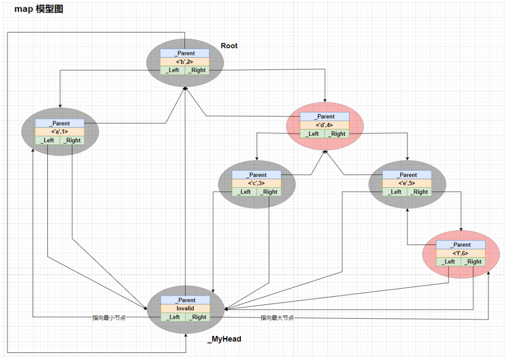
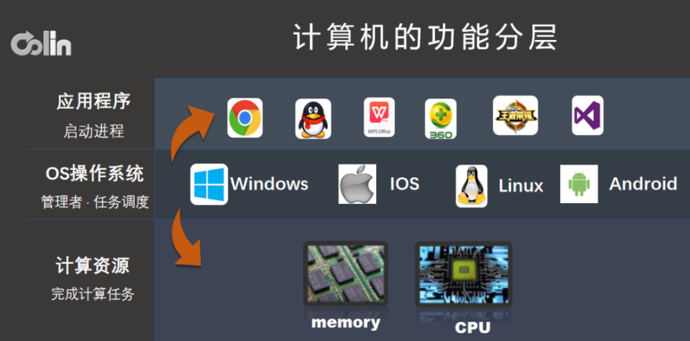
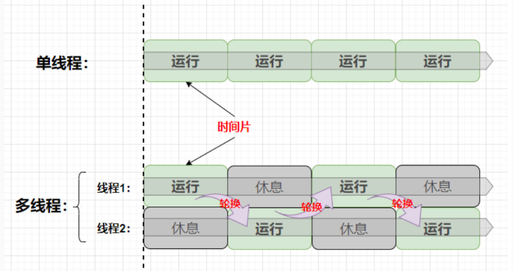
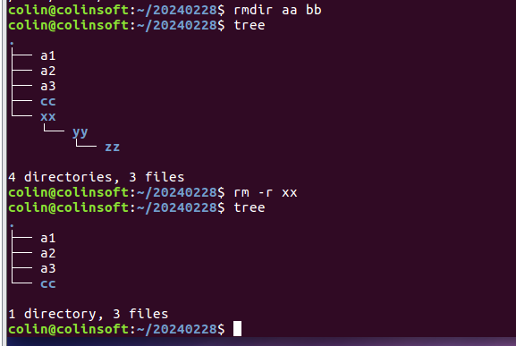
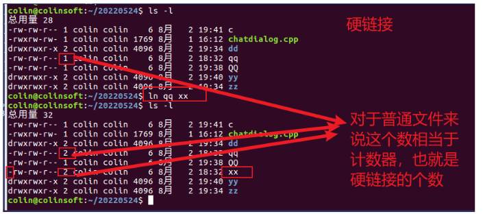
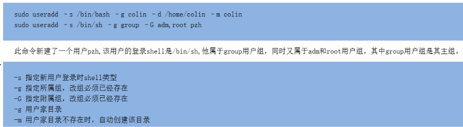
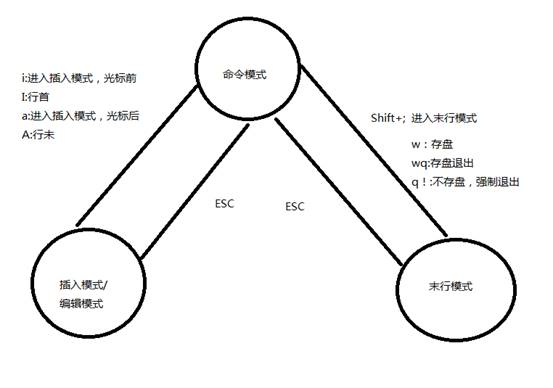
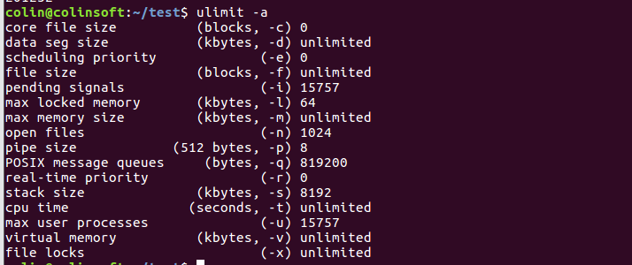
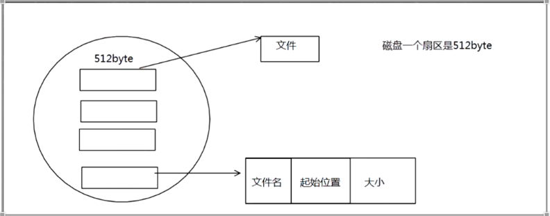

# 2024.02.22

## 转换构造函数

一个类中可以存在多个构造函数，构造函数只有一个参数而且非当前类对象时，可以将其他的的类型隐式的转换为当前类的类型，这个过程叫做隐式类型转换，发生隐式类型转换的函数叫做转换构造函数

```c++
#include<iostream>
using namespace std;
class CTest {
public:
	
	CTest(int a) {}//转换构造函数
	//CTest(int a, int b = 0) {}//转换构造函数
	//CTest(int a=0, int b = 0) {}//不是转换构造函数
	//explicit CTest(int a, int b = 0) {}//禁止发生转换构造函数
};

int main() {
	CTest tst(5);
	CTest tst2 = 10;
	tst2 = 30;
}
```

## 拷贝构造函数

编译器默认提供的特殊的构造函数，在类中与默认的无参构造并存，**参数为当前类对象的引用**， 函数体代码一般不为空，参数中对象成员依次给this对象成员进行初始化

```c++
class CTest{
	int m_a;
	CTest(const CTest &tst):m_a(tst.m_a){
		//this->m_a=tst.m_a;
		//两种初始化代码的方式
	}
}
int main(){
	CTest tst;
    CTest tst2(tst);
    cout<<tst2.m_a<<endl;
};
```

当我们手动重构了拷贝构造函数，编译器就不会提供默认的拷贝构造函数了，

一个对象给另一个对象初始化时，会调用拷贝构造函数

```c++
class CTest{
  	CTest(){}
    CTest(const CTest &tst){}
};
CTest tst1;//无参构造
CTest tst2(tst1);//拷贝构造

```

默认拷贝构造是一个**浅拷贝**，当类中存在指针成员并且指向了一个new出来的具体空间，**拷贝构造只是将两个指针里面存储的地址进行了拷贝，并不会处理指针指向的空间，** 导致多个对象里面的指针指向了一个空间，导致两个问题

1.一个对象通过指针修改了指向空间的值，其他对象使用的就是修改后的值了

2.如果是new出来的空间，会导致多个对象回收一块内存空间，引起非法错误操作


深拷贝：在拷贝构造时，为当前this对象中指针重新额外开辟新的内存空间，并初始化

```c++
class CTest{
    int *m_p;
    CTest(const CTest &tst){
        //深拷贝
        if(tst.m_p)
            m_p=new int(*tst.m_p);//指针指向的空间也要拷贝一份 （*tst.m_p）把值拷贝过来，
        else
            m_p=nullptr;
    }
};
```

对于函数的参数，尽量避免值传递，使用引用传递和指针传递

```c++
void fun(CTest tst) //如果对象有指针成员，会出现问题

void fun(CTest &tst)

void fun(CTest *ptst)//拷贝都没有发生，自然没有问题
```

## 默认operator=

空类中会默认提供一个 **operator=** 函数，参数和返回值为当前类对象的引用，一个对象给另一个对象赋值时，会调用默认的operator= 函数

```c++
class CTest{
public:
	int m_a;
	CTest& operator=(const CTest&tst){
		this->m_a=tst.m_a;
	}

};
CTest tst1;
CTest tst2;
tst1=tst2;//调用operator=
```

默认operator=函数的函数体不为空，参数对象成员依次给this对象成员赋值。

默认operator=函数也是一个浅拷贝，深拷贝写法

```c++
class CTest{
public:
	int m_a;
    int *m_p;
	CTest& operator=(const CTest&tst){
        if(this != &tst){//判断是否自己给自己赋值
            this->m_a=tst.m_a;//不是指针
            if(tst.m_p){//指针是否为空
                if(this->m_p){//有自己的空间
                    *this->m_p=*tst.m_p;
                }
                else{
                    this->m_p=new int(*tst.m_p);
                }
            }
            else{
                if(this->m_p){
                    delete this->m_p;//有空间，回收掉
                     this->m_p=nullptr;
                }
            }
        }
		
	}

};
CTest tst1;
CTest tst2;
tst1=tst2;//调用operator=
```

空类中默认提供的4个参数

1.默认无参构造函数

2.默认拷贝构造

3.默认的operator=

4.默认析构函数

## 设计模式

### 1.概念 

对代码设计经验的总结。

设计模式主要是为了解决某类重复出现的问题而出现的一套 成功或有效的解决方案，设计模式的出现提高代码可复用性、扩展性、可维护性、灵活性、稳健性以及 安全可靠性的解决方案。

 一般分为三大类：创建型模式、结构性模式、行为型模式，共计23种。 

本质是面向对象设计原则的实际运用，是对类的封装性、继承性和多态性以及类的纵、横关系的充分理 解。

 注：设计模式只是一个程序设计指导思想，在具体的程序设计开发中，必须根据设计的应用系统的特点 和要求来适当的选择，而不是一味的追求设计模式。

### 2.单例模式

属于创建型模式，三个要点： 

1. 当前类最多只能创建一个实例（对象）。 
2. 这个唯一的实例，只能由当前类创建。 
3. 需要提供公共的接口，在整个系统都可以访问。

单例对象优点

1.提供严格的对唯一实例的创建，访问和销毁，安全性高

2.节省系统资源

单例 

懒汉式 ：现用现创建

实现一

```c++
#include<iostream>
using namespace std;
class CSingleton {
private://私有 只能当前类创建对象
    
	static CSingleton* m_pSin;//静态指针，可以在没有对象的情况下，调用不需要对象调用的函数
	CSingleton(){}
	~CSingleton(){}
	CSingleton(const CSingleton&) = delete;//弃用拷贝构造
    
public:
	static CSingleton* GetSingleton()//静态函数只能用静态属性或函数
	{
		if (!m_pSin)//限制数量只能有一个对象
		{
			m_pSin = new CSingleton;
		}
		return m_pSin;
	}
    
    static void DestorySingleton(CSingleton* &psin){
        if(m_psin){
            delete m_psin;
        }
        psin=m_psin=nullptr;
    } 
};
CSingleton* CSingleton::m_psin=nullptr;
int main(){
	CSingleton* psin1=CSingleton::GetSingleton();
    CSingleton* psin2=CSingleton::GetSingleton();
    
}
```

实现二

```c++
class CSingleton{
private:
    CSingleton();
    ~CSingleton();//构造函数、析构函数和拷贝构造函数都被声明为私有。这样做是为了确保不能从外部直接实例化、销毁或复制 CSingleton 对象。
    CSingleton(const CSingleton &)=delete;
public:
    //多线程下不会失效，编译器创建局部对象保证其原子性
    static CSingleton* CreateSingleton(){//CreateSingleton 方法提供了访问 CSingleton 类唯一实例的途径。它使用了一个静态局部变量 sin，确保在第一次调用该方法时初始化，且只初始化一次。每次调用该方法都返回指向相同实例的指针。
        static CSingleton sin;
        return &sin;
    }
};
```

饿汉式

```c++
class CSingleton{
private:
    static CSingleton sin;//创建静态对象
     CSingleton();//构造函数和析构函数被标记为私有。这意味着外部代码不能直接创建或销毁 CSingleton 的实例。这个限制是单例模式的关键部分，确保只有一个类的实例存在。
    ~CSingleton();
    CSingleton(const CSingleton &)=delete;//拷贝构造函数被禁用，意味着该类不能被拷贝。这样防止了通过拷贝创建额外实例，强制实现了单例模式的单一实例规则。
public：
    static CSingleton* CreateSingleton(){//CreateSingleton 方法提供了访问 CSingleton 类唯一实例的途径，返回一个指向静态实例 sin 的指针。
        return &sin;
    }
    
};
CSingleton CSingleton::sin;//类定义外初始化了静态实例 sin。该实例在程序启动时被创建，确保单一实例在整个程序执行过程中存在。
```

### 3.工厂模式（创建型设计模式）

 主要用来集中创建对象的，如果在任何使用的地方创建对象那就造成了类或方法之间的耦合，如果要更 换对象那么在所有使用到的地方都要修改一遍，不利于后期的维护，也违背了开闭设计原则，如果使用 工厂来创建对象，那么就彻底解耦合了，如果要修改只需要修改工厂类即可。

工厂模式最大的优势：解耦。

总结 

1. 对于简单工厂和工厂方法来说，两者的使用方式实际上是一样的，如果对于产品的分类和名称是确 定的，数量是相对固定的，推荐使用简单工厂模式。
2.   抽象工厂用来解决相对复杂的问题，适用于一系列、大批量的对象生产。

1.简单工厂

提供了一个集中创建所有类型产品的方法，根据对应的标识创建对应的产品。

发动机的类

```c++
class CEngine {
public:
	virtual void working()=0;
};

class CEngine2L :public CEngine { 
public:
	virtual void working() {
		cout << "2.0自然吸气发动机正在工作" << endl;
	}
};

class CEngine2T :public CEngine {
public:
	virtual void working() {
		cout << "2.0涡轮增压发动机正在工作" << endl;
	}
};
```

```c++
//发动机工厂的类
class CFactoryEngine{
public:
    CEngnie* CreateEngine(string& type){
        if(type=="2.0L") return new CEngine2L;
        else if(type=="2.0T") return new CEngine2T;
        else return nullptr;
    }
};
```

上例中的CreateEngine()方法包含了所有类型的发动机，但当增加新的产品种类时，除了要增加对应的 类外，还要修改工厂的集中创建方法，违背了开闭原则。适合创建种类比较少且比较固定的对象，对于 复杂的业务环境就不太适应了

2.工厂方法 

由于简单工厂存在弊端（违背开闭原则），所以在其基础上，进一步将工厂类进行抽象，拆分多个类型 的工厂，每个工厂创建对应类型的类对象。 在“不同发动机”的例子基础上，做一些改动。具体为：将工厂抽象（变为抽象类），增加新的具体工厂 与发动机种类一一对应。

```c++
class CFactoryEngine{
public:
    virtual CEngnie* CreateEngine()=0;//变成一个抽象接口
};

class CFactoryEngine2L:public CFactoryEngine{
public:
    virtual CEngnie* CreateEngine()=0{return new CEngine2L;}
};

class CFactoryEngine2T:public CFactoryEngine{
public:
    virtual CEngnie* CreateEngine()=0{return new CEngine2T;}
};
```

工厂方法模式每个子类工厂对应一个具体类型的对象，比如CFactoryEngine2L 对应CEngine2L 对象， 遵循了开闭原则，提高了扩展性 (如果增加了新的类型的发动机那么原有的发动机工厂不用改动）。但如 果对象种类较多，那么一个都要对应一个工厂，需要大量的工厂得不偿失。

3.抽象工厂

和工厂方法的模式基本一样，但区别在于，工厂方法是生产一个具体的产品，而抽象工厂可以用来生产 一组相同，有相对关系的产品，重点在于一组、一批、一系列。 

在上述例子的基础上，若有新的产品，比如变速箱也需要生产 不同类型的产品 

发动机

```c++
class CEngine {
public:
	virtual void working()=0;
};

class CEngine2L :public CEngine { 
public:
	virtual void working() {
		cout << "2.0自然吸气发动机正在工作" << endl;
	}
};

class CEngine2T :public CEngine {
public:
	virtual void working() {
		cout << "2.0涡轮增压发动机正在工作" << endl;
	}
};
```

变速箱

```c++
class CGearbox {
public:
	virtual void working()=0;
};

class CGearboxManual :public CGearbox { 
public:
	virtual void working() {
		cout << "手动变速箱正在工作" << endl;
	}
};

class CGearboxAuto :public CGearbox {
public:
	virtual void working() {
		cout << "自动变速箱正在工作" << endl;
	}
};
```

抽象工厂类以及部分具体工厂类

 抽象工厂


对于具体工厂类可以根据需求自由组合产品，如需求增加 CEngine2L 和 CGearboxAuto 的组合，则新 建工厂类CFactory2LAuto即可

## 模板

### 泛型编程

 概念：通用的数据类型和算法，将算法从数据结构中抽象出来，程序写得尽可能通用，用不变的代码完 成一个可变的算法。屏蔽掉数据和操作数据的细节，让算法更为通用，让编程者更多地关注算法的结 构，而不是在算法中处理不同的数据类型，总之是不考虑具体数据类型的一种编程方式。 

在C++中，模板为泛型程序设计奠定了关键的基础。

使用模板需要用到两个关键字：  

template ：定义模板的关键字 

typename ：定义模板类型的关键字  

格式为： template  <> ：指定模板的参数列表，类似于函数的参数列表。

### 函数模板 

确认模板类型的三种方式 

实参自动推导 建立一个通用函数模板，它所用到的数据的类型 （包括返回值类型、形参类型、函数体中局部变量类 型）用一个虚拟的类型（模板类型来代替），而实际调用时编译器根据传入的实参来逆推出真正的类 型，生成对应的具体的函数。这样一个通用的模板函数不仅将数据的值作为变化的量，类型也被参数化。

实例化：由通用的模板函数生成具体类型的模板函数，按照编译单元（.cpp） 按需实例化。

 其中T是模板参数，虚拟的类型，用于替换。在实际调用时，实参为int类型，那么会生成一个参数和返 回值都为int类型的函数，由一个通用的模板函数生成具体类型的函数。编译器由函数模板自动生成模板 函数的过程叫模板的实例化。

**默认类型** 类似于函数参数指定默认值。

`templata<typename T=int>`

**显式指定** 如果函数的参数中并未使用模板类型，那么编译器无法自动推导，这时就需要手动显式的指定模板类 型。

`add<int>(a,b);`

显式指定可能会与实参推导产生冲突。比如定义一个int型的变量，但显式指定时却指定为int*，此时就 会发生冲突。 

三种方式的优先级：**显式指定 > 实参自动推导 > 默认类型**。 推荐使用显式指定，然后是默认类型，最后是实参推导。

### 多模板参数 

类似于函数参数，模板类型可以指定多个，用逗号分割，每个模板类型都需要关键字typename修饰。`templata<typename T,typename  K>`  ，模板类型T替换一种类型，K则替换为另一种类型。多模板参 数也可以使用实参进行自动推导。

**不同于函数参数的默认值，模板参数默认值指定的顺序可以是任意的 没有强制的顺序要求，但在调用函数时显式指定模板类型时必须从左向右依次指定，不能有间断。 **

**一般编译器能够自动推导出来的模板参数放最后，剩余的模板参数若有默认值放中间，无默认值放最前 面**

### 模板函数的声明和定义

如果函数的声明和定义分开，那么在声明和定义处都需要加上模板，如果模板存在默认类型，那么只在函数声明时指定即可。(意思是函数定义时不用写默认值了，模板还是要写) 

由于模板函数的定义并不是真正的函数，他们不能单独编译，所以不能将模板函数单独放到源文件中， 模板必须与特定的模板实例化请求一起使用，所以最好的办法是模板函数的声明和定义放在一起。

### 类模板 

与函数模板差不多，类模板也需要在类定义的上面加上template及typename，但在定义对象时，必须 使用<>显式的指定模板类型。

```c++
templata <typename K=char> //定义一个类模板
class CTest{};
int main()
{
	CTest <int> tst;  //定义对象，显示指定模板
	CTest<> tst;//即使有默认的模板类型，<>也不能省略
}
```

模板类型可以替换类内的任意地方定义的类型，包括成员属性类型，成员函数。类中成员属性若为模板类型，那么我们可以定义带参数的构造，让调用者去指定初始化值。 

类模板可以有多个模板类型，且可以指定默认的模板参数，规则是从**右往左依次指定不能间断**（即从后 向前），在定义对象时从左向右指定，如果不指定模板参数，将使用默认的。并且不**可根据实参推导出 模板类型**。

**在模板参数列表中，如果某个模板参数有默认值，那么其后的所有模板参数都必须有默认值。** 

如果模板类中的成员函数在类中声明，类外实现时，定义的函数也要加上模板。如果类模板指定了默认 的类型，为了避免歧义，默认的模板类型应当去掉

如果在模板类中声明、类外定义的成员函数存在函数模板，那么在定义时，两个模板都需要指定。

```c++
#include <iostream>

// 模板类
template <typename T1, typename T2>
class CTest {
public:
    // 成员函数声明
    template <typename U>
    void show(U value);
};
// 成员函数定义（在类外定义时，需要同时指定模板参数）
template <typename T1, typename T2>
template <typename U>
void CTest<T1, T2>::show(U value) {
    std::cout << "Value: " << value << std::endl;
}
int main() {
    // 创建模板类实例
    CTest<int, double> myTest;
    // 调用函数模板
    myTest.show(42);
    return 0;
}
```

### 模板类中嵌套的情况 

利用4个类来模拟模板类嵌套的不同情况

```c++
template<typename T>
class A {
public:
    T m_t;
    A() { m_t = 10; }
    A(T t) : m_t(t) {}
};//类 A 是一个模板类，包含一个模板参数 T，其中有一个成员变量 m_t，并提供了两个构造函数，一个默认构造函数将 m_t 设置为 10，另一个构造函数接受参数 t。
template<typename T>
class B {
public:
    A<long> m_a;
    B() {}
    B(long a) : m_a(a) {}
};//类 B 包含一个 A<long> 类型的成员变量 m_a，并提供两个构造函数，一个默认构造函数，另一个构造函数接受一个 long 类型的参数 a，并将其传递给 A<long> 类的构造函数。
template<typename T>
class C {
public:
    A<T> m_a;
    C(T a) : m_a(a) {}
};//类 C 包含一个 A<T> 类型的成员变量 m_a，并提供一个构造函数，接受一个模板参数 a，并将其传递给 A<T> 类的构造函数。
template<typename K>
class D {
public:
    K m_k;
    D(const K k) : m_k(k) {}
};//类 D 包含一个模板参数 K 的成员变量 m_k，并提供一个构造函数，接受一个模板参数 k，并将其传递给 D 类的构造函数。
```


# **20240223**

内存管理

## 计算机体系结构

输入设备，CPU,（运算器，控制器，内存），外存，输出设备


什么是内存？

用于暂时存放CPU中运算数据的，正在运行的数据

什么是内存管理？

操作系统不对内存进行管理，会出现什么问题？（容易导致内存数据的混乱，以至于限制进程的并发执行）

1.系统崩溃或者死机，如果出现bug,一直new对象，内存管理会将这个进程杀死

2.安全问题：

3.避免资源浪费：回收new出来没有回收的空间

逻辑地址：虚拟地址

物理地址：

逻辑地址和物理地址存在映射关系，但不是相等的

## 内存管理分类：

#### 1.连续分配管理

（会产生碎片，小的空间无法使用）实现连续地址空间

1）单一连续分配  （每次执行一个程序，洗衣机只能洗）

2）固定分区分配  （易于实现，方便开发，也会出现内部碎片，造成浪费）


3）动态分区分配

是可变分区分配，根据作业大小动态分配创建分区

#### 2.非连续分配（逻辑地址）

##### 1）页式存储

页式管理

物理内存空间分成块（不一定连续），块大小与页大小相等，从0开始编号

逻辑空间等分为页，从0开始编号，页面大小为4kB

**逻辑地址结构** 


地址长度为32位，0-11位为页内地址，即每页大小为4kB，12-31位为页号，最多2^20页

逻辑地址/2的12次方（4096）=页号     页号%2的12次方（4096）=页内地址


 若页面大小为1K字节，页号2对应的物理块b=8,计算逻辑地址A=2500的物理地址

8*1024+452

## **缺页中断与页面置换算法**


**OPT:最优页面置换算法**

当发生缺页中断时，对于保存在内存中的每一个逻辑页，计算在它的下一次访问之前，还需要等待多长时间，

从中选择一个一个等待时间最长的页，作为被置换的页

**FIFO:先进先出**

选择在内存中驻留时间最长的页面作为被置换页

**LRU：最近最久未使用算法**

选择最久未使用的页面，作为被置换项

##### **页式存储优缺点**

优点：

1. 很好的解决外部碎片问题，只产生内部碎片
2. 打破了内存分配的连续性需求
3. 提高了主存的利用率

缺点：

1. 程序需要全部装入内存，需要硬件支持
2. 会有内部碎片产生
3. 动态的地址变化，方案实施会消耗额外的系统资源
4. 存储拓展问题没有解决--进程大小受到限制，可用块数小于进程需要的块数，无法运行

##### 2）段式存储（没有内部碎片，只有外部碎片）

段式存储基本原理

1. 用户编制的程序是由若干段组成的:
2. 一个程序可以由一个主程序、若干子程序、符号表、栈以及数据等若干段组成。
3. 每一段都有独立、完整的逻辑意义，每一段程序都可独立编制，且每一段的长度可以不同。
4. 每一段都可从“0”编址，段与段之间地址不连续，但段内地址是连续的。
5. 分段式存储管理为作业的每一个段分配一个连续的内存区域，用来存放该段信息


##### 段式存储优缺点

优点：

1. 没有内部碎片
2. 可以以段为单位进行共享，包括通过动态链接进行代码共享
3. 可以针对不同类型的段采取不同的保护

缺点：

1. 会产生外部碎片，不过由于进程被分为多个小块，所以外部碎片也会很小

##### 3）段页式存储


段式存储总结

1. 结合了段式和页式的优点，但是增加了（存储表和查询表的开销），只在大型计算机中使用
2. 段页式存储不会产生外部碎片，会产生内部碎片


##### 段式 和 页式 段页式存储的比较

1. 页式存储 就是说将程序分页时，页的大小是固定的，只根据页面大小强硬的将程序切割开而分段时比较灵活，只有一段程序有了完整的意义才将这一段切割开。
2. 分页式作业的地址空间是一维的，页间的逻辑地址是连续的:而分段式作业的地址空间则是二维的，段间的逻辑地址是不连续的。
3. 在页式、段式存储管理中，为获得一条指令或数据，须两次访问内存;而段页式则须三次访问内存


‘虚拟内存：让每个进程以为自己拥有一片连续完整的内存空间


当出现不允许式，会将出现暂时存放在外存中，需要运行时，放回内存中

MMU:物理地址转换成虚拟地址

## 类基础

### 1.类封装

在c语言中，一般数据和算法是分开的，彼此之间没有联系。在c++中，将彼此有联系的数据和算法封装起来，形成结构体或类。无论类还是结构体都是一个抽象的概念，只有在定义对象时才真正存在。

类：完成某一个功能的数据和算法的集合，是一个抽象的概念

对象：类的一个实例，具体的概念，真正存在于内存中

定义类的关键字class  一般以大写C开头，成员属性一般以m_k开头

```c++
class CTEst{
private://私有属性，只能在类内使用，类默认为私有，结构体默认为公有
protected://保护 可以在类内，子类中使用
public://公共的 都可以使用
    int m_a;
    void show();
};
int main()
{
    CTest tst;
}
```

### 2.构造函数

用来初始化类成员属性，空类中默认存在无参构造，函数体为当前类名,无返回值

一个类中构造函数允许存在多个，他们之间是函数重载的关系，只有重构了任何的构造函数，编译器就不会提供哪个默认的无参构造了，一个对象只能执行其中一个构造

```
class CTest{
	CTest(){}
	~CTest(){}
};

```

### 3.析构函数

作用是回收类成员申请的额外空间，空类中默认存在一个默认的析构函数。构造函数在对象的生命周期结束的时候，自动调用。**析构函数只允许存在一个** ，

注意：析构在回收对象内存空间之前调用，类成员申请的额外空间回收完成后，才真正回收对象内存空间


### 4.面向过程与面向对象

面向过程变成（POP）是一种函数模型，过程有一系列要执行计算步骤，以过程为中心把要解决问题的步骤，流程分析出来，用函数封装成一个个模块，在主流程中按照具体的步骤调用相应的函数。

面向过程的主体是函数，以函数为中心，关注怎么一步一步解决问题，从而实现程序的执行，

至上而下，顺序执行，逐步细化

面向对象以对象为中心，他把要解决的问题分成一个个对象，专注于对象之间的交互，分成对象的目的不是为了解决问题的某个步骤，而是为了描述对象在解决问题时的属性和行为，对象之间通过方法来交互

面向对象分析问题步骤：分析问题中有哪些实体，实体有哪些属性和方法，我们如何通过实体属性和方法解决问题，任意操作都需要实体来完成，实体就是动作的支配者，没有实体，就没有操作的发生	


### 5.类和结构体的区别

1. 类的属性、方法的属性默认是私有的，结构体默认是公有的
2. 继承时，类默认继承方式是私有的，结构体默认继承方式是共有的
3. 从使用习惯上，一般类描述功能实现，结构体单纯表示数据

## 类进阶

### 1.类成员

c++标准规定，但凡一个独立的对象都必须具有非零大小，所有一个空类中即使没有任何数据其大小也不能为0，空类实例大小为1，用来在内存中占位，不同的对象地址不同。

sizeof(类型)：类型占用的空间大小

sizeof(类)：当类中存在非静态成员对象时，占用的1字节不会存在，变量的地址已经起到了占位的作用

类成员属性：定义对象时才存在，定义多个对象类成员属性存在多份，彼此独立互不干扰

类成员函数：编译期才存在，与是否定义对象无关，类成员函数只有一份，多个对象共享同一份函数

### 2.this指针

类中的非静态成员包括构造析构函数，都存在一个隐藏的this指针，他是编译器默认加上的，在所有参数之前 类型为 类* const this,当我们用对象调用函数时，this指针就指向了调用的函数，在类中使用类成员属性和类成员函数时，都通过this指针调用，

：this指针作用，连接对象和成员的桥梁，可以无感的使用成员

### 3.静态成员

需要使用static关键字进行修饰

static int m_a;

static void show(){}

**静态成员变量**

- 属于类的，不参与类对象的空间占用，在编译期就存在，所有的对象共享这个静态变量
- 可以在类外进行初始化， 格式 类型 类名：：变量名=初始化值；
- 可以通过类名作用域调用也可以通过对象调用

**静态成员函数**

属于类的，不参与类对象的空间占用,编译器就存在，所有的对象共享一个静态成员函数

可以通过类名作用域调用也可以通过对象调用

**静态成员函数与普通成员函数的区别**

- 没有隐藏的this指针，也就不能使用普通的成员和函数，但可以使用静态成员变量 但函数普通成员函数可以使用静态成员
- 静态成员函数是否通过对象都可以使用，普通成员函数只能使用对象调用。

### 4.常量

特性：定义了就必须要初始化，一旦初始化后就不能进行修改

当成员属性被const修饰时，定义了就要初始化，在初始化参数类表中初始化，**初始化顺序是类在成员中定义的顺序**，而不是在初始化参数列表中的顺序

```c++
class CTest {
    int m_a;
    const int m_b;
    CTest():m_a(10),m_b(20){//初始化参数列表
        m_a=10;//赋值允许
        m_b=20;//赋值不允许
    }
};
```

### 

**常量指针**： `int const *p （等同于const int *p）`，

const修饰的是 * p，说明*p不能修改  

**指针常量**： `int * const p ，const修饰的是p`，

说明p的指向不能改，所以p必须初始化  

`const int * const p` ：代表当前指针的指向不能改，且指向空间里的内容也不能修改 常量指针的升降级问题 

```c++
const int a = 10;
const int* p1 = &a;
int b = 20; 
int *p2 = &b;
```

`p2 = p1; （无法从 const int* 转换为 int * ）` 

这是指针的安全级别的降级操作，不允许 

`p1 = p2; （ int * 可以转换为 const int * ）` 

这是指针的安全级别升级操作，允许

### 5.常函数

常函数：类中的成员函数**参数列表后面**有const修饰时，称为常函数，为了保护类中成员变量，限制修改。

特性：不能修改类中的非静态成员，因为const修饰this指针变为`const 类* const this`,也就是执行this->变量=val;操作是违法的，但可以查看成员变量。对于静态成员属性不光能查看，也能对其修改，因为静态成员不是属于对象的，并不在const约束范围内。

在常函数中可以查看普通的成员变量、常量、静态变量，也可以调用其它常函数，但是却不能调用普通的成员函数，因为其this指针的类型不同

CTest * const this =const CTest* const this;

这是指针安全级别降级的非法操作

```c++
class CTest{
    int m_a;
    const int m_b;
    static int m_c;
    void f(){}
    void c2()const{}
    void c1()const{
        m_a;//查看合法
        m_b;//查看合法
        m_c;//查看合法
        m_c=20;//修改合法
        m_b=10;//修改不合法
        //f();错误C2662 不能将“this”指针从“const CTest”转换为“CTest &”
		c2();
    }
};
```

但在普通的成员函数中却是可以调用常函数的，

`const CTest* const this=&CTest`这是一个指针安全升级的操作

如果想在常函数中修改部分指定的普通成员，我们可以使用关键字**mutable**来修饰该成员

```c++
class CTest{
	int m_a;
    mutable int m_b;
    void c1()const{
        //m_a=10;  //非法
        m_b=10;//合法
    }
};
```

### 6.常量对象

：使用const修饰的对象(const CTest tst;) 不能调用普通的成员函数，只能调用常函数，因为常量对 象调用普通成员函数是（类名 * const this = &const 类名），这是一个安全级别降级的非法操作。普通 的对象可以调用常函数，因为（const 类名* const this = &类名），这是一个安全级别升级的合法操 作。

### **总结** 

由于静态成员函数没有this指针，所以不能调用普通成员与常量成员。但普通成员函数与常函数可以调 用静态成员。 

常函数可以调用普通成员属性和常量，但仅限查看。但对于静态成员属性不仅可以查看，也能修改，因 为静态成员属性不受this指针限制。 

常函数不能调用普通成员函数，因为（类名* const this = const 类名* const this）这是指针安全级别降 级的非法操作。 

普通成员函数可以调用常量和常函数，因为（const 类名* const this = &类名）这是一个指针安全级别 升级的合法操作 

常量对象不能调用普通成员函数，而普通的对象都可以调用。

## 静态链接库和动态链接库的区别

首先来看什么是库，库(Library)说白了就是一段编译好的[二进制](https://so.csdn.net/so/search?q=二进制&spm=1001.2101.3001.7020)代码，加上头文件就可以供别人使用。
什么时候我们会用到库呢？一种情况是某些代码需要给别人使用，但是我们不希望别人看到源码，就需要以库的形式进行封装，只暴露出[头文件](https://so.csdn.net/so/search?q=头文件&spm=1001.2101.3001.7020)。另外一种情况是，对于某些不会进行大的改动的代码，我们想减少编译的时间，就可以把它打包成库，因为库是已经编译好的二进制了，编译的时候只需要 Link 一下，不会浪费编译时间。
上面提到库在使用的时候需要 Link，Link 的方式有两种，静态和动态，于是便产生了静态库和动态库。
静态库
静态库即静态链接库（Windows 下的 .lib，Linux 和 Mac 下的 .a）。之所以叫做静态，是因为静态库在编译的时候会被直接拷贝一份，复制到目标程序里，这段代码在目标程序里就不会再改变了。
静态库的好处很明显，编译完成之后，库文件实际上就没有作用了。目标程序没有外部依赖，直接就可以运行。当然其缺点也很明显，就是会使用目标程序的体积增大，浪费资源和空间。
动态库
动态库即动态链接库（Windows 下的 .dll，Linux 下的 .so，Mac 下的 .dylib）。与静态库相反，动态库在编译时并不会被拷贝到目标程序中，目标程序中只会存储指向动态库的引用。等到程序运行时，动态库才会被真正加载进来。
动态库的优点是，不需要拷贝到目标程序中，不会影响目标程序的体积，而且同一份库可以被多个程序使用（因为这个原因，动态库也被称作**共享库**）。同时，编译时才载入的特性，也可以让我们随时对库进行替换，而不需要重新编译代码，**程序升级变得简单**。动态库带来的问题主要是，动态载入会带来一部分性能损失，使用动态库也会使得程序依赖于外部环境。如果环境缺少动态库或者库的版本不正确，就会导致程序无法运行（Linux 下喜闻乐见的 lib not found 错误）

## 内存区域有哪些，作用是什么？

从低地址到高地址，依次是代码区，常数区，全局/静态区，栈区，堆区

代码区：当程序将要运行时，会有一个准备加载的过程，其中的函数以及函数中的流程结构指令会被放到代码区等待运行

常数区：**字符串常量，const全局变量**会在加载时放到常数区，常数区的代码只能读取，不能修改

全局区/静态区：**全局变量，代码中的静态变量**会在程序加载时放在这个区域，只有程序运行结束时这些变量空间才会被释放

栈区：当函数被调用时，其内部的形参，函数内的其他局部变量会被**创建**在栈区，当函数被调用结束时，系统会自动回收释放这些变量。

堆区： 堆区是由程序员自主管理的内存空间，可以通过 malloc 等函数在堆区内存中申 请需要的任意大小的内存空间。但当此内存空间不打算继续使用时，务必使用 free 函 数释放掉这些空间，否则在程序关闭以前，这些内存空间是不会被其它程序所使用的， 会造成很大的空间浪费甚至宕机。直到程序被关闭后没有手动释放的空间才会被操作系 统回收。

## 栈内存与堆内存的区别？

分配方式与分配效率不同：当函数被调用时，函数的形参与局部变量会一起在栈区被创建出来，而堆区空间分配是由程序员通过malloc函数分配出来的，栈区效率会高一些

管理方式不同：栈内存空间是由操作系统支持管理的，堆内存需要开发者自行维护 ——创建与回收。如果开发者疏忽了回收就会产生垃圾内存。所以堆内存是容易产 生内存碎片的，栈内存由于系统自动维护则不会产生内存碎片。

存储内容不同：堆区适用于数据量较大的情况，栈区更适合存储临时少量的数据

生长方向、空间大小不同：堆区与栈区都是动态延展的，堆区空间比栈区大一些，堆空间更适合存储大一些的数据

## 全局变量与局部变量的区别？

全局变量通常指在函数体外部创建的变量。程序被启动执行时，它们会被创建在全 局区。而局部变量指函数体内的定义的变量，包括形式参数在内都是局部变量。它们是 伴随函数调用而被创建于栈区，函数调用结束后从栈区被回收的临时性变量。全局变量 与局部变量的区别在于生命周期与作用域的不同。

从生命周期角度看：全局变量的生命周期在程序启动时就被创建在全局区，并且默 认初始值置为 0。只有程序被关闭后，其占用的内存空间才被释放掉。而局部变量是其 所在函数被执行时才被创建，函数执行结束后被回收。当函数再被执行时局部变量再重 新创建。

从作用域的角度看：全局变量可以被项目内任何的函数访问；而局部变量的访问只 能在函数体内部，函数体外部是不能通过局部变量名字访问函数内的变量。另外，在一 个函数被执行时，恰巧其函数内定义的局部变量名与全局变量名重名时，按照临近原 则，全局变量被屏蔽，只有最近的局部变量才能被访问。所以局部变量与全局变量重名 是不影响编译运行的。但是在同一个作用域内是不允许变量重复定义的。

# **20240224**

## 高级编程语言、汇编语言、机器语言的关系是什么？

所谓高级编程语言就是用英文单词+计算符号+数字构成的指令代码，经过学习和重 复实践就能够掌握。我们把接近人类自然语言的计算机指令称为高级编程语言。我们目 前常用的编程语言 C/C++、java、python 等都属于高级编程语言，甚至把数据库中的 SQL 语句称为“第四代语言”。因为它更接近人类的自然语言表达。高级编程语言的“高 级”代表的是接近了人类，但却远离了机器。最终高级语言的每一条指令还是最终要变 为 0 或 1 的机器语言的指令才能被机器执行。但是 0 或 1 组成的机器指令是很难被大多 数人理解并学习的。所以人们研究开发出了汇编语言，汇编语言也称为机器语言的助记 符号，也就是把 01 的指令用一个单词来代表，这样相对于机器语言更利于学习和使 用。所以我们用 VS2019 编写的 C 语言源代码，计算机不会立刻能够执行它们，而是需 要把它们最终变为 01 的机器指令后，再由计算机去执行机器指令。

## C语言代码执行原理

源代码编写 .c文件

1.预处理时期 

预处理就是是对所有#开 头的指令进行处理。 比如#include 会把被包含的文件复制粘贴进我们的源代码， #define 会根据宏名对源代码中宏名替换成对应内容

2.编译期 

我们编写的源代码需要一个编译器 Compiler（能够识别源代码语法的程序），对源代码进行词法分析、语法分析、优化等操作，最后生成汇编语言代码。当然如果在转换 成汇编语言代码过程中由于语法不符合编译就会报出编译错误的提示；比如之前的语法  错误等。

3、汇编期 

把编译器产生的汇编语言继续转换成机器语言的过程称为汇编。这个转换期间称为 汇编期。也就是根据每个源代码文件都会自动生成一对一的一个文件名相同但不同扩展 名的.obj 或.o 文件；我们称之为“目标文件”。即程序源代码最终目标是变为机器能够 识别的指令。完成这个转换过程的工具程序称为“汇编器”。

4、连接期 

所谓的连接就是把第四步的目标文件及用到的某些库函数一同连接或理解为“打 包”进一个 exe 文件的过程。整个期间称为连接期。完成这个任务的程序称为“连接 器” ——Linker

产生LNK错误是哪个时期什么原因导致的呢？连接期，要么没有包含对应的头文件（因为头文件中通常包含被 调用的函数声明），或者通过声明找不到对应的函数定义。总之，找不到你调用的功能 函数模块。 还有一种情况是我们所有的源代码经过了编译期排除了语法错误。汇编期生成了机 器指令文件。但是当把它们汇总时可能发现 main 函数或其它函数有重名的情况。

5、执行期 

.exe执行的期间叫执行期

## C++语言代码执行原理

### 头文件和源文件 

默认情况下，头文件不参与编译，而每个源文件自上而下独立编译。 

头文件（.h）包含：变量的声明、函数声明、结构体和类的定义、宏。 

源文件（.cpp）包含：变量的定义初始化、函数定义实现、成员属性的定义初始化、成员函数的定义实 现 ... 

分为头文件和源文件的原因：方便去管理、规划，更重要的是避免了重定义的问题。 

在头文件内定义类后，类内的成员只声明不定义，类中的成员函数在对应的源文件中定义时，一定要加 上 类名:: 

静态和常量成员一定要在源文件中进行定义初始化（而不是头文件中）。 

常函数：保留const关键字 

静态成员函数：去掉static关键字 

虚函数：去掉virtual关键字 

纯虚函数：不需要实现

### 程序生成的过程 

1、预处理（Preprocessing） 

将源文件 (.cpp) 初步处理，生成预处理文件 (.i) ： 

1. 解析 #include 头文件展开替换 
2. 宏定义指令:：#define 宏的替换，#undef等。 
3. 预处理指令：解析 #if、 #ifndef、 #ifdef、 #else、#elif、 #endif 等。 
4. 删除所有注释。 

2、编译（Compilation） 

将预处理后的文件(.i) 进行一系列词法分析、语法分析、语义分析及优化，产生相应的汇编代码文件 (.asm)。 

3、汇编（Assembly） 

将编译后的汇编代码文件 (.asm)汇编指令逐条翻译成目标机器指令，并生成可重定位目标程序的.obj文 件，该文件为二进制文件，字节编码是机器指令。 

4、链接（Linking） 

通过链接器将多个目标文件 (.obi) 和 库文件 链接在一起生成一个完整的可执行程序。 

编译期-运行期 编译期：

把源程序交给编译器编译、生成的过程，最终得到可执行文件的过程。 

运行期：将可执行文件交给操作系统执行、直到程序退出的过程。把在磁盘中的程序二进制代码放到内 存中执行起来，执行的目的是为了实现程序的功能。

类：编译期的概念，包含了类成员函数、静态属性、作用域、访问权限。

对象：运行期的概念。包含了实例、引用和指针。

### 头文件重复包含 

指的是头文件里的内容在源文件内被多次调用，造成重定义的错误。 解决的方案 #pragma once：告诉编译器，当前的头文件在其它源文件中只包含一次，直接和编译器沟通，编译效 率高，速度快。

### 宏

1.主要作用：在预处理阶段进行替换，替换后才进行编译。 

2.宏也可以替换多行内容，使用 \ 字符（用来连接当前行和下一行），一般最后一行不加 \ ，\ 后不能有任 何字符，包括空格、tab、注释等。

```
#define B \
for (int i = 0; i < A; i++) {\
cout << i << " ";\
}
```

3.宏可以加参数，也是一个替换的作用

```
#define C(NUM)\
for (int i = 0; i < NUM; i++) {\
cout << i << " ";\
}
```

4.\# 将宏参数转为字符串，相当于加了双引号

```c++
#define N(PARAM) #PARAM 
N(123) //相当于 "123" 
N(abc) //相当于 "abc
```

5.\#@ 将宏参数转为字符，相当于加了单引号

```c++
#define E(PARAM) #@PARAM 
#define N(PARAM) #@PARAM 
N(1) //相当于 '1' 
N(a) //相当于 'a'
```

6.\## 拼接作用

```c++
#define N(PARAM) int a##PARAM;
N(1) //相当于 int a1;
N(2) //相当于 int a2;
```

**宏只是简单的替换，宏及参数不会自动计算，也不会表达式求解**

7.\#undef 宏：

取消宏定义，限制宏的范围 

8.宏逻辑判断

```c++
#ifndef 宏 //如果没有定义这个宏 
#define 宏 //定义一个宏 
...我的代码... 
#endif //结束
```

在大量头文件时，编译速度降低，耗时增加。而且需要考虑宏重名的问题，如果重名会导致本来应该包 含的却未包含。

优点 

1. 使用宏可以替换在程序中经常使用的常量或表达式，在后期程序维护时，不用对整个程序进行修 改，只需要维护、修改一份宏定义的内容即可。 
2. 宏在一定程度上可以代替简单的函数，这样就省去了调用函数的各种开销，提高程序的运行效率。 

缺点 

1. 不方便调试 
2. 没有类型安全的检查 
3. 对带参的宏而言，由于是直接替换，并不会检查参数是否合法，也并不会计算求解，存在一定的安 全隐患。

## 变量命名规则与规范

1. 变量名可由中英文字符、数字、下划线_、$符号组合构成 
2. 变量名不可以有空格等标点符号。 
3. 变量名不可以用数字开头：8hello 是错误的、_hello 是可以的
4.  变量名不可以和编程语言的保留字（或称关键字）重名

## 运算符与表达式

-  A算术运算

  +-*/ %    ()优先级最高

- B: 赋值运算

  ①：= 赋值号也有返回值。返回结果为左值（左侧变量存储空间的数据）。 ②：复合赋值如：+= -= ...的计算过程（以+=为例） ③： ++ -- 的计算过程（以++为例）

- C：关系运算 

  【注意】C语言没有boolean类型，因此 关系运算、逻辑运算返回值为0或1。0代表假 1 代表真

- D：逻辑运算

  ① 逻辑运算: 

  1. ! 逻辑非：从右向左计算，取相反逻辑即 0 相反是1，1相反是0 

  2.  && 逻辑与：与（并且之意） 1 && 1 两侧都是1（即真）则结果为 1真， 有一侧0则结果为0 假 

  3. || 逻辑或： 或（或者之意）0 || 1 两侧都为0 则结果为0 有一侧为1 结果就为1 即真 

     逻辑运算符的优先级：! 优于 && 优于 || 。 【注意】：&& 和 || 并非同级别运算符。 

     【逻辑运算、关系运算混合时的优先级：】 ！ 优于 关系运算( > >= < <= == != ) 优于&& 优于 || 

     ② && 和 || 的“短路”问题 ：&& 在执行时，发现左侧为0假，右侧就不进行判断执行了。因此++b表达式并没有被执行。 

  【同理】：|| 在执行时，发现左侧为1真，右侧也不进行任何执行操作。

- E：条件运算符 C语言中唯一三目运算符 

  【格式】： 关系逻辑表达式 ? 真返回的值 : 假返回值

- F：位运算符：对二进制0或1的计算

  1.& 按位与运算     按全 1 则 1，有 0 就 0 

  2.| 按位或运算       全 0 则 0 有 1 则 1 

  3.^ 按位异或运算   相同为 0 不同为 1 

  4.<< 左移运算符    二进制数向左移动若干位，前面被移出的数据被舍弃而后面补充 0。 

  5.<<右移运算符    对于非负数右移补 0。但对于负数右移会补 1 

    位运算的运用demo： 

  1. 交换：两个变量的值 不允许你使用额外的辅助变量来完成交换 两个相同的数异或之后结果会等于 0，即 n ^ n = 0。并且任何数与 0 异或等于它本身，即 n ^ 0 = n。 

     ```c
     int x = 10,y = 20; 
     x = x^y; 
     y = x^y; 
     x = x^y; 
     printf("%d %d\n",x,y); 
     ```

     2. 判断奇偶数 `int x = 10; printf("%s\n", x&2? "偶数":"奇数");` 

     3.计算x的绝对值 

     ```c
     int y ; 
     nt x= -15; 
     y = x >> 31 ; 
     printf("%d\n", (x^y)-y)
     ```

- G：逗号运算符   逗号运算符的优先级别最低

- H：sizeof运算符 sizeof是C语言中保留关键字，也可以认为是一种运算符，单目运算符。用于取得一个变量或一个数据类型所占内存空间的字节数。

- I：内存地址运算符 & 为单目运算时，称为取地址运算符 * 为单目运算时，称为地址空间内操作运算符，空间内操作包括：取值、赋值。 &与*为互逆运算。

## 如何得到不同整型的数据范围？

方式一：利用 limits.h 头文件中定义好的最大值与最小值。

方式二：利用溢出现象计算得到。

由于-1 经过原码、反码、补码后在二进制计算机里就是全 1。所以-1 可 以作为无符号变量初始的最大值。当然也可以用十六进制的 F 进行设置。一个 f 为 4 个 1111，ff 就是一个字节全 1。这样就实现了无符号的最大值设置。 无符号变量如果是最大值，再整除 2 就得到有符号角度的最大值。在这个最大值基 础上再加 1；由于“溢出现象”在有符号角度下就能得到其最小值。

```c
#include<stdio.h>
#include<limits.h>
int main()
{
	unsigned int a = -1;
	printf("%d %d %u %u\n", a / 2, a / 2 + 1, 0,a);//2147483647 -2147483648 0 4294967295
	printf("int 最大值：%d 最小值：%d\n", INT_MAX, INT_MIN);//int 最大值：2147483647 最小值：-2147483648
	printf("unsigned int 最大值：%u 最小值：%u\n", 0, UINT_MAX);//unsigned int 最大值：0 最小值：4294967295
}
```

## x86与x64区别

1. 支持的内存不同

   32 位的操作系统，最多支持 4G 的内存，实际内存为 3.25G；64 位系统支持 4G 8G  16G 32G 64G 128G、256G 内存，理论上可以无限支持，只要你主板上有足够的内存条。

2. 支持的处理器不同

   64 位的操作系统支持基于 64 位的处理器，而 32 位的系统却不能完全支持 64 位的处 理器。

3. 支持的软件不同

   32 位的操作系统，支持基于 32 位的软件，不能运行 64 位的软件；而 64 位的系统一 般这两种类型的都支持，基本上与各种软件都兼容，特别是 adobe 公司的软件，现在的新 版本的都只支持 64 位。

4. 运算能力不同

   32 和 64 表示 CPU 可以处理最大位数，一次性的运算量不一样，理论上 64 位的会比 32 位快 1 倍，内存寻址也不一样。

5. 系统体积大小不同

​        64 位系统都比 32 位系统大的多,比如 win7 64 位比 win7   32 位系统大 700M 左右。

是x86 即 32 位平台下，指针（内存地址编号）将以 4 个字节空 间存储地址编号。如果选择的是 x64 即 64 位平台下，则以 8 个字节长度对地址编号。

## 大小端模式

- 小端存储：低位存放在低地址（高位存放在高地址） 

- 大端存储：低位存放在高地址（高位存放在低地址）

  ```c
  #include <stdio.h>
  int main()
  {
  	int num = 1;
  	char* p =(char*) &num;
  	if (*p==1)
  	{
  		printf("小端模式\n");
  	}
  	else
  	{
  		printf("大端模式\n");
  	}
  	return 0;
  }
  ```

  

## 函数的执行原理是什么？


操作系统会为本项目内所有函数的调用次序维护一个称为 stack（栈）的数据结构，我们可以称其为“函数调用栈”。栈结构的特点是 Last in first out (LIFO)即最后入栈的先出栈，最先入栈的最后 出栈。这个过程简称（后进先出）。被调用的函数先入栈，一个程序至少会有 main 函 数，因此 main 先入栈，main 函数再去调用其它函数，其它函数还会调用别的函数，谁被 调用谁入栈。等在栈最上面的（栈顶）函数执行完，它就会被操作系统从这个调用栈中 被 pop（即弹出）出栈。哪个函数执行完，哪个函数就出栈。当然最后一个出栈的就是 main 函数了。

##  实参的传递顺序是什么？

实参的传递顺序从右到左

## return 语句的作用与注意事项有哪些？

return 的作用是结束函数调用并返回符合返回类型设定的一个结果值。在使用 return 时有如下几点需要注意： 

1、 如果返回类型是 void 即无类型，也就是不需要 return 返回一个结果，那么函数最 后一句的 return;可以省略。 

2、 如果返回类型不是 void，那么函数中必须有一个 return 返回一个匹配类型的值。如 果是 C++编译器会报编译错误。C 编译器由于语法检测不算非常严格可能不报错误。 建议明确写明。 

3、 如果函数内的流程结构打算中途结束函数执行，那么 return 前务必以 if 条件语句 进行控制。

## 函数名的本质是什么？

每个函数的名字就是其所在代码区的内存地址，所 以通过函数名调用函数的本质是：使用函数名所代表的代码区地址找到函数代码，加上 ()传入实参就能启动执行这段代码。

##  函数指针变量是什么？举例说明

函数指针变量就是能够存储函数所在代码区地址的变量。因为函数名的本质就是地址，是项目被执行时项目内的函数代码被加载放置的代码区的内存空间地址。所以如果 能够找到这个地址，就可以用()并传入实参的方式执行这个地址空间里对应的代码指 令。所以函数指针变量一旦保留了某函数在代码区的地址，就可以在项目的任意位置通 过这个地址去执行其所在代码区里面的函数代码。

```c
#include <stdio.h>
int add(int a, int b);
int main()
{
	int (*p_add)(int , int );//函数指针变量
	p_add = add;//指向add函数
	printf("%d\n",add(4,5));
	printf("%d\n", p_add(40, 50));//隐式调用
	printf("%d\n", (*p_add)(400 ,500));//显示调用
	return 0;
}
int add(int a, int b)
{
	int sum = 0;
	sum = a + b;
	return sum;
}
```

## extern 的作用？

extern 通常用于表达变量或函数来自外部（即其它源代码文件）。函数本身就是全 局定义的，extern 是不需要在函数上写的。extern 用的比较多的地方还是对全局变量 的声明。定义全局变量时一般是不需要写 extern 的，只需要给全局变量赋初始值就是 明确定义了全局变量，而不写初始值则可能是声明。如果想在另一个源代码文件中使用 此全局变量，则需要**使用前用 extern 做一下这个变量的外部声明，用于告知此变量的 创建来自其它源代码文件**，这里仅仅是使用。注意声明是**不能赋值**的，如果赋值了就是 定义行为，从而会产生全局变量重定义的错误。

```c
//a.c 源代码文件的代码
int age = 5;
//b.c 源代码文件中的文件
#include <stdio.h>
int main()
{
extern int age;
printf("%d\n",age);
return 0;
}
```

## static 修饰变量的作用？

static修饰的变量其生命周期是程序启动时被创建在全局静态区，程序 结束后才被回收。static修饰的变量可以将其作用域限定在某源代码文件内或某函数 内。 它不会随着函数执行的结束而消失。当函数又一次被执行时，还会继续访问它最后一次的赋值

## const 修饰全局变量与局部变量的差异是什么？

const 可以翻译成“常量”，即不可被改变的量。通常用于修饰变量让其内容在初始 化后都不可以改变它，相当于 read-only（只读）。用它的目的是用语法的行为保护变量 的值不被意外的修改。

① 修饰一个变量使之变成常量    const int a=1  初始值不能被改变 

② 修饰一个函数形式参数，使其运行时不可更改 int fun(const int a) {  a不能被修改} 

③const 修饰指针变量 【明确：】指针通常包括两个方面的内容： A：指针保存的地址 B：指针指向的空间数据 因此const修饰指针也从两个方面进行修饰

## typedef

### typedef 的作用及用法？

`typedef char BYTE;` 

`BYTE kb[1024];`

### 如何用 typedef 简化指针相关类型的定义？

`typedef double(*PFUN)(double);*`

`typedef int(*P5INT)[5];`

### typedef 可以嵌套定义吗？

```
当然可以，所谓 typedef 的嵌套就是在新类型名的基础上继续创建新类型。例如：
typedef int ARR_INT_5[5];
typedef ARR_INT_5* P5INT;
typedef P5INT ARR_4_POINTER[4]
```

第一个是定义了一个 5 个整数的数组类型，第二个是在这个数组的基础上，为其指 针创建了一个类型，这个类型就是一个数组指针，第三个为这个数组指针类型的 4 个数 量的扩展（即数组）又创建了类型。最终 ARR_4_POINTER 所代表的类型是数组指针数 组。

##  数据库范式 “一原二键三不传递” 谐音就是"原件不可传递" 

  1范式 原子性，属性不可再分 

  2范式 主键性，每行数据能被唯一标识 

  3范式 不可传递性，A表依赖B表，只能通过引用B表的主键，而不能通过引用别的属性

# **20240525**

## 为什么说 C 语言是强类型语言？

根据“变量在定义时，是否需要显式地指明数据类型”，可以分为强类型语言与弱 类型语言。

**C 语言,C++,JAVA** 这些语言对于变量的类型“极其敏感”。不同数据类型定义 的变量会拥有不同的存储原理与空间大小，如果变量在被赋值或读取值时，类型与值不 匹配会产生编译错误。因此要想数量掌握 C/C++这种强类型语言，不同数据类型的底层 原理就要很了解。与之相反的称为弱类型语言，如 **JavaScript（JS）、Python、PHP** 等。弱类型语言在定义变量时不需要显式的指明类型。编译器（或解释器）会根据最新 赋值给变量的数据值自动推导类型。一个变量的类型值可自由切换。

**C 语言是强类型语言**。其数据类型可分为三大类：**基本数据类型、指针相关类型、 扩展（或称复合）数据类型**。[]数组类型、enum 枚举类型、struct 结构体类型、union 共用体类型就属于扩展的数据类型。

## C89/C90/C99/C11 是什么？

**C89、C90、ANSI C** 通常指的是同一个 C 语言标准。1989 年，美国国家标准协会 (ANSI)推出 C 语言和 C 标准库的标准。该标准通常被称为 ANSI C。由于该标准是 1989 年推出的，因此也被称为 C89。时隔一年，1990 国际标准协会 ISO 参照 ANSI 标准，推 出一模一样的 C 语言和 C 标准库标准，由于该标准是 1990 年提出的，因此被称为 C90 标准。因此，C89, C90, ANSI C 是同一个标准。**1994** 年，ANSI/ISO 联合的组织想要为 ANSI C 标准加入有限的改动，使 C 标准在国际化字符、一些明显的缺陷、数值计算上更 上一层楼，推出了 C99 标准。**2011** 年，标准委员会推出了 C11 标准。

## 变量命名规范与命名规则有什么区别？

变量的命名规则是应对编译器的语法检查。如果不满足（问题 11）的规则会产生编 译不通过的语法错误。而命名规范通常是指行业约定速成的命名形式。一般变量名尽量 采用有含义的英文单词的名词或形容词（不要用汉字命名变量）来增强代码可读性。如 果变量名由多个单词构成，例如：苹果的价格，如用 apple+price 两个单词命名时，

比较主流的方式有：

 1、下划线隔开每个单词：apple_price 

2、 小驼峰式：applePrice 即首单词首字母小写其后每个单词都需要首字母大写。 

3、 大驼峰（或称帕斯卡）式：ApplePrice。每个单词首字母都要大写。

 4、 匈牙利命名法（不推荐）：属性+类型+大驼峰。例如：g_iApplePrice 其中 g_代 表全局整型变量 i 代表 int 整型。 属性与数据类型缩写都需要额外记忆，增 加了额外的学习成本。

## 结构体指针变量的定义方式有哪些？

```c
typedef struct book{
	int year;
	char bookname[10];
}BOOK, *P_BOOK;//*P_BOOK是结构体指针类型
1.使用结构体最原生的指针类型 struck book* p1;
2.使用typedef封装的结构体类型 BOOK* p2;
3. 使用 typedef 封装的结构体指针类型名称：P_BOOK p3;
```

## 结构体成员访问运算符 . 与->的用法是什么？

.运算符用于结构体变量。使用“结构体变量.成员”的格式在整个结构体空间内使 用其中的成员空间，是整体与局部的关系。而->非常形象的像个箭头，是结构体指针变量专用的运算符。用于结构体指针变量访问指向空间内的某个结构体成员空间。

```c
BOOK b1 = {2008,65.0,"Pointer on C C 和指针","Reek"};
BOOK* pbook = &b1;
printf("%s\n", b1.bookName);
printf("%s\n", (*pbook).bookName);
printf("%s\n", pbook->bookName);
```

## 结构体的对齐、补齐是什么？

结构体对齐就是以结构体成员中**占数据类型字节数最多的为基准**。所谓补齐就 是为结构体成员分配内存空间时，先补齐一个对齐字节数，如果空间不足以存放一个结构体成员，那么再补齐一个新的对齐字节数，如此向下直到为所有结构体成员分配对应 空间为止。按照**定义成员的顺序**依次对齐

有两种类型要额外注意，他们是数组类型与指针 类型。

所谓数组类型其实就是同类型的多个变量，所以数组的对齐字节数不按照成员总 长度，而是按一个成员的类型大小作为对齐字节数。也就是 int arr[5]，从对齐字节数角度就是 4 个字节。 

另一个是指针类型。指针变量的内存字节数只和 x86 和 x64 的选择有关和指向的类 型无关，所以如 char* e 这种指针类型变量作为结构体成员，其对齐字节数在 x86 下就 是 4 个字节。

```c
#pragma pack (2) /*指定按2字节对齐*/
#pragma pack () /*取消指定对齐，恢复缺省对齐*/
```

## 结构体(struct)和联合体(union)的区别？

两者最大的区别在于内存利用

一、结构体struct

    各成员各自拥有自己的内存，各自使用互不干涉，同时存在的，遵循内存对齐原则。一个struct变量的总长度等于所有成员的长度之和。

二、联合体union

    各成员共用一块内存空间，并且同时只有一个成员可以得到这块内存的使用权(对该内存的读写)，各变量共用一个内存首地址。因而，联合体比结构体更节约内存。一个union变量的总长度至少能容纳最大的成员变量，而且要满足是所有成员变量类型大小的整数倍。不允许对联合体变量名直接赋值或其他操作。


**代码1:对比struct和union占用内存大小**

```c
//结构体
struct u  //u表示结构体类型名
{
    char a;     //a表示结构体成员名
    int b;
    short c;
}U1;
//联合体
union u1  //u1表示联合体类型名
{
    char a;    //a表示联合体成员名
    int b;
    short c;
}U2;
printf("%d\n",sizeof(U1));//12
printf("%d\n",sizeof(U2));//4
```

**代码2:union成员赋值**

 所有成员共用一块存储空间，在操作不同的成员时，编译器根据不同的成员类型，按照不同的方式取值。

```c
	U2.a='a';
    printf("%c%c\n",U2.b,U2.c);//输出aa
    U2.a='b';
    printf("%c%c\n",U2.b,U2.c);//输出bb
    U2.b=0x4241;
    printf("%c%c\n",U2.a,U2.c);//输出AA
```

**代码3:union大小计算**

  union大小计算准则：1、至少要容纳最大的成员变量 2、必须是所有成员变量类型大小的整数倍

代码中U3至少容纳最大e[5]=20字节，同时变量类型最大值是整数倍，即使double(字节数是8)的整数倍，因而sizeof(U3)=24。

```c
#include<stdio.h>
//联合体
union u2  
{
    char a;   
    int b;
    short c;
    double d;
    int e[5];
}U3;
//主函数
int main(){ 
    printf("%d\n",sizeof(U3));//输出24
    return 0;
}
```

## 文件

### 文本文件与二进制文件的区别？

所谓文本文件就是内存的数据以字符编码（比如 ASCII）的方式保存到外存（比如 硬盘、优盘等）。这类文件用记事本等文本编辑器就可查看。而二进制文件是把内存中 的数据及结构原封不动的平移复制到文件的过程。此时用文本编辑器打开文件通常是乱码的现象，所以得用专门的软件程序才能读取其数据进行打开。如图：同一个 pdf 文件 用记事本和 pdf 阅读器打开完全不同

### 文件打开函数 fopen 的处理模型是什么？

fopen 函数来自 stdio.h。其函数声明为： FILE * fopen ( const char * filename, const char * mode );其参数 filename 是文 件的存储路径及名称。参数 mode 为文件的打开方式。

fopen 的工作模型如上图所示： 当我们调用 fopen 函数打开某文件时，如果文件能够找到或创建成功，会为这个文 件在内存中开辟一段存储空间，作为该文件的缓冲区。因为一个文件可以非常大，甚至 比内存的整体空间都大，所以缓冲区相当于这个文件在内存中的“代理”。你对文件的读 或写的操作只需要对其缓冲区操作即可。项目运行时系统会自动把缓冲区的内容向文件 中进行读写操作。这个缓冲区的首地址用 FILE*类型的指针来保留。如果文件没有找到或 创建失败，系统是不会为这个文件创建内存缓冲区的，此时 fopen 函数返回 NULL。我们 通常把数据在内存与外存间的传输（或称为数据交换）的过程形象的称为 I/O 流 （stream）。基于这样的处理模型，我们可以写出文件打开的基本范本代码：

```c
FILE* file=fopen("路径及文件名"，"打开方式");
if(file!=NULL){//如果打开文件成功
	... ... ...
    fclose(file);//关闭文件流
    file=NULL;//释放文件指针
}
else{
	printf("文件打开失败");
}
```

### 文件的打开方式有哪些？

| 打开方式 | 功能 |                  存在                   |
| :------: | :--: | :-------------------------------------: |
|    r     | 只读 |                必须存在                 |
|    w     | 覆写 |    不存在：创建一个 存在：覆盖原来的    |
|    a     | 追加 | 不存在：创建一个 存在：在尾部追加新内容 |
|    r+    | 读写 |      必须存在，可读可写，随意更新       |
|    w+    | 写读 |                w与r+叠加                |
|    a+    | 追读 |                a与r+叠加                |

通常：t 代表文本文件、b 代表二进制文件。r 方式代表只读，其要求所处理的文件必 须是已经存在的。rt 的组合代表的是以只读的方式打开文本文件。r+t 中的 r+则是在只 读的基础上增加写入的功能。rb  rt  wb  wt

### 删除文件与修改文件名的函数是什么？

删除文件用 remove 函数，给文件改名用 rename 函数。其实删除文件与修改文件名 包括创建文件就是调用操作系统的功能。 

`int remove ( const char * filename );`  

`int rename ( const char * oldname, const char * newname );` 

两个函数返回值如果是 0 代表处理成功。非零就是处理失败的错误编号。

### 创建文件的方法有哪些？ 

可以使用 fopen 函数的 w（write）方式创建文件。如果指定的文件路径及文件名存 在，那么就把这个已存在的文件删除，然后再创建一个新的文件。这个过程称为覆写。 其次，也可以用 a（append）方式。其作用是文件如果不存在会创建新的文件，如果存 在就不创建，并会在其尾部追加新数据。

创建文件代码如下：

 `FILE* p=fopen("d:/tf/白名单.txt","wt");`

` FILE* p = fopen("d:/tf/白名单.txt", "at");`

### 向文本文件写入数据的函数有哪些？

```c
FILE* p = fopen("d:/tf/data.txt", "wt");
if (p)
{
	//屏幕输出内容：
	printf("%d %.2f %s hello\n"10,3.14159,"colin");
	puts("how are you");
	putchar('A');
	//向文件输出
	fprintf(p, "%d %.2f %s hello \n", 10, 3.14159, "colin");
	fputs("how are you\n", p);
	fputc('A', p);
	fclose(p);
	p = NULL;
}
```

其中 fprintf、futc、fputs 都是向文本文件进行写的函数。其用法就是指明写入的文 件缓冲区指针即可。其它参数及用法于向屏幕输出相同。

### 如何读取一个文本文件中不确定长度的所有整数？

```c
假设有一个文本文件 score.txt，其内容是：89,78,85,69,95,100,
如果要循环读取这些文件中的数据可以用如下代码：
int num;
FILE* p = fopen("d:/tf/score.txt","rt");
if (p)
{
while ( !feof(p) && fscanf(p, "%d,", &num)>0)
{
printf("%d \n", num);
}
fclose(p);
p = NULL;
}
上面代码中 feof()函数用于判断当前打开的文件是否读取到了文件尾部。fscanf函数按照“%d,”的格式一次读取一段数据，把满足%d 的文本字符变为数字存储到变量里，并返回存储成功的变量个数。所以 fscanf 返回值大于 0 就代表读取成功。
```

### 文件光标指什么？如何得到和设置文件光标位置？

当文件以 r（read）方式打开后，会有一个光标（cursor）指向文件内容的当前位
置，当我们不断读取内容时，光标会不断后移，就如同我们看书时的目光。ftell 函数
能够返回当前的光标位置。例如

```c
FILE* p=fopen("d:/tf/letter.txt", "rt");
if ( p )
{
	//获得光标当前位置
	printf("当前光标位置：%ld\n", ftell(p));// 当前光标位置：0
	//读取数据
	printf("%c\n", fgetc(p)); //读取当前光标位置的字符   1  
	printf("当前光标位置：%ld\n", ftell(p)); //查看光标新的位置   当前光标位置：1
	printf("%c\n", fgetc(p));  2
	printf("%c\n", fgetc(p));  3
printf("当前光标位置：%ld\n", ftell(p)); 当前光标位置：3
	fclose(p);
	p = NULL;
}
else
{
	printf("文件打开失败\n");
}
```

当文件打开后，光标位置是 0，当我们不断读取一个字符时，光标就会下移。当然光标也可以向回移动。可以用**rewind函数让光标回到开头处。或者用fsetpos函数把光标放置在某个位置点上。**

### 如何对一个文本文件的内容进行改写操作？

首先打开的文件方式需要采用 r+的方式，即在读的基础上可以改写内容。然后必须 对需要改写的位置进行定位，最后才能在定位点上开始利用 fprintf、fputs 等写入函 数覆盖后面的内容，不可以插入内容。 

定位打开文件数据内容的位置可以用 fseek 函数。其函数声明为： `int fseek ( FILE * stream, long int offset, int origin );即 int fseek ( FILE * 文件缓冲区, long int 偏移量, int 相对位置);` 其中相对位置的参数有三个参照点： SEEK_SET：文件开头处、SEEK_CUR：当前位置、SEEK_END：文件尾部

```c
FILE* p=fopen("d:/tf/letter.txt", "r+t");
if ( p )
{
	fseek(p, 0, SEEK_CUR);//定位当前位置
	fputc('8', p);
	fseek(p, 2, SEEK_SET);//从文件开头处定位并偏移个字节
	fputs("1234", p);
	fseek(p, -3, SEEK_END);//从文件尾部处定位并向回偏移2个字节
	fputc('6', p);
	fclose(p);
 	p = NULL;
}
else
{
	printf("文件打开失败\n");
}
```

### 二进制文件的读写操作函数 fread 与 fwrite 的用法？

当我们要把内存中的一片字节复制到文件或者反之把文件中的一段二进制字节复制 到内存，这样的基于二进制 01 数据的平移复制操作都可以用 fread 和 fwrite 函数来实 现。其函数声明为：

```c
size_t fread ( void * ptr, size_t size, size_t count, FILE * stream ); 
实际读取的大小 fread ( void * 读取后放置的内存位置,  			   size_t 一个数据的字节数, 
               size_t 数据总数量, 
               FILE * 从哪个文件缓冲区读取);
fwrite 函数的参数与返回值的逻辑类似。区别是从哪个内存地址读取，然后写入到哪个文件缓冲区。
size_t fwrite ( const void * ptr, size_t size, size_t count, FILE *stream );
```

例如把一个变量和一个数组的值以二进制方式存入到文件中：

```c
FILE * writeFile=fopen("d:\\tf\\data.txt","wb");
//1 存储一个整型变量
int a = -1;// 
fwrite(&a, sizeof(int), 1, writeFile);
//2 存储一个数组
int arr[] = { 65,66,97,98,48,57 };
fwrite(arr, sizeof(int), 6, writeFile);
反之把数据从文件中读取并存入到内存的某个位置。
FILE * readFile=fopen("d:\\tf\\data.txt","rb");
//1 读取一个整型变量
int aa;
fread(&aa, sizeof(int), 1, readFile);
printf("%d\n",aa);
//2 读取一个数组
int arr[100];
int len=fread(arr, sizeof(int), 100, readFile);
for ( int i=0; i<len;i++ )
{
	printf("%d ",arr[i]);
}
上面代码中 fread(arr, sizeof(int), 100, readFile);虽然设置了读取 100 个int 数据，但是其返回值是实际读取的数量。
```

### 如何实现文件的复制功能？

上图表达式的是文件复制的逻辑，一个文件在硬盘上是以最小 1KB 为存储单位，所 以设置一个容纳 1KB 的数组 buffer 作为缓冲区，不断循环从一个文件中读取 1KB 内 容，只有读取的内容大于 0 就把读取的内容写入到另一个文件，从而实现复制的过程。 具体代码如下：

```c
FILE * from = fopen("E:\\保你平安.mp4","rb");
FILE * to = fopen("d:\\tf\\bnpa.mp4","wb");
unsigned char buffer[1024];
int len;
if ( from && to)
{
	while ( 		(len=fread(buffer,sizeof(char),1024,from))>0 )
	{
		fwrite(buffer, sizeof(char), len, to);
	}
	fclose(from);
	fclose(to);
}
```

## printf 与 scanf 

### printf 的设置参数常有有哪些，到哪里找，如何查看？

```
%[标记][整体宽度].[其中小数位数][类型长度]类型说明符
其中[ ]圈起的部位为可选项，可以不使用。
```


说明

- %02d：2 代表数据的展示宽度为 2 个文字位。如果对应的数值（比如 8）不足 2 个文字位则用 0 补充。如果大于等于 2 个文字位，则以实际数据为准；宽度限制无效。
- %f 代表小数形式，小数的整数部分默认实际的数据宽度，小数部分默认 6 个小数，不足补 0。 
- %.2f ：格式规定小数部分只显示 2 位，其会对第 3 小数位进行四舍五入。 
- %8.2f：规定整体宽度 8 位，其中小数位（不含小数点）占 2 位，如实际数据总 位数不足时，数据右对齐左补空格。 
- %08.2f：在%8.2f 基础上，实际数据位数不足时则左补 0。 
- %-8.2f：在%8.2f 基础上，数据左对齐 右侧补空格。 
- %+8.2f：让数据显示其正负数的符号。

### scanf 与 scanf_s 的区别是什么？

方式一：采用微软独有的安全函数 scanf_s。但是它并不是标准的库函数，使用它 会使得 C 代码移植性受到影像。所以它还会提供第二种方式解决。 

方式二：使用`_CRT_SECURE_NO_WARNINGS` 这个“宏” 来关闭“C 运行时 CRT_保护 SECURE _无 NO _警告 WARNINGS”的警告提示。但务必保证将 `#define _CRT_SECURE_NO_WARNINGS` 这句代码放置在第 1 行处，即#include的前面。

###  scanf 的返回值是干什么的？

scanf 返回的是被正确无误的存入到变量的 数量。

## 流程结构

### 流程结构分几种？它们的思维逻辑是什么？

- 动作类型 1：步骤化的行为。比如刷牙。我们称为顺序结构。表达步骤先后的逻 辑。 
- 动作类型 2：根据条件判断结果后，再决定的行为。比如点餐的行为。我们称为选 择结构。表达先判断再行动的逻辑。
-  动作类型 3：规律性重复的行为。比如跳绳比赛中“跳”的行为。我们称为循环结 构。表达在满足条件范围内，不间断的重复一个行动。

这三种动作类型（或称流程结 构）可以任意的交叉组合（流程的嵌套结构），就可以描述出任意的复杂动作。

### 多分支选择结构可以用什么语法表达？

方式一：if else if else if…结构

方式二：switch  case结构

break 关 键字用于结束退出 switch 的多选一结构。break 作为 switch 结构的“出口”语句，在没有特殊情况下不要省略。如果只有 case 的入口，而没有 break 的出口，那么代码的执行会进入下一个 case 入口继续执 行，直到遇到能退出 switch 结构的语句。

### C 语言有 bool（布尔）类型吗？其逻辑真与假用什么表示？ 

C 语言不具有很多编程语言都具有的 boolean 类型（即布尔类型或称逻辑类型）。 boolean 类型通常有两个值：true 代表逻辑真，false 代表逻辑假。C 语言中的 “替代”方法是用 int 代表 boolean 类型。非 0 的整数代表逻辑真，0 代表逻辑假。

### while、do while、for 三种循环的思维逻辑有何差异？

while 先判断后执行

do while 先执行一次，如果条件满足就继续执行

for (从哪里开始（初始值）； 到哪里结束（判断条件）； 每一次的变化规律（增量） )

{

​	执行：每次重复做什么（循环体）。

}    for 循环是万能型循环

### 死循环是什么？用 while 和 for 举例

```
while(1){

}
for( ; ; ){

}
```

### break 语句与 continue 语句的区别？

break 除了在 switch 结构中应用外，还可以在循环中使用。其作用是提前结束所在 循环的执行。

```c
for (int i=1 ;i<=10 ;i++ )
{
	if (i%5==0)
	{
		break;
	}
	printf("%d\n",i);  // 1 2 3 4
}
```

此时 break 和 if 条件语句配合,当 i 是 5 时提前退出了 for 循环。所以结束循环的 方式就变成了两种。一种是正常结束循环，如 i<=10 的相反逻辑。另一种是中途结束， 即 if 与 break 的配合。

因为 continue（继续）是暂停当次循环体执行，直接回到 增量 i++的部分而忽略掉 printf 的执行。所以 continue 是结束本次循环但并不退出循 环。而 break 则是退出循环。

```C
for (int i=1 ;i<=10 ;i++ )
{
	if (i%5==0)
	{
		continue;
	}
	printf("%d\n",i);//没有 5 10
}

```

## 运算符与表达式 案例

### **%运算符的作用？-9%-2 的计算结果如何分析？**

“%”是求余数运算符又称“取模”运算。如果分析负整数求余数计算结果时，建议可 以先进行整除计算，然后用**被除数-商 * 除数**的方法就可计算出余数。所以分析-9%- 2 的余数时首先计算-9/-2，整除后得到 4，然后计算-9-(4*-2)得到余数-1 。

```c
printf("%d......%d\n", 9 / 2, 9 % 2);//1
printf("%d......%d\n", -9 / 2, -9 % 2);//-1
printf("%d......%d\n", 9 / -2, 9 % -2);//1
printf("%d......%d\n", -9 / -2, -9 % -2);//-1
```

### **7/2 与 7.0/2 的计算区别是什么？**

### **复合赋值运算符有哪些? 赋值表达式的计算结果如何分析？**

复合赋值运算符就是把一个计算符号和赋值号组合成一个新的运算符号。

 和算术运算符结合的有：+=、-=、*=、 /=、%=。 

和位运算符结合的有：<<=、>>=、&=、^=、|= 。 

它们的共同特点都是：先把算术运算或位运算的结果首先计算好后再赋值回变量保 存结果。赋值表达式的计算结果是左侧变量的最终值。

在分析混合计算结果 时，按照“**先看优先级、优先级相同再看结合性**”的原则

例如：

```c++
int m = 5;
m += m *= 2;
printf("%d\n",m);
```

上面代码中 m 的最终计算结果是 20。由于+=和  *  = 是相同优先级，因此按照结合性的 要求 m* =2 这个表达式先被计算执行；即 m 自乘 2 后 m 变量的值是 10，m*=2 作为赋值表达式，变量 m 的当前值 10 就是赋值表达式的值。然后再计算的表达式 m+=10。此刻变量 m 的值是 10，再自增加 10 最终结果就是 20。

### **i++表达式与++i 表达式的计算结果有何不同？**

i++ 先返回i 再自增1   ++1  i先自增 再返回i

### int a = 5, b = 5; a+= a++ + ++b; 变量 a 和 b 的值分别是多少？

如何分析此计算类结果？建议熟悉不同运算符号的优先级，优先级相同再看结合 性。用这个顺序划分出表达式，再继续分析不同表达式的计算结果最终分析出每个变量 的值。 

以本题为例：变量 a,b 的初始值都是 5。a+= a++ + ++b;这条语句中包含了+=、 +、++三个运算符号，按照优先级查看，它们是不同的优先级。所以构建表达式的计 算顺序： 

1、a++：a 在++之前，变量 a 的当前值作为表达式的值然后再自增加。结果 a++ 表达式的值是 5，但变量 a 的值是 6。 

2、 ++b：由于++在前，所以 b 先自增 1 后其值为 6，6 也作为++b 表达式的值被 返回。 

3、 +运算：即左侧 a++的表达式值加上右侧++b 表达式的值，最终得到 5+6 为 11。 

4、 a+=11：a 变量的当前值是 6，+=是在 a 的基础上增加 11，最终变量 a 的值 是 17，变量 b 的值是 6。

### 关系运算符与逻辑运算符都有哪些？其表达式计算结果是什么？

关系运算符包括：>大于、>=大于等于、<小于、<=小于等于，和==等于、!=不等于两大部分。前一部分的优先级高于后一部分。在混合运算时注意区分。

### &&与||的区别是什么？什么是短路问题？

&&是逻辑与运算符。代表是并且的逻辑意思。&&两边都是真（非 0）结果才是真； 有一侧结果是假（0），&&逻辑与的计算结果就是假。 ||是逻辑或运算符。代表“或者”的意思。

||如有一侧为真则逻辑或表达式的结果 就为真。只有当两侧都为假是，||表达式的结果才是假。 

【注意】&&是比||高一个优先级的运算。混合运算时注意优先级。 短路问题通常指逻辑运算符&&和||的计算特点。

### 位运算中& | ^ 的优先级从高到低的顺序是什么？ 它们有哪些特性。(弯越多优先级越高)

& 按位与运算    有0就0 全1则1

| 按位或运算     有1就1 全0则0

^ 按位异或运算  相同为0 不同为1

### 位运算的<<和>>是什么？另外>>时正负数如何处理？

<< 左移运算符  即二进制数向左移动若干位，前面被移出的数据被舍弃而后面补充 0。乘以2

\>> 右移运算符  对于非负数右移补 0。但对于负数右移会补 1。

除以2   **注意：符号位要变回来**

### 判断条件 ? 非 0 的处理 : 0 的处理

### 逗号运算符的作用及计算结果是什么？

 “,”逗号运算就是用英文逗号链接起来多个表达式从而形成的一串表达式。逗号 表达式也是有计算结果的，那就是最后一个（或最右侧）表达式的计算结果将代表整个 逗号表达式的结果。

### -、 !、 ~ 举例说明三种具有“反”功能的作用？

- ​    -相反数
- ！的作用就是取一个整数的相反逻辑值。printf("%d %d %d\n",!9,!0,!- 9); !9 表达式的值就是 0。即 9 代表的是逻辑真!9 就是逻辑真的相反逻辑即逻辑假 （0）。
- ~是按位取反运算符。即每个二进制位（无论是否是**符号位**）都取相反的二进制 数：即 0 变 1、1 变 0。

##  基本数据类型 

基本数据类型从大的应用上分为：整数类型（整型）、浮点数类型（浮点型）和字 符型。

## 进制转换

### 十进制转二进制的数学计算方法是什么？

十进制转二进制：整数部分除二取余，小数部分乘二取整


### 八进制与十六进制，更方便转换成二进制位

 1 八进制 位相当于 3 进制位 

八进制 123 转为二进制: 001 010 011

1 个十六进制位就是相当于 4 个二进制位

十六进制 5A 转为二进制就是：0101 1010。

### 整型数的存储原理是什么？

原码

 反码（负数除了符号位，按位取反）

 补码（负数加1）

 符号位（0代表正数，1代表负数）

正数原码、反码、补码都相同

## 字符型的原理是什么？为什么其存储原理是定点存储？

字符的本质就是一个整数编码号对应一个“显示影像”。我们对字符编程就是对 字符编码号的使用。由于字符影像是有限的（如上图的 ASCII 码表），所以一个字节的数据 范围就可以表示英文的相关字符。因此把存储一个字节的数据类型定义为 char （character）即字符型。字符型变量的本质就是一个整数（编码号）。因此字符型和整型 从存储上原理是相同的。

## 转义字符有哪些及其作用是什么？

\n 换行

\r 光标回到下一行头部

\b 退格，光标向左侧移动一个字符

\t  8个空格空间  相当于tab

\\'   就是一个‘

\\"  就是一个“

\\\  就是一个\

## 字符类型的常见算法有哪些？


"0 "   48   

"A"      65

"a  "     97

### 浮点型存储原理是什么？

float 的内存空间（4 个字节 32 位）：1 个符号位+8 个指数区+23 个尾数区。 

double 的内存空间（8 个字节 64 位）：1 个符号位+11 个指数区+52 个尾数区。 

float 类型的存储中小数尾数有 23 个二进制位，可以表示 6~7 位十进制有效数字。 

double 类型的存储中小数尾数是 52 个二进制位，可以表示 15~16 位十进制有效数字。

## 数组

参照地址[偏移量] 等价于 *(参照地址+偏移量)

### 一维数组名+1 与&一维数组名+1 的区别？ 

1、 数组名是首个成员的地址，所以数组名+整数是数组成员间的移动。 

2、 数组名用&取地址运算后，得到的是整个数组类型（即 5 个 int 类型变量空间） 的指针，所以再加 1 是整个数组类型的空间偏移。也就是找到的是数组 arr 后面 的地址。

### 指针数组与数组指针的区别

指针数组：指针类型的数组，数组的每个成员都是一个指针变量     int *p4

数组指针： int( * )[4]，其就可以是一个扩展空间 的指针类型，代表的是指向 4 个 int 的指针类型 int (*p)4

## 字符串

### 1、字符数组与字符串的区别？

char str[] = {'a','b','c','\0'};

char str[] = "abc";//自带了\0

### 2.字符串常量的原理是什么？

```c
#include<stdio.h>
int main()
{
char str1[] = "Hello";
char* p1 = "Hello";
char* p2 = "Hello";
str1[0] = 'h';
p1[0] = 'h';//指针变量 p1 无法修改指向的空间，因为此时没有这个权限
p2[0] = 'h';
return 0;
}
```


当程序启动时，双引号的字符串常量Hello会首先被创建在内存的常量区。虽然源代码中有三个“Hello”但是在常量区只会被创建一 份。放置在常量区的数据只能读取不能修改。 

接下来main函数被调用执行。main函数内的局部变量str1字符数组等其它指针变量 p1、p2被创建在栈区。接下来初始化str1字符数组：在源代码中字符串常量代表了其所 在常量区的首地址。所以初始化str1的过程是把常量区的Hello\0的内容复制进str1在 栈区的内存空间中。

再接下来初始化p1：由于p1是指针变量，又由于字符串常量在源代 码中代表了其所在常量区的地址，p1保留这个地址，所以通过p1就可以找到这个字符串 常量。p2指针变量也是如此处理。通过调试器的局部变量视图可以看到p1与p2保存的是 同一个地址。接下来str1[0] = 'h';这句是可以正常执行的，因为它改变的是字符数组 str1所在栈区的空间内容，这是它申请的自主空间。而p1[0] = 'h';则会执行失败。因为 p1指向的是常量区的地址，常量区的内容是不可以被修改的。 

另外当有如下的代码时。

```C
str1 = "world";
p1 = "world";
p2 = "world";
```

如上的代码中 str1 = "world";是错误的，因为str1是数组名是一个地址，是一个 指针常量，是不可以被修改的。

而p1和p2是指针变量，它们可以指向任意的字符串（或 称保留任意字符串的首地址），因此不会产生编译错误。

### 4、如何得到字符数组的长度和字符串长度？strlen()

```
#include<stdio.h>
int main()
{
	char str[50] = "Hello";
	printf("字符数组长度: %d 字符串长度			%d",sizeof(str),strlen(str));//字符数组长度  50 字符串长度  5
return 0;
}
```

字符串长度用 strlen()函数得到，其参数是字符串的开始地址，它会从这个地址 出发向后寻找到第一个’\0’。这之间的字符数量就是字符串长度。注意’\0’是不 会被计入到字符串长度的。例如字符串常量”abcd”的字符数组长度是 5，因 为’\0’也需要占一个字节的空间。但字符串长度是 4。

### strcpy()与 memcpy()的区别？复制

strcpy 是字符串复制函数。其作用是把从一个地址开始到第一个\0（包括\0） 之间的字符复制到另一个字符数组中。而 memcpy 函数是一个内存块的复制函数。作 用是把内存中某地址开始的一片内存空间（指定字节数长度的）内容复制到另一个 内存地址开始的空间内。二者相比 memcpy 可以适用任意类型数据，通用性更强些。 

参考两者的函数声明： 

`void * memcpy ( void * destination, const void * source, size_t num );` 

`char * strcpy ( char * destination, const char * source );`

### strcat()的用法及仿真实现？拼接

strcat函数的功能是字符串拼接，即把一个字符串连接（复制）到另一个字符串的尾 部，并把最终的字符串首地址返回。要求被连接的字符数组空间要足够大，能够容 纳下新的字符串。

其实现原理是找到第一个被连接字符串的尾部\0位置，然后把字符串2完整复制 到\0的位置。

### strstr()字符串匹配函数的用法及仿真？ 匹配

strstr 是字符串的匹配函数，第一个参数是一个长的字符串，第二个参数是短 串（或称子串），其作用是在长串中寻找短串首次出现的指针（内存地址），并把这 个指针返回，如果没有找到匹配的位置就返回 NULL。

### strcmp()字符串比较函数的用法及仿真？

1、>0说明字符串1大于字符串2 

2、==0说明两个字符串内容完全相同 

3、<0说明字符串1小于字符串2 。

### 字符串与数字类型的互相转换类型有哪些？

一、整数转字符串

_itoa(num,str,10)函数是把数字变成对应的文字存储到字符数组。其中最后一个参数代表进 制，可以是 2~36 之间的任意进制。

二、小数转字符串

sprintf 函数的作用是把格式化打印的结果向字符串输出。 这样就可以把任意数据类型以任意的样式设置生成字符串。

三、字符串转数字

```
#define _CRT_SECURE_NO_WARNINGS
#include <stdio.h>
#include<stdlib.h>
int main()
{
	char str_num[50] = "168";
	char str_pi[50] = "3.1415926";
	char str_dis[50] = "12364568";
	int num = atoi(str_num);//字符串转int类型
	double pi = atof(str_pi);//字符串转double类型
	long long dis = atoll(str_dis);//字符串转long long类型
	printf("%d %lld %.7f\n", num,dis,pi );
	return 0;
}
```

### 函数重载 

在同一个作用域下，函数名相同的，参数列表不同（类型、数量，顺序），与返回类型无关（可同可不 同），描述的是多个函数之间的关系，若只有返回类型不同，则会认为是重定义。

重定义

```
void fun4(int ) {} 
void fun4(const int) {}
```

函数重载

```
void fun5(int*) {} //指向整数的指针
void fun5(const int * ) {}//指向常量整数的指针
```

```C
void fun(int a){} 
void fun(int &a){} 
void fun(int *p){} //三个函数是 函数重载的关系，值传递和引用传递区分：1. 局部声明化 2.通过指针间接使用 解决冲突指针方法如下所示： *
*void (*fun1)(int) = &fun; 
void (*fun2)(int&) = &fun;
```

# STL

是“Standard Template Library”的缩写，中文译为“标准模板库”。STL是C++标准库的一部分，位于各个 C++的头文件中，即它并非以二进制代码的形式提供，而是以==源代码==的形式提供。STL体现了泛型编程的 思想，大部分基本算法被抽象，被泛化，独立于与之对应的数据结构，用于以相同或相近的方式处理各 种不同情形，为我们提供了一个可扩展的引用框架，高度体现了程序的可复用性。 

重要特点：**==数据结构和算法的分离==**。 

STL的头文件都不加扩展名（即无.h），且打开std命名空间。 


## 容器

1. **序列性容器**：序列容器保持插入元素的原始顺序。允许指定在容器中插入元素的位置。每个元素都有固定位置，取决于插入时机和地点与元素值无关。包括：**链表（list）、向量（vector）、双端队列 （deque**）。
2. **关联性容器**：元素位置取决于特定的排序规则和插入顺序无关，map映射表，hash_map哈希表 set集合

### list链表

STL链表是序列性容器的模板类，它将其元素保存在线性结构中，是链式结构，允许在序列中的任何位 置进行有效的插入和删除。

**特点：list在任何指定位置动态的添加删除效率不变，都是O(1)， 操作相比于vector比较方便。查找效率 为O(n)，若想访问、查看、读取数据推荐使用vector。**

**双向循环列表**


```c++
#include<list>
using namespace std
int main(){
    list int 
}
```

创建方式 

`list lst(3);` 构建了指定长度的链表，且有默认的初始值（默认的初始值是0） 

`list lst(3,4);` 构建了指定长度的链表，手动指定初始化值（前面为长度，后面为初始化值） 

`list lst{2,3,4};` 使用初始化列表进行构建

具有begin()和end()方法，可以使用增强的范围for遍历 

```c++
list<int> lst3{ 2,3,4 };
	for (int v : lst3) {
		cout << v << " ";// 2 3 4
	}
	cout << endl;
```

1. **begin()**：获取头节点的迭代器 
2. **end()**：获取尾节点的迭代器
3. **clear()**：清空链表（只是清空数据，并不是销毁空间） 

4. **front()**：返回头节点里的值。 
5. **back()**：返回尾节点的值。 
6. **size()**：返回链表的长度，也就是元素的数量 

7. **bool empty()**：检测链表是否为空，为空返回true，不为空返回false
8. **erase()**：删除指定迭代器位置的节点，返回的是删除节点的下一个节点的迭代器。 
9. **insert()**：指定迭代器位置插入一个元素，返回的是插入元素的迭代器

```c++
list<int>  lst{1,2,3};
list<int>::iterator ite = lst.begin();
ite=lst.erase(ite);//此时ite指向开头，也就是1
cout<<*ite<<endl; //2  返回下一个位置
ite=lst.insert(ite,4);//此时ite指向2
cout<<*ite<<endl;// 4 返回的是插入的位置
	while (ite != lst.end())
	{
		cout << *ite << " ";//4 2 3
		ite++;
	}
	cout << endl;
```

10. **push_back()**：链表尾添加  
11. **push_front**()：链表头添加  
12. **pop_back**()：链表尾删除 
13. **pop_front**()：链表头删除
14. **remove(const Type& _Val)**：将值为val的所有节点删除lst.remove(2);  //删除所有为2的元素
15. **unique()**：将连续而相同的节点移除只剩一个

0，0，2，2，0，0，1，1，3，3

变成0，2，0，1，3

16. **sort()**：对链表元素进行排序，默认升序。也可以指定排序规则，需要指定排序规则函数。 bool func(Type,Type); 或 greater() 降序， less() 升序

```c++
lst.sort();//升序

bool rule(int a,int b){return a>b;}//规则函数(降序)  函数体外
lst.sort（&rule)  //使用规则函数
    
lst.sort(greater<int>());//greater:降序 less升序
```

17. **reverse()**：链表进行翻转

18. **splice(iterator Where, list& Right)**：将 Right 链表整个结合到另一个链表where位置之前，这是个 “剪切”操作，Right 链表将为空

	splice(iterator Where, list& Right, iterator First)：

	将Right链表的First位置节点结合到 this 链表的 where位置之前，这是一个“剪切”操作。this 和 Right 可以为同一个链表。就是剪切一个链表中指定位置 的节点

	**splice(iterator Where,list& Right,iterator First,iterator Last)**：将Right链表的First位置到Last位 置的一段元素[First,Last)，不包含Last，结合到this链表的where位置之前，这是一个“剪切”操作。this 和 Right 可以为同一个链表，但 Where不能位于[First,Last)内。

19. **merge(list& Right,Traits Comp)**：将 Right 链表合并到this链表上，this 和 Right 必须经过排序两者 或都为递增、或都为递减，Comp 描述了递增合并还是递减合并，bool func(Type,Type)或greater() 降 序，less() 升序。这是一个“剪切”操作，Right 将为空链表。

20. **swap( list& Right** )：交换两个链表

**list的迭代器能够++，但不能+=，也不能+，但有函数能解决这个问题： ::advance(ite,3); //ite += 3**

### vector向量

vector 的行为类似于数组(array)，但是其容量会随着需求自动增长。向量在尾部的push和pop操作时间 是恒定的。在向量的中间insert或erase元素需要线性时间，在序列结尾插入、删除操作比开始位置性能 要优越。

当向量元素增加超过当前的存储容量时，会发生重新分配操作。重载了[]操作符，就意味着它可以像数组一样使用【下标】访问元素。

特点：数据的存储访问比较方便，可以像数组一样使用**`[index]`**访问或修改值，适用于对元素修改和查看比较多的情况，对于插入 或 删除 比较多的操作，很影响效率，不建议使用vector。

**vector模型图**


使用

打开方式：

```c++
#include<vector> 
using namespace std;
```

创建的方式

- ```c++
	vector<int>vec(3);  //3 代表的是使用量和容量，并且默认值是0
	
	vector<int>vec(3, 4);  //指定了默认值4
	
	vector<int>vec{ 1,2,3 };  //初始化参数列表进行初始化
	vec[2] = 2; //能直接下标修改值
	```

有begin()和end()方法，可以使用三种遍历方式进行遍历

```c++
vector<int> vec{1,2,3,4,5,9};
vector<int>::iterator ite = vec.begin();
//迭代器while
while(ite!=vec.end()){
    cout<<*ite<<" "; //1 2 3 4 5 9
    ite++;
}

//迭代器for
for(ite;ite！=ite.end();ite++){
	cout<<*ite<<" ";endl;
}

//增强的范围for
for(int v;vec)
{
    cout<<v<<" ";
}
```

1. begin()  end()  返回头尾函数的迭代器

2. front()    back() 返回头尾元素的值

3. size()  返回向量的使用量

	capacity()  返回向量的容量
	
4. push_back()，pop_back()，在向量头、尾添加删除，当用push back 向vector 尾部加元素的时候，如果当前的空间不足，会重新申请一块更大的空间（**新空间大小为原空间大小的1.5倍**）。pop_back 删除时，使用量减少，但容量不会减少。不同于list，并没有提供 push_front 和 pop_ front。

  ```c++
  vector<int> vec{4,9,6,3,8};
  cout<<vec.size()<<" "<<vec.capacity()<<endl; //5	5
  vec.push_back(9);
  cout<<vec.size()<<" "<<vec.capacity()<<endl; //6	7(1.5倍)
  vec.pop_back();
  cout<<vec.size()<<" "<<vec.capacity()<<endl; //5	7
  ```

  

5. insert(const_iterator Where, const Type& Val)：向量的某个位置之前插入指定值。 

  insert(const_iterator Where, size_type Count, const Type& Val)：向量的某个位置之前插入count个指定值。 返回插入元素的迭代器。size会增加，如果容量不够也会增加。

  ```c++
  vector<int> vec{4,9,6,3,8};
  vector<int>::iterator ite = vec.begin();
  
  ite=vec.insert(ite,2);
  cout<<*ite<<endl;  //2   迭代器在插入的位置
  
  ite=vec.insert(ite,4,2); //插入 2 2 2 2
  ```

6. erase(const_iterator Where)：删除迭代器指向的元素，返回的是删除元素的下一个元素的迭代器。size 减少，capacity 不变。

7. clear()：清空向量里的元素，size使用量为0，capacity容量不变。                                      empty()：向量是否为空，描述的是使用量

8. resize(size_type Newsize)，resize(size_type Newsize, Type_Val)：为向量指定新的使用量，如果使用量减少，元素按顺序截取，但容量不变。如果使用量的增加大于原容量，则扩展容量，并可以指定新扩展元素的值。

  ```c++
  vector<int> vec{4,9,6,3,8};
  vec.rsize(3);
  for(int v:vec)
  {
      cout<<v<<" ";  //4 9 6  小于使用量，截取
  }
  cout<<endl;
  
  vector<int> vec{4,9,6,3,8};
  vec.rsize(8);
  for(int v:vec)
  {
      cout<<v<<" ";  //4 9 6 3 8  0 0 0 大于使用量，未指定值 默认为0
  }
  cout<<endl;
  
  vector<int> vec{4,9,6,3,8};
  vec.rsize(8，5);
  for(int v:vec)
  {
      cout<<v<<" ";  //4 9 6 3 8  5 5 5 大于使用量，指定值为5
  }
  cout<<endl;
  ```

9. swap()：交换两个向量的元素

**向量的迭代器不仅能++，还能够+=，+**

### 对比 list 和 vector

1、vector 是连续性空间，顺序存储，list 链式结构体，链式存储。 

2、vector在非尾部插入、删除节点会导致其他元素的拷贝移动，list则不会影响其他节点元素. 

3、vector 一次性分配好内存，使用量不够时，申请内存重新分配。list每次插入新节点时都会申请内存。 

4、vector随机访问性能好，插入删除性能差；list随机访问性能差，插入删除性能好 

5、vector 具有容量和使用量的概念，而list只有使用量 (即长度)概念

### deque双端队列

 deque 没有容量的观念。它是动态以分段连续空间组合而成，一旦有必要在deque 的前端和尾端增加新 空间，串接在整个deque 的头端或尾端，deque 的选代器不是普通的指针，其复杂度比vector 复杂的 多。除非必要，我们应该尽量选择使用vector 而非 deque。deque 是一种双向开口的连续性空间，可以 在头尾两端分别做元素的插入和删除操作


打开方式：

```c++
#include<deque> 
using namespace std;
//创建的方式
deque<int> de1(3);  //指定长度，默认值为0
deque<int>de2(3, 4);  //指定长度，并且指定了默认值
deque<int>de3{ 1,2,3 };  //初始化参数列表进行初始化
```

1. push_back()：尾添加	push_front()：头添加 

	pop_back()：尾删除 	pop_front()：头删除

2. begin()：返回头部的迭代器 end()：返回尾部的迭代器 
3. back()：返回尾元素的值 front()：返回首元素的值
4. insert()：插入元素，返回的是插入元素的迭代器
5. erase()：删除对应元素，返回的是删除元素的下一个迭代器
6. size()：查询长度 
7. empty()：判断是否为空 
8. clear()：清空元素
9. 支持[]下标访问

### map映射表

 特性：所有元素都会根据元素的键值自动被排序，map的所有元素都是pair，同时拥有键值（key）和实 值（value）。Pair的第一元素被视为键值，第二元素被视为实值。map 不允许两个元素拥有相司的键 值，map 的键值关系到map的元素的排列规则，任意改变map元素键值将严重破坏map的组织。所以 不可以通过map 的迭代器来改变map 的键值。但是可以通过迭代器来修改元素的实值。  

查找效率：( log2(n))，内部实现红黑树



```c++
#include<map> 
using namespace std;
int main()
{
    创建方式
	map<char, int> mm{ {'d',1},{'f',2},{'b',3} }; //初始化参数列表进行初始化
	map<char, int> mm;
	//mm[键值] = 实值
	mm['C'] = 10; //通过下标 快速添加元素
	mm['A'] = 20;
	mm['D'] = 30;
	mm['B'] = 40;
	mm['B'] = 50;  //如果键值存在，则是通过键值修改实值
	创建时会根据键值的大小自动排序
}
```

begin()：返回头元素迭代器 end()：返回尾元素迭代器  遍历方式：

```c++
map<char,int> mm{{'d',1},{'f',2},{'b',3}} 	//初始化
mm['a']=5;
map<char,int>::iterator ite=mm.begin();
while(ite!=mm.end())
{
    //first:取键值 后面没有（）  second:实值
    cout<<ite->first<<"-"<<ite->second<<" ";
    ite++;
}
cout<<endl;

for(pair<char,int> v:mm)
{
    cout<<v.first<<"-"<<v.second<<" ";//a-5 b-3 d-1 f-2
}
```

pair<iteretor, bool>insert(value_type& Val),插入一个元素，如果key值重复，插入失败


iterator erase(iterator Where)：删除成功后，返回删除元素的下一个迭代器，有可能返回end

clear()：清空map size()：map的元素数量 empty()：判断map是否为空

iterator find(const Key& Key)


count(const Key& Key)：按照键值统计元素，返回1或0，可以用来判断键值是否存在。

upper_bound(const Key& Key )：返回大于该键值的map 的迭代器，若是尾部，则返回end()。

lower_bound(const Key&Key)：返回该键值或者大于该键值的map 的迭代器。键值若存在，返回该键值的迭代器，若不存在，返回大于该键值的迭代器。

两者结合可用来判断某个键值是否存在


### set集合

 所有元素都会根据元素的键值自动被排序，set的元素不像map那样可以同时拥有实值和键值，set元素 的键值就是实值，实值就是键值。set不允许两个元素有相同的键值，因为set元素值就是其键值，关系 到 set元素的排列规则。如果任意改变set的元素值，会严重的破坏set组织。 

查找效率：O( log2(n))，内部实现红黑树。

```c++
#include<set>
using namespace std;
int main()
{
    set<int>st{1,5,2,4};
    set<int>::iterator ite = st.begin();
    while(ite!=st.end())
    {
        cout<<*ite<<" "; //1 2 4 5
        ite++;
    }
    
    for(const int v:st)
    {
        cout<<v<<" ";//1 2 4 5
    }
    cout<<endl;
}
```

pair<iterator,bool> insert(const value type& Val)：插入一个元素，如果key值重复，则插入失败。 

iterator erase(iterator Where)：返回删除的下一个。


clear()：清空

set size()：set的元素数量 

empty()：判断set是否为空 

iterator find(const Key& Key)：按键值查找，未找到则返回end() 

count(const Key& Key )：按键值统计元素，返回1 或 0 

upper_bound(const Key& Key )：返回大于该键值的set 的迭代器 lower_bound(const Key& Key )：返回该键值或者大于该键值的set 的迭代器

### hash_map哈希表

 基于hash table (哈希表)，数据的存储和查找效率非常高，几乎可以看作常量时间，相应的代价是消耗 更多的内存。使用一个较大的数组来存储元素，经过算法，使得每个元素与数组下标有唯一的对应关 系，查找时直接定位。

```c++
打开方式：#include< hash_map > 
using namespace std;             
但现在一般使用：
#include<unordered_map>
using namespace std;来打开
int main()
{
    unordered_map<string, int> mm;
	mm["aa"] = 1;  //利用下标创建并初始化
	mm["bb"] = 2;
	mm["cc"] = 3;
	mm["dd"] = 4;
    unordered_map<string,int>::iterator ite=mm.begin();
    while(ite!=mm.end())
    {
        cout<<ite->first<<"-"<<ite->second<<" ";//aa-1 bb-2 cc-3 dd-4
    }
    
    for(pair<string,int> v:mm)
    {
        cot<<v.first<<"-"<<v.second<<" ";
    }
}
```

pair<iterator,bool> insert(const value_type& Val)：插入一个元素，如果key值重复，则插入失败。 

iterator erase(iterator Where)：返回删除的下一个 

iterator find(const Key&_Key )：按照key值进行查找 注意：查找速度、数据量、内存使用

## 算法（Algorithm）

 STL中的算法头文件位于<algorithm > 和<numeric>文件中 (以 < algorithm >为主) 

1. 遍历： for_each( InputIterator First, InputIterator Last, Function _Func ) ：第一个参 数为起始位置，第二个参数为结束位置，第三个为遍历的规则函数

2. count(InputIterator First,InputIterator Last, const Type& Val)：统计指定范围内的元素的数量。  注：这是左闭右开的，即只统计到结束位置的前一个元素

	

3. bool equal(InputIterator1 First1, InputIterator1 Last1, InputIterator2 First2)：比较first1~last1 范围内的元素的值，与起始的First2 逐个比较是否相等。相等返回true，否则返回false。 First2 容器元素数不能小于First1~Last1。

	

4. InputIterator find(InputIterator First, InputIterator Last, const Type& Val)：在指定的范围找指定的某个元素

	

5. void sort(RandomAccessIterator first, RandomAccessIterator last, Predicate comp)：排序函数，三个参数分别为起始位置，结束位置，排序的规则函数。                          注：不能对链表进行排序，链表自带了sort功能函数。

	

6. const Type& max(const Type& Left, const Type& Right )：返回相比最大的容器，是复制一份 const Type& min(const Type& Left, const Type& Right )：返回相比最小的容器，是复制一份


## 迭代器（Iterator）

算法、容器、迭代器三者之间的关系：算法名字虽然一样，但底层的实现不同。所以算法并不与容器直 接相关，而是通过迭代器进行中间连接。 

正向迭代器 begin()：正向的头 end()：正向的尾 

反向迭代器（reverse_iterator） 

rbegin()：反向的头	 rend()：反向的尾  

reverse_iterator::base()：反向迭代器转正向迭代器


## 容器适配器（Adapter）

容器适配器即是对特定类封装作为其底层的容器，并提供一组特定的成员函数来访问其元素。容器适配 器本质上还是容器，只不过此容器模板类的实现，利用了大量其它基础容器模板类中已经写好的成员函 数。当然也可以添加新的成员，它是一个封装了序列性容器的模板类，它在一般序列容器的基础上提供 了一些不同的功能。之所以称为适配器类，是因为它可以通过适配器现有的接口来提供不同的功能，将 不适用的序列式容器 (包括 vector、deque 和 list) 变得适用。**容器适配器不支持迭代器、当然也就不能 使用算法 (algorithm) 函数。**

容器适配器默认都是用底层序列性容器实现的。

###  stack栈适配器

实现的是一个==后入先出== (Last-In-First_Out, LIFO) 的压入栈。它**默认是用 deque<_Ty> 去实现的，但也可 以用list vector等底层容器实现**。 

打开方式

```c++
 #include<stack>
 using namespace std;
int main()
{
    stack<int> st;
    st.push(1);
    st.push(2);
    st.push(3);
    st.push(4);
    cout<<"size="<<st.size()<<endl;  //size=4
    while(!st.empty())
    {
        cout<<st.top()<<" ";//查看栈顶的元素  4 3 2 1
        st.pop();  //栈顶出栈
    }
     cout<<"size="<<st.size()<<endl;  //size=0;
}
```

**size()**：查看栈内元素的个数 

**empty**()：判断栈是否为空 

**pop**()：从栈顶弹出元素 

**push**()：从栈顶压入元素 

**top**()：查看栈顶元素

### queue队列适配器

实现的是一个==先入先出== (First-In-First_Out, FIFO) 的队列，它默认是用 deque< _Ty> 去实现的，但也可 以用list等底层容器实现。

```c++
#include<queue>

using namesapce std;
```

打开方式 

**size**()：查看队列内元素的个数 

**empty**()：判断队列是否为空 

**pop**()：从队列头部删除元素 

**push**()：从队列尾部添加元素 

**front**()：查看队首元素 

**back**()：查看队尾元素

## 仿函数（Function Objects）

通俗定义：又称为函数对象 (function object) 是一个能行使函数功能的类。仿函数的语法几乎和我们普 通的函数调用一样，不过作为仿函数的类，都必须重载operator()运算符


# 20240226


# IOS/OSI七层网络模型

口诀：物联网，叔会使用

TCP/IP五层模型

口诀：物联网，叔应用


### 应用层（提供网络间的通信）

#### HTTP/HTTPS

HTTP的端口号80  HTTP端口号443

区别：都是浏览器使用的协议 HTTPS使用了SSH加密方式 更加安全

#### FTP

(File Transfer Protocol):文件传输协议，端口号21 专门用来传输协议

#### DNS

DNS(Domain Name System):端口号53  域名解析协议 如果想要访问一个网站，就必须找到这个网站的IP地址，但IP地址不好记忆，所以把IP转换成好记忆的域名，实际上还是使用IP地址，只不过进行了转换,当使用浏览器访问某个网站时，会先去DNS服务器处查询域名对应的IP地址，然后根据IP地址去访问服务器。使用nslookup可以查看域名对应的ip地址，一般比较大的网站都不会只部署一个服务器，就不只有一个ip。

### 解析一个网站的过程


下面看一下当需要访问www.163.com这个网址的时候，获取IP地址的流程：

客户端先到本地DNS服务器询问www.163.com这个域名的IP地址。如果本地DNS缓存里面有这个域名的话，就直接告诉客户端IP是多少；如果没有的话就先去DNS根服务器去询问www.163.com的IP。

此时根服务器会告诉本地服务器.com这个域名的管理服务器的地址，然后本地服务器就会去问.com域名的管理服务器www.163.com这个域名的IP地址是多少。.com域名的管理服务器会告诉本地服务器163.com域名的管理服务器的地址，

然后本地服务器又会去163.com域名的管理服务器去询问www.163.com这个域名的IP地址。这时候，163.com域名的管理服务器查到了www.163.com对应的IP是1.1.1.1，告诉了本地DNS服务器，本地DNS服务器就告诉给了客户端，同时把www.163.com这个域名和它对应的IP写入自己的缓存中，方便下次客户端访问的时候直接告诉客户端，就不需要去其他服务器问询一圈了。 

这也就是为什么访问一些比较偏门的网站速度很慢的原因，其中DNS解析就需要很长的时间。而我们经常访问的网站就比较快。

#### DHCP

DHCP(Dynamic Host Configuration Protocol):动态主机配置协议,端口号68，动态的进行网络配置，比如我们连接Wifi是，DHCP会自动的为我们配置IP，防止与别人相同

服务器

#### Telnet 

端口号23（ 远程登录 ）服务，是Internet上普遍采用的登录和仿真程序。 同样需要设置客户端和服务器端，开启Telnet服务的客户端就可以登录远程Telnet服务器，采用授权用户名和密码登录。

 

#### **SMTP** ：

Smtp 端口号25  全称是“Simple Mail Transfer  Protocol”，即简单邮件传输协议。它是一组用于从源地址到目的地址传输邮件的规范，通过它来控制邮件的中转方式。SMTP 协议属于  TCP/IP 协议簇，它帮助每台计算机在发送或中转信件时找到下一个目的地。SMTP 服务器就是遵循 SMTP 协议的发送邮件服务器。 

####   **POP3**

 端口号110 是Post Office Protocol  3的简称，即邮局协议的第3个版本,它规定怎样将个人计算机连接到Internet的邮件服务器和下载电子邮件的电子协议。它是因特网电子邮件的第一个离线协议标准,POP3允许用户从服务器上把邮件存储到本地主机（即自己的计算机）上,同时删除保存在邮件服务器上的邮件，而POP3服务器则是遵循POP3协议的接收邮件服务器，用来接收电子邮件的。

#### SSH

 端口号22专为远程登录会话(甚至可以用Windows远程登录Linux服务器进行文件互传)和其他网络服务提供安全性的协议，可有效弥补网络中的漏洞。通过SSH，可以把所有传输的数据进行加密，也能够防止DNS欺骗和IP欺骗。还有一个额外的好处就是传输的数据是经过压缩的，所以可以加快传输的速度。目前已经成为Linux系统的标准配置。


### 表示层（提供数据格式转化服务）

#### 数据加解密

登录一个网站时，需要用户名和密码，输入后，数据需要通过网络传到对应服务器上，服务器需校验输入的密码和注册时的密码是否匹配。而这些用户名和密码在网络上进行传输时，不能使用明文传输，所以数据在发送前需加密，收到后解密，这样数据更安全。

#### 数据解压缩

在发送文件时，即使用户没有压缩，在发送前，应用程序也有很大的可能进行压缩，接收时在解压缩，然后呈现给用户。

#### 图片视频编解码

也是在做压缩的事 视频编解码技术：视频由每一帧的画面组成，不同的帧按照一定的顺序连续播放，就成为了视频，每一帧画面实际上就是一个图片。最开始的画面为 I 帧，后续的就是在该画面基础上增加一些东西。所以我们只传增量，即当前的第二帧画面相比于第一帧改变的数据量，这样的帧叫做 P 帧。第二帧显示的是接收P帧和I帧后进行计算，计算完毕后，显示对应的画面。所以 P 帧的大小远小于 I 帧。 黑屏和花屏的问题：在传输过程中可能某一 P 帧丢失。所以在传视频时，每隔一段时间就传入 I 帧。

### 会话层（建立 管理 维护 会话）

#### session会话管理

当用户在应用程序的Web页之间跳转时，存储在Session对象中的变量将不会丢失。以访问爱奇艺网站为例，当用户输入完用户名和密码后，用户的信息就会存在Session中。当用户点击某个视频想要观看，浏览器需要重新访问服务器请求视频数据，这时也会把Session中的用户信息一起发送到服务器端，用于服务器验证用户是否有权限观看这个视频以及是否需要播放广告。

#### 服务器验证登录

作用同上

#### 断点续传

在下载文件或上传文件时，中间因为网络波动而断网，那么在连接上网络后，可以继续传输文件，而不是从头开始传输。

### 传输层（提供应用进程之间的逻辑通信）

#### TCP:传输控制协议

提供一种面向连接的，可靠的，基于字节流的传输协议，有流量控制和差错控制，文件传输一般使用TCP

#### UDP:用户数据报传输协议

无连接的，低可靠的，效率高的数据传输协议，通常在线手游 直播等

特点：面向非连接的，传输数据时，可以一对一，也可以一对多

​           传输效率高

​			稳定性低容易丢包

​			使用数据报进行传输

#### **线程**：

#### 端口号

一个程序有多个端口号，但一个端口号只能被一个程序使用，一对多的关系 ，端口号标记了数据到达了哪个程序

作用：让数据从一个应用程序上出发，到达另一个数据时，让相应的应用程序接收数据	

IP地址

作用：数据在网络传输中到达了哪个设备 所以先用IP地址确定设备，再用端口号确定对应的应用程序

#### Socket

是通信的基石，是支持TCP/IP协议的基本单元，包含了进行网络通信必备的五种信息：**连接使用的协议，本地主机的IP地址，本地进程的协议端口，远地主机的IP地址，远地进程的协议端口**。

TCP/IP协议：TCP/IP是一组协议的代名词，包括许多别的协议，组成了TCP/IP协议族。其中比较重要的有IP协议、ARP协议、TCP协议、UDP协议、FTP协议、DNS协议等。因为TCP协议和IP协议是最常用的两个，所以把这个协议族叫做TCP/IP协议族，简称TCP/IP协议。

### 网络层（寻址和转发数据）

#### 防火墙

防火墙技术是通过结合软件和硬件设备，帮助计算机网络于其内、外网之间构建一道相对隔绝的保护屏障，以保护用户资料与信息安全性的一种技术。windows有自带的防火墙，通过软件设置可以控制网口允许被哪些IP访问，可以设置白名单或者是黑名单，也可以限制端口的访问

#### IP

IP是Internet Protocol的缩写，是整个TCP/IP协议族的核心，也是构成互联网的基础。连上互联网的每一台主机的每一个接口都会有一个IP地址，它是一个32位二进制数，也可以用点分十进制表示，每八位一组，用一个十进制表示即0~ 255，每组用"."分隔开，例如172.16.45.10，每个网卡的IP地址是可以改变的（例如连上不同的wifi，IP地址也会不同）。网络上的每台主机IP都需要是唯一的且不能重复。一般IP地址都选择自动获取的方式，而不是手动添加，就是为了防止IP重复。可以使用ipconfig命令查看当前电脑的IP。IP现在包括IPV4和IPV6，因为IPV4现在已经不够用了，加上IPV4有一些其他的缺点，所以又设计了IPV6。因为要实现IP版本的升级，需要花费相当多的时间，现在我们的电脑上基本都是IPV4和IPV6共存的，各类软件目前都还在使用IPV4。

路由器：有线和无线

#### ARP协议：

地址解析协议（address revolution protocol），是根据IP地址获得物理地址的一个TCP/IP协议


是将IP地址解析为以太网的MAC地址（或者称为物理地址）的协议。在局域网中，当主机或其他网络设备有数据要发送给另一个主机或设备时，它必须知道对方的网络层地址（即IP地址）。但是仅仅有IP地址还是不够的，因为IP数据报文必须封装成帧才能通过物理网络发送，因为发送站还必须有接收站的物理地址，所以需要一个从IP地址到物理地址的映射。ARP就是实现这个功能的协议。

使用场景：双方第一次收发数据之前

ARP报文分为ARP请求和ARP应答报文两种


- 硬件类型：占两字节，表示ARP报文可以在哪种类型的网络上传输，值为1时表示为以太网地址。

- 上层协议类型：占两字节，表示硬件地址要映射的协议地址类型，映射IP地址时的值为0x0800。

- MAC地址长度：占一字节，标识MAC地址长度，以字节为单位，此处为6。

- IP协议地址长度：占一字节，标识IP地址长度，以字节为单位，此处为4。

- 操作类型：占2字节，指定本次ARP报文类型。1标识ARP请求报文，2标识ARP应答报文。

- 源MAC地址：占6字节，标识发送设备的硬件地址。

- 源IP地址：占4字节，标识发送方设备的IP地址。

- 目的MAC地址：占6字节，表示接收方设备的硬件地址，在请求报文中该字段值全为0，即00-00-00-00-00-00，表示任意地址，因为现在不知道这个MAC地址。

  ARP报文不是直接在网络层上发送的，它还是需要向下传输到数据链路层，所以当ARP报文传输到数据链路层之后，需要再次进行封装。以以太网为例，ARP报文传输到以太网数据链路层后会形成ARP帧。ARP帧如下图所示，他就是在ARP报文前面加了一个以太网帧头。

  

- 目的MAC地址：占6字节，如果是ARP请求帧，因为它是一个广播帧，所以要填上广播MAC地址（FF-FF-FF-FF-FF-FF），其目标主机是网络上的所有主机。

- 源MAC地址：占6字节，这是发送ARP帧的节点MAC地址。

- 帧类型：占两字节，这里用来标识帧封装的上层协议，因为本帧的数据部分是ARP报文，所以直接用ARP的协议号0x0806表示就可以了。

  #### **ARP协议通过IP地址获取mac地址的流程**

  

  现在有一个PC1想要给PC2发消息，但是不知道PC2的mac地址，只知道PC2的IP地址，怎么办呢? 

  PC1要先发一个ARP请求，ARP报文里面只填了源mac地址和源IP地址、目的IP地址，目的mac地址不知道就填0。ARP协议就是利用以太网的"广播“功能：将ARP请求包以广播的形式发送，交换机或WiFi设备（无线路由器）收到广播包时，会将此数据发给同一局域网的其他所有主机。然后PC3和PC4收到之后发现不是自己的IP则丢弃。而PC2收到之后，发现请求包里面有自己的IP地址，判断是给自己的，就会返回个ARP回应包。 而PC2返回ARP回应包，使用单播实现（不需要通过广播来实现，因为大部分网络协议在设计的时候，都需要保持极度克制，不需要的交互就砍掉，能合并的信息就合并，能不用广播就用单播，以此减少需要传输的数据，让带宽变得更多，让网络变得更快。）因为PC1发的ARP请求包里面已经带了PC1的IP地址和mac地址，所以PC2是知道全部信息的，所以只需要把源mac地址、源IP地址，目的mac地址和目的IP地址都填入请求报文中发送出去就可以了。这样PC1收到PC2的回复报文时，就知道了PC2的mac地址了。

  #### ARP代理

  前面说ARP请求是广播的，我们知道路由器是分割广播域的，如果我们要查询的IP地址在外网怎么办？ 

  此时就需要ARP代理，当发送端广播ARP请求时，本地网络上不会有主机回应（因为IP地址是外网的），此时路由器将会回应该请求，则发送源误认为路由器就是目的主机，会将报文全部转发给它，再由路由器转发报文到外网，则该路由器就被称为ARP代理。

  ### 免费ARP

  在主机开机配置时，会发送一个目的IP地址为自己IP地址的ARP请求报文，该报文称为免费ARP，

  作用有两个： 

  1、让主机确认本地网络上是否有与自己ip地址相同的主机，如果有，则会返回一个错误报文

  2、告诉整个广播域，目前某个IP对应的MAC地址是什么（这一行为就像发传单，发传单是不需要回应的），若接收主机ARP缓存中本身就有发送源主机的IP一MAC对，则会更新，否则，会缓存发送源的MAC对。
  
  这一行为的原因：因为缓存会老化（老化指的是缓存中有一些长时间不用的数据就会被删除），所以需要ARP请求去获取一下本机的MAC对。

#### RARP

概括： 反向地址转换协议，网络层协议，RARP与ARP工作方式相反。 RARP使只知道自己硬件地址的主机能够知道其IP地址。RARP发出要反向解释的物理地址并希望返回其IP地址，应答包括能够提供所需信息的RARP服务器发出的IP地址。

原理：
(1)网络上的每台设备都会有一个独一无二的硬件地址，通常是由设备厂商分配的MAC地址。主机从网卡上读取MAC地址，然后在网络上发送一个RARP请求的广播数据包，请求RARP服务器回复该主机的IP地址。

(2)RARP服务器收到了RARP请求数据包，为其分配IP地址，并将RARP回应发送给主机。

(3)PC1收到RARP回应后，就使用得到的IP地址进行通讯。


### 数据链路层提供链路管理（数据分帧、物理寻址mac、重发等）


#### 交换机

- 和路由器一样都是进行数据交换的，但路由器比交换机多一个路由功能。通过交换机进行数据传输时，需要把设备都连接到同一个交换机上，但路由器可以把数据发到”外网“。一个交换机上的所有设备组成一个内网，另一个交换机上的所有设备是另一个内网，内网与内网之间数据不能进行传输。

#### 网卡

- 网卡是一块被设计用来允许计算机在计算机网络上进行通讯的计算机硬件，MAC地址用于在网络中唯一标识一个网卡，一台设备若有一或多个网卡，则每个网卡都需要有一个唯一的MAC地址。mac地址在生产时就已经定死，虽然可以通过一些强制手段改写，但是不建议这么做，可能会使得硬件不能使用。可以在系统设置里面查看网卡的mac地址，IP地址也能在这里看到。

### 物理层（提供比特流传输0）

网线：电信号

光缆：光信号

## TCP/IP事实标准网络模型

​		OSI是一个理想的模型，因此一般网络系统只涉及其中的几层，很少有系统能够具有所有的7层，并完全遵循它的规定。在7层模型中，每一层都提供一个特殊的网络功能。从网络功能的角度观察：下面4层（物理层、数据链路层、网络层和传输层）主要提供数据传输和交换功能，即以节点到节点之间的通信为主，第4层作为上下两部分的桥梁，是整个网络体系结构中最关键的部分，而上3层（会话层、表示层和应用层）则以提供用户与应用程序之间的信息和数据处理功能为主。简言之，下4层主要完成通信子网的功能，上3层主要完成资源子网的功能。

七层网络模型是一种理想化的模型，在实际开发和应用中，上面3层（会话层、表示层和应用层）每一层功能区分的并不是很清晰，都是需要应用程序去完成的，所以现实中把这3层合并成一层，叫应用层。下面2层（物理层和数据链路层）都是在传输过程中用到物理设备的，也就说是是实际存在、看得见摸得到的东西，所以把这两层也合并成一层，叫物理层。虽然网络层中的路由器和交换机也是物理设备，但是网络层中还有IP和防火墙这种虚拟的设备，所以就不把网络层也划分到物理层里面了。

TCP/IP四层网络是一种现实开发中总结出来的、符合事实标准的网络模型，模型就包括**应用层、传输层、网络层和物理层**。每层的功能跟上面七层网络模型是一样的。

**物联网，叔应用**

## C/S模型和B/S模型

C/S  Client/Server 客户端和服务端模型 B/S  Browser/Server 浏览器和服务器模型 区别：C/S特点：每一个应用程序都有自己对应的客户端，客户端和服务端的通信协议没有要求，常用的为TCP或UDP B/S特点：对客户端没有要求，但通信协议必须是HTTP或HTTPS


## 分别写出基于UDP和TCP协议的服务端和客户端收发数据的步骤

UDP:

服务端

1.加载库	2.创建套接字	3.绑定IP和端口号	4.接收数据	5.发送数据	6.关闭套接字	7.卸载库

客户端：1.加载库	2.创建套接字	3.发送数据	4.接收数据	5.关闭套接字	6.卸载库

TCP：

服务端：1.加载库 2.创建套接字	3.绑定IP和端口号	4.监听	5.接收数据	6.发送数据	7.关闭套接字	8卸载库

客户端： 1.加载库	2.创建套接字	3.连接	4.发送数据	5.接收数据	6.关闭套接字	7.卸载库

## 数据包在传输过程中的变化过程


在应用层用户操作产生的数据叫做用户数据（结构体）， 

传到传输层时，根据协议，添加UDP头，包括目的端口号和源端口号，合起来叫UDP报文段 

传到网络层时，在报文段前面加IP头 包括目的IP和源IP 叫做IP数据报 

传到物理层时，分别加上帧头（包括目的MAC和源MAC），后加帧尾和CRC，就成为了帧 通过光信号或电信号传到另一个设备的物理层，另一个设备从下向上走，减去对应的头，并检查是否对应（检验MAC地址，IP地址，端口号）。即发送数据时在数据前加对应的“东西”，接收数据时在对应的层解析对应的头。

## 单播、组播和广播

单播（unicast）：两台设备一对一的进行发送和接收消息

组播（multicast）：类似于微信的群，和距离无关，关心的是具体设备是谁

广播（broadcast）：哪台设备在广播范围（一般为局域网）内，哪台设备就能收到广播消息，关心范围，在范围内的设备都能收到消息


## 路由数据转发过程


当我们知道了双端设备的IP地址和mac地址，就可以在网络中传输数据了。                                     

那么下面来看一下数据在网络被路由转发的过程： 如图，其中Router1、Router2、Router3、Router4都是路由器。Router1在相应接口接收到编码后的比特流，经过解码后上传到数据链路层，在数据链路层将帧结构解封，路由器会检查帧中的目的mac地址，确定目的mac地址如果与接收口的mac地址匹配，则将IP数据报上传到网络层；

在网络层由Router1做出路由选择，然后Router1将数据包重新封装到数据链路层，并将它作为编码后的比特流从Router1的另一个端口转发出去。

Router2收到比特流后，重复和Router1一样的过程，最后数据包经过Router2、Router3、Router4路由器的转发，到达目的主机。从源到目的地这一路上，每个路由器都要执行相同的解封、搜索路由表、再一次封装的操作

在数据链路层中，添加的帧头中的目的mac地址实际上不是最终要到达的目的主机的mac地址，而是下一个要到达的设备的mac地址。我们一起来理解下这个过程。假设网络拓扑图是这样的，Router2上有两个接口，Router3上有两个接口，由主机10.0.0.1向主机60.0.0.6发送数据包，那么在主机10.0.0.1形成的数据包的目的IP就是60.0.0.6，源IP就是10.0.0.1，目标MAC地址就是Router1的MAC地址，源MAC地址就是主机10.0.0.1的MAC地址。 由主机10.0.0.1发给Router1，Router1经过重封装后，源IP和目标IP是不变的，源MAC地址变成Router1的MAC地址，目标MAC地址变成Router2接口1的MAC地址，封装完成发送给Router2，Router2接收到数据包后和Router1做的操作是一样的，源IP和目标IP的不变的，源MAC地址变成Router2接口2的MAC地址，目标MAC地址变成Router3接口1的MAC地址，Router3再发给Router4，最后Router4的目的MAC地址变成主机60.0.0.6的MAC地址，然后发送给主机60.0.0.6，这样主机60.0.0.6就收到了这个数据包，当回复数据包的时候就是把收到的数据包的源IP地址 (主机10.0.0.1的IP地址)和源MAC地址 (Router4的MAC地址)作为他的目标IP和目标MAC地址。 转发数据报时，路由器首先在路由表中查找，判明是否知道如何将数据包发送到下一个站点（路由器或主机），如果路由器不知道如何发送数据包，通常将该数据包丢弃；否则就根据路由表的相应表项将数据包发送到下一个站点，如果目的网络直接与路由器相连，路由器就把数据直接送到相应的端口上。比如说主机10.0.0.1向主机60.0.0.6发送数据包，数据来到Router2这里，Router2查询自己的路由表目标IP地址60.0.0.0的下一跳地址是40.0.0.4，那Router2就会把数据包发送给Router3的接口1。

# 子网划分

## IP地址分类


IP地址分为A B C D E 五类 

A类：1.0.0.0~127.255.255.255   大量主机、公网 

B类： 128.0.0.0~191.255.255.255 国际大公司 政府 

C类：192.0.0.0~223.255.255.255 小公司 校园网 科研单位 

D类：224.0.0.0~239.255.255.255 组播 

E类：240.0.0.0~255.255.255.255 保留 **开头分别相差128 64 32 16**  16

私网 A类：0.0.0.0~0.255.255.255 保留           

127.0.0.0~127.255.255.255 系统回环测试即你发送的IP地址若为127.0.0.1，那么最终数据会回到你的设备上          10.0.0.0~172.3.255.255 政府保留 

B类：172.168.0.0~172.31.255.255 

C类：192.168.0.0~192.168.255.25

## 子网掩码

又叫网络掩码、地址掩码、子网络遮罩就是把子网络遮起来了 不让外界窥探到.用来将某个IP地址划分成网络地址和主机地址.子网掩码是一个32位的二进制数 其对应的所有网络地址的所有位置都为一 对应的所有位置都为0 某主机的网络地址（对外的IP地址）=某主机IP地址&（全一为1 有0就0）子网掩码

子网掩码的1必须是连续的 若使用默认子网掩码 对外的IP地址中 网络号不变主机号为0


默认子网掩码

A类 255.0.0.0

B类 255.255.0.0

C类 255.255.255.0

## 网关


网关就是具有路由功能的IP地址，就是说网关必须要有路由功能，默认的主机号都是0，这样的才是网关.比如网关A的IP地址是192.18.1.0 网络B的IP地址就应该是192.168.2.0

网关的用处

如图，通过子网掩码计算知道，网络A这个子网的对外IP是192.168.1.0，网络B这个子网的对外IP是192.168.2.0，网络A和网络B是属于不用的网段。举个例子，我们平时播屏，播屏都是广播信息，教室1播屏就不会影响教室2播屏，就是因为教室1和教室2属于不同的网段，同一个网段内的数据传输不影响其他网段。正常来讲，两个不同网段之间即使是拿交换机连在一起，也不可进行行TCP/IP通信的。如果要实现通信就必须依靠网关。因为网关也叫做网间连接器，通过网关可以打通这两个网络。那它是怎么做的：首先要设置这个网关，设置好网关以后，网络A里面的主机想要跟网络B里面的主机通信，就会先把数据发送给网络A中的网关，然后网络A的网络把数据转发给网络B的网关，网络B的网关再把数据转发给目的主机。

## 广播地址

用于向网络中所有的设备进行广播 

直接广播地址：具有正常的网络号部分而主机部分全为1的IP地址称为广播地址

网关：主机号全0的地址叫做网关地

有限广播地址：网络号和主机号32位全1有限广播地址 

有限广播地址用于本网广播（连接在同一个局域网内的设备），直接广播不仅能本网广播 还能把广播发到外网，可以跨路由器

## 非默认子网掩码


## 子网划分常见问题


# 以太网帧结构


MTU（最大传输单元）：一个网络包的最大长度，以太网中一般为1500字节 

MSS（最大报文段长度）：除去IP和TCP头部后，一个网络包所能容纳的TCP数据的最大长度1460 

以太网帧结构=目标mac（6）+源mac（6）+类型（2）+数据（46~1500）+帧校验（4） 

数据（46~1500）MTU = IP头（20）+TCP头（20+tcp选项）+用户数据MSS 

以太网帧的大小范围64~1518，MSS最大大小 =1500 - 20（ip头）- 20（tcp头） = 1460

# IP协议格式（IP头）

IP报文是在网络层传输的数据单元，也叫IP数据报。IP报文格式如下图：图片中的每一行是32位，4个字节，协议标准都是遵循对齐原则的。注意：数据在内存中存储实际上是一直向后存的，并没有换行。


- 固定部分
  - 版本：占4位，指IP协议的版本，目前的IP协议版本号为 4（即IPv4），下一代IP协议版本号为6。
  - 首部长度：占4位，可表示的最大数值是15个单位（一个单位为 4字节），因此IP的首部长度的最大值是60 字节。                                          目的：为了区分IP数据报中的首部和数据部分，因为首部是不固定的，所以需要一个标识，方便接收到数据后把IP头从数据报中截取出来。
  - 区分服务：
  - 总长度：占16位，指首部和数据之和的长度
  - 标识：确定是那个包 确保顺序正确
  - 标志：占3位，目前只有前两位有意义 MF：标志字段的最低位是 MF（More Fragment） MF=1 表示后面“还有分片”。MF=0 表示最后一个分片 DF：标志字段中间的一位是 DF（Don't Fragment） 只有当 DF=0 时才允许分片
  - 片偏移：占12位，指较长的分组在分片后某片在原分组中的相对位置。片偏移以 8 个字节为偏移单位。比如说较长的一段数据共3800个字节，分成3段发送，每段发送1400个字节，那么第二个数据段的片位移就是1400/8=175，第三个数据段的片位移就是2800/8=350。片偏移就是这么计算的。
  - 生存时间：占8位，记为TTL（Time To Live），IP报文所允许通过的路由器的最大数量。每经过一个路由器，TTL减1，当为0时，路由器将该数据报丢弃。
  - 协议：占8位，指出IP报文携带的数据使用的是哪种协议，以便目的主机的IP层能知道要将数据报上交到哪个进程（不同的协议有专门不同的进程处理）。和端口号类似，此处采用协议号，TCP的协议号为6，UDP的协议号为17，ICMP的协议号为1，IGMP的协议号为2。
  - 首部校验和（单向加密方式）：占16位，计算IP头部的校验和，检查IP报头的完整性。通过一个算法计算出一个数，保证整个数据包在传输过程中未修改过，在接收方收到数据包后，也进行计算，两数之间若相同就说明未被修改。
  - 源IP地址：占 4 字节，标识IP数据报的源端设备。
  - 目的IP地址：占4 字节，标识IP数据报的目的地址。、
  - IP头大小：最小20字节，可选字段最大40字节，所以IP头范围20~60字节。


# UDP协议

## 分别描述什么是阻塞和非阻塞模式。Socket默认是什么模式?使用哪个函数设置改变 socket的模式?

阻塞：烧水时，在一边等着，直到水烧开结束

非阻塞：烧水时，去做别的事，每隔一段时间就查看一下，烧开就结束，未烧开继续去干别的事

recvfrom是阻塞的，它阻塞是因为socket默认属性就是阻塞的。

设置socket为非阻塞模式：ioctlsocket();          注意：此举很占用CPU，因为非阻塞就是牺牲CPU资源，然后提高进程响应。但是CPU占用率高了以后，对其它进程的响应就会变慢。

## 发送函数的阻塞和非阻塞

发送函数阻塞：当发送缓冲区空间不足够大时，等待空间足够大以后在发送 

非阻塞：有多少空间就发送多少数据 剩余数据由应用函数自己处理(判断发送函数的返回值是否<发送数据的大小 小于的话就是没有全部发送

缓冲区

每建立一个socket 操作系统就会分配一个接收缓冲区和一个发送缓冲区 接收数据就是从接受缓冲区拷贝数据到进程，发送数据就是从进程拷贝到发送缓冲区

虚拟内存：每个应用程序有4G的虚拟内存，不是全部分配，而是按需分配。 分为两部分：0~3G，用户空间，3~4G，内核空间

## recvfrom数据是从哪来的

进程是可以分配空间的，创建一个套接字，就会在内核空间对应的拥有两块缓冲区，发送缓冲区和接收缓冲区。 sendto就是将recvBuf中的数据拷贝到发送缓冲区中一一这一步是应用层执行的。 recvfrom是从内核缓冲区，将数据复制到自己的缓冲区（即程序定义的recvBuf），这里的内核缓冲区其实就是接收缓冲区。 数据包格式：|mac头|IP头|TCP头|数据|，其中TCP头是包含端口号的，进程是端口号绑定的，操作系统会监听到哪个端口来数据了，然后放到对应进程的内核缓冲区中，进程调用recvfrom函数的时候，就会把数据从内核缓冲区复制到自己的缓冲区也就是代码中的recvBuf。

接收缓冲区和发送缓冲区的大小都是65536。65536是2的16次幂，2的10次幂是1024是1KB，65536是2的6次幂*2 的10次幂，2的6次幂是64，65536就是64KB，这是系统默认的值。所以在接收或者发送的时候，单次数据最好不要超过64KB，不然会有问题。

recvfrom

阻塞模式下的recvfrom就是一直在等待数据到来，才继续往下执行代码。                              

非阻塞模式下的recvfrom就是一会来查询一下有没有数据到来，如果有的话，就继续向下执行代码，如果没有，就过一会再来查询一下。

sendto

阻塞模式下的sendto就是如果缓冲区没有足够的空间，就等待空间足够大后再把数据放入发送缓冲区。                                                             非阻塞模式下的sendto只要有数据要发送就放入缓冲区，能放多少放多少，放完后立即返回，剩下的数据如何处理看应用程序，返回值是实际放入发送缓冲区的大小，所以发送数据的返回值可能小于想要发送的数据的大小。

## UDP数据报特点

1、UDP数据报，只要有数据放入发送缓冲区，就直接发送出去，然后从缓冲区中删除，发送的数据不会在缓冲区中停留。这样，假如数据发送失败，就没有办法重新发送一遍了，因为数据已经从发送缓冲区里删除掉了。 

2、UDP数据报，数据不可拆分，若发送1000个字节，接收端使用100个字节接收，就只接收100个字节的大小，剩下的就丢弃。

 3、如果发送端发送字节数<接收端自定义缓冲区大小，收到数据直接返回，有多少接多少，不会等待缓冲区全部填满。

## UDP协议特点

1、面向非连接，接收数据时，可以接收任意人发送的数据，可以是1对1，也可以是1对多 （广播、组播） 

2、通讯方式：数据报文的通讯方式，数据包不可拆分

 3、传输效率高（跟TCP对比会更明显） 

4、会产生丢包，没有校验检查，也可能会出现乱序 

UDP用在局域网中比较多。UDP的代码看似比较简单，但是因为UDP不稳定，所以UDP在实际使用的过程中是需要二次封装协议的。所以，相对TCP来说，使用起来是更难一些的。

# TCP协议

## TCP协议头

这个图里面的每一行是32位4个字节


与UDP相比，TCP协议中除了源端口和目的端口外，还增加了很多其他标志位和校验位等，依靠这些位可以保证TCP传输的准确性。学习详细的TCP协议格式，有助于我们在UDP协议的基础上进行扩展。例如，QQ就是使用UDP协议进行通信的，那基于UDP传输不可靠的特性，腾讯肯定是在UDP的基础上，应用层做了很多扩展来保证数据不会丢失。

### 源端口号和目的端口号

在TCP和UDP中都是关键信息，电脑上运行了很多的进程，进程和端口号是绑定的，端口号就是用来区分数据具体是哪个进程发送或者接收的。要不然那么多进程，网络数据到底是给谁的，就是用端口号来区分的。

源端口号：占16位，数据报来源主机的端口号

目的端口号：占16位，数据报目的主机的端口号

序号和确认序号

### TCP序号seq（sequence number）：

占4个字节32位，是用来保证数据有序到达的关键。因为数据在网络中传输，有的数据包先发出的但是后到达了，有的数据包后发出的先到达了，就需要这个序号来确保数据能够按照发出的顺序排列。数据是按照字节排布的，序列号是这个数据包起始的字节位置。比如发送的第一个报中seq=0，数据报内容20字节，那么下一个数据报的seq就应该是21。三次握手中第一次发送的序列号是随机的。在三次握手中要交换这个随机值，确认随机值是从什么时候开始的，这样可以建立连接。然后有序可靠传输。

### 确认序列ack（Acknowledge character）：

占4个字节32位，Acknowledge有答谢、告知收悉的意思，character在计算机中是字符的意思，简称是char。是用来保证数据可靠到达的关键。确认收到上一个数据报，然后ack的值是指定自己想要收到的下一个数据报的seq，比如我收到一个数据报的seq=0，数据报内容20字节，那么我的ack就应该是21，用来标明我seq=0，内容为20字节的数据报已经收到，我接下来期望收到的是seq=21的数据报。

假如说seq这个包丢失了，或者ack的包丢失了，那么发送端有个定时器，在一定时间之内没有收到ack的包，就会重新发送seq这个包，直到收到ack的包为止再进行下一个包的发送。序号和确认序号保证了数据有序、可靠的到达。UDP是面向非连接的、高效的数据传输协议，如果想使用UDP协议，可以仿写TCP协议，那一定少不了序号和确认序号这两个关键的内容。

序号和确认序号实现了TCP协议的可靠稳定，序号保证了接受的数据进行处理的顺序与发送时的顺序保持一致。

### 首部长度：

data offset数据偏移量，offset是偏移量的意思。占4位，用来标明TCP头部的长度，也可以说是数据从哪里开始，单位也是字节。因为TCP头部长度是20~60字节，不是固定长度的，所以一定要让接收方知道TCP头部的具体长度，才能够正确的取出数据。

6位保留位，不使用

### 6个标志位

这6位分别代表了TCP包是个什么样的包，给标志位置1代表要使用这个功能，置0代表不使用。

- URG：紧急标志位，如果置1，代表紧急指针生效，说明此包中有紧急需要看的数据，紧急指针指向数据地址。
- ACK：确认序号标志位，如果置1，就代表当前的包是确认包，确认序号生效。
- PSH：push标志位，如果置1，就代表当前包中的数据需要应用层尽快处理，不需要等到接收缓冲区填满后，尽快就将数据传递给应用层，优先级比紧急指针低，但比普通的数据高。
- RST：reset标志位，重置连接，当连接的两端发生了一些异常的错误导致两端没有连接关系了，需要发送RST为1的包，通知对端需要重新建立连接。
- SYN：表示包是用来建立连接使用的，说明包是三次握手的信息。
- FIN：断开连接标志位，是TCP四次挥手里面的标志位。

### 窗口：

指定了滑动窗口的大小，是用来做流量控制的，简单来说就是一次性最多能发多少个包。

### 校验和：

就是TCP头里面的数据需要校验一下，确保数据传输的时候没有问题，如果有问题就告诉对方重发一遍。校验的原因是因为在网络里面数据是一种电信号的形式传播的，电信号会受到电磁波的干扰，数据可能就会有问题，所以就需要校验。校验范围包括TCP头、数据报内容和概念性伪头部。概念性伪头部又包括源IP，目的IP，TCP协议号。

### 紧急指针：

跟紧急位配合使用，用来识别紧急数据的，有需要紧急处理的数据时，紧急指针就会存入该数据的起始地址，然后该数据就能优先处理。

### 可变部分选项：

在TCP里面可以设置报文是多长的、多大的。选项是TVL类型的，T就是type，就是设置的什么类型的属性，V就是value，设置属性的值是多少，L就是长度，长度是可变的就是选项的长度是可变的，有的时候可能不是32位 (4个字节) 的整数倍，但是数据包要尽量对齐，如果不够32位后面就需要补齐，形成一个对齐。

## ACK机制——确认应答机制


客户端发送一个数据，序列是从1开始的，一个数据包是100个字节。服务端收到数据后，会回复一个确认已经收到的数据包。这个数据包中，ACK标志位会置1，然后ack=101代表下一次发送的数据从101开始。然后下次发送的数据从101开始，一个数据包是100个字节。下一个确认包中ack=201。

## 超时重传

丢包有两种情况： 1、发送数据时丢包 2、返回信息时丢包 所以有一个超时重传机制

TCP是面向连接的，可靠的传输机制。那如果丢包了，就需要重新传输。

重传的流程：首先客户端给服务器发送一个数据包，序列号是1，大小是100个字节。客户端会开启一个定时器，发送数据以后开始计时，在一定时间内有没有接收到服务器端回复的确认包。如果时间到了也没有收到服务器端回复的确认包，那就重新发送一遍刚才的数据。

这里面没有收到回复确认包有两种情况，1、发送的数据包丢失了，2、服务端回复的确认包丢失了，无论哪一种情况客户端到超时了以后还会再发送一遍刚才的数据，这时候服务端收到这个数据发现是刚才已经处理过的数据了，就会丢弃不处理这个包，但是仍然会发送回复确认包给客户端。


## 三次握手

1、TCP传输控制协议是面向连接的，可靠的、基于字节流的传输协议。数据传输是在连接的基础上进行的。三次握手就是用来描述建立连接的流程。

SYN被设置为1 表明这是一个TCP连接请求报文段

SYN  和 ACK 都设置为1  TCP连接请求

ACK被设置为1  普通的TCP确认报文段


### 三次握手的流程

首先，客户端和服务端都处于CLOSE状态。先是服务端主动监听某个端口，处于LISTEN状态，这个就是咱们服务端代码里面写的监听。接下来就是开始三次握手了：

1、客户端使用connect主动发起连接服务端，connect是阻塞式连接，SYN代表标志位置1，因为之前没有通信，这个时候序列号seq是随机的，之后客户端处于SYN-SEND状态。

2、服务端收到发起的连接，需要应答收到的SYN同时建立连接，就是回复一个包即做应答又做建立连接。应该是ACK标志位置1，ack=x+1，建立连接就是SYN标志位置1，序列号seq=y也是一个随机数（因为这是服务端第一次发送数据包给客户端）。接收accept也是阻塞的，之后服务端处于SYN-RCVD状态。

3、客户端收到服务端发送的SYN和ACK之后，再发送一个ACK，此时seq=x+1，ack=y+1，ACK标志位置1。之后客户端处于ESTABLISHED （已确立的）状态，因为它一发一收成功了，connect返回了。

4、服务端收到ACK之后，处于ESTABLISHED状态，因为它也一发一收了，accept也返回了。

### 为什么需要三次握手

为了实现可靠传输，发送方和接收方始终需要同步（SYN）序号。 需要注意的是，序号并不是从0开始的，而是由发送方随机选择的初始序列号（lnitial Sequence Number,ISN）开始。由于TCP 是个双向通信协议，也就是全双工（全双工就像手机，打电话的时候可以同时接收声音和说话，半双工就像对讲机，说话的时候就没有办法接收声音），通信双方都有能力发送信息，并接收响应。 因此，通信双方都需要随机产生一个初始的序列号，并且把这个起始值告诉对方。 只有经过三次握手才能确保双方收和发的都是没有问题的。

若是四次的话，就是把SYN和ACK拆开成两个包。

## 四次挥手


### 四次挥手的流程

1、主动方打算关闭连接，调用close()函数后，会发送一个TCP首部FIN标志位被置为1的报文，也即FIN报文，之后主动方进入FIN_WAIT_1状态。数据包中seq=u，ack=v+1都是承接之前数据传输下来的，FIN代表标志位置1。

2、被动方收到该报文后，就向主动方发送ACK应答报文，接着被动方进入CLOSED_WAIT状态。应答报文中seq=v+1是承接之前数据传输下来的，ack=u+1说明应答的是seq=u的消息，ACK标志位置1。此时被动方不能立刻断开连接，因为可能还有一些数据在路上，还有一些收到的数据没有处理完，需要处理一段时间。

3、主动方收到被动方的ACK应答报文后，之后进入FIN_WAIT_2状态。

4、等到被动方处理完数据后，也向主动方发送FIN报文，之后被动方进入LAST_ACK状态。报文中seq=v+2是继续上一条数据的seq=v+1，ack=u+1说明应答的是seq=u的消息，ACK标志位置1，FIN标志位置1。

5、主动方收到被动方的FIN报文后，回一个ACK应答报文，之后进入TIME_WAIT状态。报文中seq=u+1是继续seq=u的报文继续发送的，ack=v+3说明回复的是seq=v+2报文的应答，ACK标志位置1。

6、被动方收到了ACK应答报文后，就进入了CLOSED状态，至此被动方已经完成连接的关闭。

7、主动方在经过2倍的MSL一段时间后，自动进入CLOSED状态，至此主动方也完成连接的关闭。                                                                因为主动方最后发给被动方的ACK谁也不知道被动方能不能收到，如果在一定时间内没有收到被动方重新发送的第三个FIN数据报的话，就是说被动方已经收到客户端发送的ACK了。然后主动方再进CLOSED状态。

### 为什么需要四次握手

因为被动方不知道主动方是什么时候要断开连接，所以主动方在断开连接的时候，被动方可能会有些数据在路上，因为网络中的数据有一些先发的可能还没有到达，主动方发送断开连接的请求时只代表主动方不再给被动方发送数据了，不代表之前发送的数据都已经到达了，而且被动方还可能有一些收到的数据没有处理完，需要处理一段时间。所以被动方往主动方发送的FIN断开连接的请求不能跟ACK数据报一起发送，需要等待一段时间以后单独发送一个断开连接的数据报。所以需要4次握手才能断开连接。

### 被动方在收到主动方的FIN包后，为什么不立刻回FIN包，而是立刻回ACK包

因为数据包在网络中传输的顺序不是固定的，可能在主动方的FIN包到达之后还会有一些主动方之前发送的数据包未到达，或者被动方还有未处理完的数据，被动方需要等到这些数据处理完后才能发送FIN包，而这个时间是不固定的，可能会触发主动方的超时重传，所以需要立刻回复一个ACK包。（这个过程可以理解为：告诉主动方我知道了断开连接这件事，但还有事情没处理完，需要等待一段时间）

### 主动方在发送最后一个FIN包后，为什么要等待2MSL后在关闭

MSL是报文最大生存时间，它是任何报文在网络上存在的最长时间，超过这个时间报文将被丢弃。2MSL这段时间保证数据包可以一去一回，防止四次挥手的第四次数据包丢包后，无法重传数据包，导致服务器无法正常关闭。假如第四个包丢了，那么1个MSL时间后，服务器会给客户端重传一个FIN的包，2倍的MSL时间正好够收到服务器重传FIN包的时间。所以是等待2倍的MSL时间。因为没有办法确认最后一个包对端能不能够收到，所以只能使用超过一段时间后自动关闭的方式来断开连接。

## RTT(Round-Trip Time 往返时延)

在计算机网络中它是一个重要的性能指标，表示从发送端发送数据开始，到发送端收到来自接收端的确认 (接收端收到数据后便立即发送确认)，总共经历的时延 RTT由三个部分决定：即链路的传播时间、末端系统的处理时间以及路由器的缓存中的排队和处理时间。其中，前面两个部分的值作为一个TCP连接相对固定，路由器的缓存中的排队和处理时间会随着整个网络拥塞程度的变化而变化。也决定了RTT的效率，所以RTT的变化在一定程度上反映了网络拥塞程度的变化。

## RTO(Retransmission Timeout 超时重传时间）

TCP每发送一个报文段，就对此报文段设置一个超时重传计时器。此计时器设置的超时重传时间RTO应当略大于TCP报文段的平均往返时延RTT，一般可取RTO =2RTT。但是，也可以根据具体情况人为调整RTO的值，例如可以设置超时重传时间RTO=90秒。当超过了规定的超时重传时间还未收到对此TCP报文段的预期确认信息，则必须重新传输此TCP报文段。

## TCP流量控制--滑动窗口

### 累积应答

接收方可以在发送方发了一定量的包后，统一回复一个ACK，代表前面所有的包都已经收到了。

有了窗口，就可以指定窗口大小，窗口大小就是指无需等待确认应答，而可以继续发送数据的最大值。如图所示，发送端一口气发送4个包，然后接收端等这4个包都接收到了以后一起回复一个确认包，而不是接收到一个包就回复一个包。第一个包起始是1到1000，第二个包是1001到2000，第三个包是2001到3000，第四个包是3001到4000，那么ack直接就是4001就可以了，代表1到4000的包都已经接收到了。这个就叫做累加应答或者叫累积应答。


### 窗口概念：

TCP不是每发送一个数据，都要进行一次确认应答，当上一个数据包收到了应答了，再发送下一个，这个模式就有点像我和你面对面聊天，你一句我一句，但这种方式的缺点是效率比较低的。实际上TCP传输数据需要会累积发送到一定量的数据后，一次性应答。而累积多少这个量就是由滑动窗口定的。

### 窗口大小由哪一方决定

三次握手的时候(在发送第二帧握手信息的时候回复ack里面会带了窗口的大小),会交换窗口大小，通常窗口的大小是由接收方的窗口大小来决定的。发送方发送的数据大小不能超过接收方的窗口大小，否则接收方就无法正常接收到数据。

### 具体如何滑动


滑动窗口可以理解成是缓冲区的一部分。从图中可以看到，接收端有一个缓冲区，发送端有一个缓冲区，滑动窗口是缓冲区中蓝色框框起来的这一部分，就是从32字节到51字节这一部分。

**发送方的发送缓冲区分为4个部分：**

**#1**是已发送并且收到ACK确认的数据，1~31字节。

**#2**是已发送但是未收到ACK确认的数据，32~45字节。

**#3**是未发送但是总大小在接收方处理范围内，46~51字节。

**#4**是未发送但是总大小超过接收方处理范围，52字节以后。如果接收窗口比实际要发送的数据大的话，就会在发送方出现

**接收方的缓冲区分成3个部分：**

**#1+#2**已经成功接收并且确认的区域。

**#3**未接收到数据但是可以接收的数据32~51字节。

**#4**未接收到数据并且不可以接收的数据，52以后的字节。

**丢包了怎么办**

掌握滑动窗口之前要先掌握这几个区域。我们在考虑不丢包的情况下，来理解滑动窗口。TCP建立连接的初始，接收方会告诉发送方自己的接收窗口大小，比如为‘20’：字节32-51为发送窗口。根据接收方给出的窗口值，发送方构造自己的窗口。假如此时发送方发送32-45字节的数据，接收方只接收到32~38字节的数据，此时接收方的滑动窗口都向后移动到39数据的位置，因为39数据丢失掉了，那么接收方给发送方回复的ack=39，然后发送方的滑动窗口都向后移动到39数据的位置，然后发送方发送下一次39-58字节的数据。

### 流量控制

**既然了解了滑动窗口，那么我们来看一下流量控制是怎么实现的。**

（滑动窗口和流量控制是两个东西，**流量控制是通过滑动窗口来实现的**。在实际传输过程中，滑动窗口的大小是不断变化的，怎么变化和根据什么变化，就跟这个流量控制有关系了。首先看一下什么是流量控制。）**所谓流量控制，主要是接收方传递信息给发送方，使其不要发送数据太快，是一种端到端的控制。主要的方式就是返回的ACK中会包含自己的接收窗口的大小，并且利用大小来控制发送方的数据发送。**

### 流量控制的流程

这个例子就是通过应用层怎么去影响滑动窗口的大小。左侧是客户端，右侧是服务端。黑色框框区域是滑动窗口。SND是分为两个，一个SND.UNA是已发送未确认，一个SND.NXT是未发送可发送，SND.UNA和SND.NXT都是从1开始，黑色窗口外的区域是不可发送区域。刚开始的时候，滑动窗口的大小是360个字节。RCV只有一个指针RCV.NXT，也是从1开始。

1、第一次发送数据，发送了140个字节给服务端，Seq=1，length=140，此时SND.UNA还是1，SND.NXT变成141，中间黄色的区域140代表已发送未确认的数据。注意，服务端收到140字节数据后，RCV.NXT变成141，但是应用进程只读取了40个字节，还有 100字节一直占用着缓冲区，于是接收窗口收缩到了260 (360-100) 并在发送确认信息时，通告窗口大小给发送方。所以接收方回复的ack=141，同时通知发送方窗口大小现在是260个字节。发送端接收到回复后，滑动窗口大小也调整为260个字节，SND.UNA也变成141。


2、客户端再发送180个字节出去，Seq=141，length=180，此时SND.UNA还是141，SND.NXT变成321，中间黄色的区域180代表已发送未确认的数据。服务端收到180字节数据后，RCV.NXT变成321，但是应用进程并没有读取任何数据，这180个字节留在了缓冲区，于是接收窗口收缩到了80 (260-180）并在发送确认信息时，通告窗口大小给发送方。所以接收方回复的ack=321，同时通知发送方窗口大小现在是80个字节。发送端接收到回复后，滑动窗口大小也调整为80个字节，SND.UNA也变成321。


3、客户端再发送80个字节出去，Seq=321，length=80，此时SND.UNA还是321，SND.NXT变成401，中间黄色的区域80代表已发送未确认的数据。服务端收到 80 字节数据后，RCV.NXT变成401，应用进程依然没读取任何数据，这80个字节留在了缓冲区，于是接收窗口收缩到了0(80-80)并在发送确认信息时，通告窗口大小给发送方。所以接收方回复的ack=401，同时通知发送方窗口大小现在是0个字节。发送端接收到回复后，滑动窗口大小也调整为0个字节，SND.UNA也变成401。

滑动窗口大小变成0以后，会导致阻塞住，不发数据了。这个就是通过滑动窗口实现流量控制的过程。就是如果应用程序没有及时处理接收到的数据，那么就告诉发送端别发那么多数据过来了。等到接收端应用程序处理了接收到的数据以后，再通知发送端继续发送数据。通过这种方式来实现流量控制。

## 粘包问题（TCP协议特有的问题）

### 为什么会出现粘包问题

在UDP协议中，每个数据包是不可以拆分的，发多少就接收多少，接收不了的就直接扔掉了。UDP协议是用户数据报协议，TCP是传输控制协议，是基于字节流的传输，流就是stream。这个流就像流水，一直流不间断的，而且是没有明显边界的。使用TCP协议传输的数据就是无边界的，意思就是假如先发送一个42字节的数据，应用程序没有及时取出数据处理，然后又收到一个58字节大小的数据，那么应用程序可以一次去取100个字节大小的数据当成一个数据包处理，因为数据包没有边界，应用程序没有办法区分是两个还是多个数据包，这就是粘包问题。 总结一下：tcp是数据流传输，是一种没有边界的，可以合并的传输数据方式。合并就要能拆开，拆不开就会粘包。

### 解决方案与缺陷

1、设置标志位（适用于包的数据比较固定） 有起始标志位和尾部标志位两种 

缺点：（1）发送的数据可能与标志位相同 （2）起始标志位：当只有一个包时，无法确定这个包什么时候结束

2、固定包大小（适用于收发文件） 缺点：发的包大小不足固定的大小时，就会浪费空间

3、先发数据长度，然后再发数据包  缺点：会多发一个包，浪费资源

例子：

```c++
struct Node n1; //发送                                                               
int nSize = sizeof(n1); 
send(sockClient,(char*)&nSize,sizeof(int),0);//先发包大小 
send(sockClient,(char*)&n1,sizeof(n1),0);//发数据包 //接收  
int nPackSize = 0; 
recv(sockClient,(charx)&nPackSize,sizeof(int),0);//先接收包大小 
char* buf = new char[nPackSize]: 
recv(sockClient,buf,nPackSize,0)//再接收包，
delete[]buf;
```

4、短连接（适用于用户浏览网站）：每次连接只发一个包 缺点：效率低，浪费时间和资源

## 心跳机制

1.**应用场景：在长连接下，有可能很长一段时间都没有数据往来。**理论上说，这个连接是一直保持连接的，但是实际情况中，如果中间节点出现什么故障是难以知道的。更要命的是，有的节点（防火墙）会自动把一定时间之内没有数据交互的连接给断掉。在这个时候，就需要我们的心跳包了，用于维持长连接，保活。

2.**什么是心跳机制：就是每隔几分钟发送一个固定信息给服务端，服务端收到后回复一个固定信息。如果服务端几分钟内没有收到客户端信息则视客户端断开。**


发包方：可以是客户端也可以是服务端，看哪边实现方便合理。心跳包之所以叫心跳包是因为它像心跳一样每隔固定时间发一次，以此来告诉服务器，这个客户端还活着。事实上这是为了保持长连接，至于这个包的内容，是没有什么特别规定的，不过一般都是很小的包，或者只包含包头的一个空包。心跳包主要也就是用于长连接的保活和断线处理。一般的应用下，判定时间在30-40秒。如果实在要求高，那就在6-9秒。

心跳包的发送，通常有两种技术

1.应用层自己实现的心跳包

由应用程序自己发送心跳包来检测连接是否正常，服务器每隔一定时间向客户端发送一个短小的数据包，然后启动一个线程，在线程中不断检测客户端的回应，如果在一定时间内没有收到客户端的回应，即认为客户端已经掉线，同样，如果客户端在一定时间内没有收到服务器的心跳包，则认为连接不可用。

2.使用SO_KEEPALIVE套接字选项（传输层的工作）

在TCP的机制里面，本身是存在有心跳包的机制的，也就是TCP的选项。不论是服务端还是客户端，一方开启KeepAlive功能后，就会自动在规定时间内向对方发送心跳包，而另一方在收到心跳包后就会自动回复，以告诉对方自己仍然在线。因为开启KeepAlive功能需要消耗额外的宽带和流量，所以TCP协议层默认不开启，默认的KeepAlive超时需要7,200,000 Milliseconds，即2小时，探测次数为5次。对于很多服务端应用程序来说，2小时的空闲时间太长。因此，我们需要手工开启KeepAlive功能并设置合理的KeepAlive参数。

## Nagle算法

TCP/IP协议中，无论发送多少数据，总是要在数据前面加上协议头，同时，对方接收到数据，也需要发送ACK表示确认。为了尽可能的利用网络带宽，TCP总是希望尽可能的发送足够大的数据。（一个连接会设置最大报文段长度MSS参数，因此，TCP/IP希望每次都能够以MSS尺寸的数据块来发送数据）。

**Nagle算法就是为了尽可能发送大块数据，避免网络中充斥着许多小数据块，**因为路由器的转发效率是数据包的数量确定的，而不是数据包的大小。

Nagle算法的规则： 

(1) 如果包长度达到MSS （最大报文段长度），则允许发送 

(2)如果该包含有FIN，则允许发送 

(3)设置了TCP_NODELAY选项，则允许发送 

(4) 未设置TCP_CORK选项时，若所有发出去的小数据包 （包长度小于MSS）均被确认（即都收到了ACK，代表网络现在不拥堵），则允许发送 

(5)上述条件都未满足但发生了超时（一般为200ms），则立即发送

Nagle 算法默认是打开的，如果对于一些需要小数据包交互的场景的程序，比如，telnet 或 ssh这样的交互性比较强的程序，则需要关闭 Nagle 算法。

关闭Nagle算法的方法 

```c++
int value =1;

 setsockopt(sock_fd,IPPROTO_TCP,TCP_NODELAY,(char*)&value, sizeof(int));
```

## 拥塞控制

**网络中的链路容量和交换结点中的缓存和处理机都有着工作的极限，当网络的需求超过它们的工作极限时，就出现了拥塞。在网络出现拥堵时，如果继续发送大量数据包，可能会导致数据包时延、丢失等，这时 TCP 就会重传数据，但是一重传就会导致网络的负担更重，于是会导致更大的延迟以及更多的丢包，这个情况就会进入恶性循环被不断地放大....**


## TCP的四种拥塞控制的算法

#### 慢开始与拥塞避免

发送方维持一个叫做**拥塞窗口cwnd**(congestion window)的状态变量。拥塞窗口的大小取决于网络的拥塞程度，并且动态地在变化。发送方让自己的发送窗口等于拥塞窗口，另外考虑到接受方的接收能力，发送窗口可能小于拥塞窗口。

**慢开始算法的思路就是，不要一开始就发送大量的数据，先探测一下网络的拥塞程度，也就是说由小到大逐渐增加拥塞窗口的大小。**

这里用报文段的个数作为拥塞窗口大小举例说明慢开始算法，实时拥塞窗口大小是以字节为单位的。如图

每经过一个传输轮次，拥塞窗口 cwnd 就加倍，这是乘法增长。


为了防止cwnd增长过大引起网络拥塞，还需设置一个**慢开始门限**ssthresh状态变量。

ssthresh的用法如下:

当cwnd<ssthresh时使用慢开始算法。

当cwnd>ssthresh时改用拥塞避免算法。

当cwnd=ssthresh时慢开始与拥塞避免算法任意

拥塞避免算法让拥塞窗口缓慢增长，即每经过一个往返时间RTT就把发送方的拥塞窗口cwnd加1而不是加倍。这样拥塞窗口按线性规律缓慢增长。


**拥塞避免算法：**

**让拥塞窗口缓慢增长，即每经过一个往返时间RTT就把发送方的拥塞窗口cwnd加1，而不是加倍。这样拥塞窗口按线性规律缓慢增长**。

无论是在**慢开始阶段还是在拥塞避免阶段**，只要发送超时重传，判断网络可能出现拥塞（其根据就是没有收到确认，虽然没有收到确认可能是其他原因的分组丢失，但是因为无法判定，所以都当做拥塞来处理）

1.把**慢开始门限设置为出现拥塞时的发送窗口cwnd大小的一半**。

**2.把拥塞窗口cwnd减少为1，重新开始执行慢开始算法。**


#### 快重传

快重传：快重传要求接收方在收到一个失序的报文段后就立即发出重复确认 （为的是使发送方及早知道有报文段没有到达对方）而不要等到自己发送数据时捎带确认。快重传算法规定，发送方只要一连收到三个重复确认就应当立即重传对方尚未收到的报文段，而不必继续等待设置的重传计时器时间到期。                                            


#### 快恢复

快恢复：考虑到如果网络出现拥塞的话就不会收到好几个重复的确认，所以发送方现在认为网络可能没有出现拥塞。所以此时不执行慢开始算法，而是将cwnd = ssthresh + 3（是因为发送方连续收到三个重复确认消息，所以cwnd=ssthresh以后又加上了3个重复确认消息），然后使用拥塞避免算法。


超时重传是网络拥塞的表现机制，拥塞窗口到达一定的大小时，有两个触发机制，即超时重传和快重传。对应出现出现向下的两种变化，即超时重传进入慢启动，快重传使用快恢复。

### TCP的拥塞控制算法有哪几种?说一下这几种算法在发送数据的时候怎么使用，什么场景下切换算法，可以画图表示。

1. **慢开始算法的思路就是，不要一开始就发送大量的数据，先探测一下网络的拥塞程度，也就是说由小到大逐渐增加拥塞窗口的大小。** 

   每经过一个传输轮次，拥塞窗口 cwnd 就加倍，这是乘法增长，知道=慢开始门限为止

2. **拥塞避免（Congestion Avoidance）：** 一旦窗口大小达到慢开始门限，就进入拥塞避免阶段。在每个往返时间内，窗口大小逐渐增加，而不是指数增长，以减缓拥塞窗口的增长速率。

   无论是在**慢开始阶段还是在拥塞避免阶段**，只要发送超时重传，判断网络可能出现拥塞（其根据就是没有收到确认，虽然没有收到确认可能是其他原因的分组丢失，但是因为无法判定，所以都当做拥塞来处理）

   1.把**慢开始门限设置为出现拥塞时的发送窗口cwnd大小的一半**。

   **2.把拥塞窗口cwnd减少为1，重新开始执行慢开始算法。**

    

   

3. 快重传：快重传要求接收方在收到一个失序的报文段后就立即发出重复确认 （为的是使发送方及早知道有报文段没有到达对方）而不要等到自己发送数据时捎带确认。快重传算法规定，发送方只要一连收到三个重复确认就应当立即重传对方尚未收到的报文段，而不必继续等待设置的重传计时器时间到期。     

4. 快恢复：考虑到如果网络出现拥塞的话就不会收到好几个重复的确认，所以发送方现在认为网络可能没有出现拥塞。所以此时不执行慢开始算法，而是将cwnd = ssthresh + 3（是因为发送方连续收到三个重复确认消息，所以cwnd=ssthresh以后又加上了3个重复确认消息），然后使用拥塞避免算法。

   

## 拥塞控制和流量控制的区别：

 拥塞控制：控制的是整个网络，所有接入这个网络中的发送方都受这个拥塞窗口的控制

 流量控制：是端到端的控制，接受方控制发送方

# 关于TCP的一些问题

面向连接的，可靠的传输，基于字节流的传输方式

面向连接指发送数据前必须在双端进行连接，建立连接使用三次握手

可靠的传输：seq ack

基于字节流：粘包问题

### tcp是面向连接的，怎么解释面向连接：

 面向连接，是指发送数据之前必须在两端建立连接。建立连接的方法是“三次握手”，这样能建立可靠的连接。建立连接，是为数据的可靠传输打下了基础。面向连接和可靠传输是相辅相成的。


### 采用数据流的传输方式，在使用的时候需要注意什么：

 流就是指不间断的数据结构，TCP不像UDP一样那样一个个报文独立地传输，而是在不保留报文边界的情况下以字节流方式进行传输。前后传输的数据包放在接收缓存区里，应用程序没有及时取出就会跟后面到的数据粘在一起，形成粘包问题。

### 遇到粘包问题的解决办法：

1.先包大小，后包内容、

2.固定包长度、

3.结束标志(起始)、

4.短连接，

比较推荐使用的是第1种方法。其中第2种，只适合用在某些场景下，因为大多数场景下，发送的数据包都是有大有小的，如果固定包长度，就会造成空间的浪费。第3种方法就是在每个包的起始或者终止的位置设置一个起始或者结束标志位，推荐设置结束标志位，因为可能会有只发送一个包的场景，设置起始标志位的话就不知道这包什么时候结束了。第4种方法就是每次发送数据建立一次连接，发送完数据就断开，这样频繁创建连接和断开，会消耗大量的资源，也会造成资源浪费。

### 为什么TCP是可靠的： 

1.三次握手和四次挥手

 2.重传和确认的机制 

3.合理的分段 

4.校验重新排序 

5.滑动窗口—流量控制：流量控制通过滑动窗口的方式实现，如果发送方把数据发送得过快，接收方可能会来不及接收，这就会造成数据的丢失。所谓流量控制就是让发送方的发送速率不要太快，要让接收方来得及接收。 

6.拥塞窗口—4种拥塞控制算法：在网络状况不佳的时候尽量降低系统由于重传带来的带宽开销。

### TCP可以发广播吗： 

**TCP是一对一传输的，理论上不能发广播**。微信就是使用TCP传输的，群组是怎么发送信息的：可以类似广播方式，循环点对点发送。但如果是抢红包的场景：循环发送，假如这个群组比较大，有500个人，那一次循环下来，最后一个人是不是太不公平了，因为这样造成了最后一个人收到信息比第一个人晚很多。那怎么才能让群组里面的人同时收到红包：说到同时，就想到了线程。但是有500个人也不能就创建500个线程吧，具体使用几个线程还需要根据具体的场景进一步分析。而且其实一个应用程序也不是只能使用一种通信协议的，可以区分场景使用TCP或者UDP协议。比如群发的时候就用UDP协议，单聊的时候就使用TCP协议也是可以的。当然，使用UDP协议的时候，要通过应用层的一些手段去保证数据可靠传输。

# TCP和UDP的区别


## 底层为UDP时，如何实现数据的可靠稳定发送

在应用层实现TCP的seq和ack机制： 

在应用层建立一个队列，把要发送的数据先存进队列（因为超时需要重传，而重传的前提是要把数据保存），其次对数据进行编号并创建一个定时器，然后对端收到的话就回一个结构体（相当于ack）。这样发送方就从队列中删除该数据，若发送方一段时间内未收到结构体，就重发该数据。


# 20240207

## 进程

进程（Process）：在【任务管理器】中，能看到【进程】Tab页下，将所有的进程分为三类(菜单【查看】->【按类型分组】)。

- 后台进程：隐藏到后台，”悄悄“的运行，如：红蜘蛛、驱动程序、杀毒软件...
- window进程：操作系统启动、运行需要依赖的各种服务...
- 各种软件、进程是依附在操作系统上运行的。

各种软件、进程是依附在操作系统上运行的。



程序是存在存储器里面的可执行代码，当我们双击快捷方式时，操作系统就会将代码从存储器中取出来开始执行，并且给每一个执行的进程分配一个**PID**。windows操作系统上的应用程序有的是可以开启多个的，比如说文件夹、浏览器等，有的应用程序只允许开启一个，比如说电脑版的微信。手机系统上的APP一般只允许开启一个。

#### **进程概念**

是一个具有一定独立功能的程序在一个数据集上的一次动态执行的过程，是操作系统进行资源分配和调度的一个独立的基本单元，是应用程序运行的载体。                                     

进程是一种抽象的概念，从来没有统一的标准定义。

进程组成：程序、数据集合、进程控制块三部分组成。

#### 进程具有4个特征： 

1、动态性：进程是程序的一次执行过程，是临时的，有生命期的，是动态产生，动态消亡的。 

2、并发性：任何进程都可以同其他进程一起并发执行。 

3、独立性：进程是系统进行资源分配和调度的一个独立单元。 

4、结构性：进程由程序，数据和进程控制块三部分组成。

#### 应用程序和进程间的关系：

从任务管理器的详细信息页面可以看出，一个应用程序可以启动多个进程，PID (port ID)是进程的唯一标识符，就像人的身份证号。一个应用程序下的多个进程是树形结构，PID最小的数是根节点。在某一个进程上鼠标右键有一个结束进程树的选项，如果选择杀死根节点的进程树，将会杀死所有子节点的进程。

## 线程（Thread)

#### 线程概念

cpu能够进行调度、分配、执行、运算的最小的基本单位，是程序执行中一个单一的顺序控制流程。一个进程可以有一个或多个线程，各个线程之间共享进程的内存空间。

1、进程类似于工厂，是系统分配资源的基本单元，线程类似于工厂中的工人，是cpu调度和执行工作的基本单元。 

2、一个进程由一个或多个线程组成。 

3、进程之间相互独立，但同一进程下的各个线程之间共享程序的内存空间(包括代码段，数据集，堆等)。 

4、调度和切换：线程上下文切换比进程上下文切换要快得多。

为了更快速的完成任务，或者某些场景需要同时做多件事情，就需要使用线程，因为线程可以”同时“执行任务。

#### 线程执行顺序                        

串行：按照顺序，一个执行完再执行下一个。 

并行：同一个时刻，指同时执行。 

并发：在同一个时间间隔内发生，指相同的时间间隔，交替执行。

在单线程下，采用串行的方式执行。

大部分操作系统的任务调度是采用轮换时间片的抢占式调度方式，一个线程执行一小段时间后暂停休息并等待着被唤醒，下一个线程被唤醒并开始执行，每个线程交替轮流执行。线程执行的一小段时间叫做时间片。                                     

由于CPU的执行速度非常快，时间片非常短，在各个线程之间快速地切换，给人的感觉就是多个线程在“同时进行”，这就是常说的并发。



#### 线程的状态


新生态：创建出新的线程对象。 

就绪态：创建出线程后，进入就绪态，会将线程添加到就绪队列中，等待分配到CPU时间片，就会进入运行状态。 

运行态：运行态的线程如果时间片用完后，就会再次进入就绪状态，一般来说就绪态和运行态不需要人为参与，由操作系统进行调度，如果遇到sleep、wait、suspend、IO请求时就会进入阻塞态。 

阻塞态（挂起状态）：一个正在运行的线程在某些特殊情况下，如被人为挂起或执行耗时的I/0操作时，会让出CPU的使用权并暂时中止自己的执行，进入阻塞状态，处于阻塞状态的线程，就不能进入排队队列。只有当引起阻塞的原因被消除后，线程才可以转入就绪状态。当恢复线程，完成IO操作、等到资源，就会进入就绪状态。

 销亡态：线程正常执行结束、因异常退出、被强制终止，该线程结束生命周期。

注意：

1、线程必须通过就绪态分配到时间片才能进入运行状态，而不能直接进入运行状态。 

2、就绪状态无法进入阻塞状态。 

3、其他状态的线程可直接进入销亡态。

# 数据库介绍

什么是数据库：数据库是“按照数据结构来组织、存储和管理数据的仓库”。是一个长期存储在计算机内的、有组织的、可共享的、统一管理的大量数据的集合。

数据库的由来：是规范化的本地存储，还可以进行加密和共享。

## 数据库分类

关系型数据库：是二维表，典型代表mysql，oracle，SQL Server

非关系型数据库：也叫NoSql，是一维映射key-value，典型代表redis，MongoDB

## 数据库语法

### 设置默认数据库 

use 20230522test;  

### 删除库

 drop schema 库名 

MySQL不区分大小写

#### 数据类型 

char(45):长度是45，如果存hello，实际上存的是"hello000000..",长度固定，一个字符占一个字节 

nchar(45):长度是45，如果存hello，实际上存的是"hello000000..",长度固定，一个字符占2个字节 

varchar(45):最大长度是45 如果存hello，实际上存的是"hello",一个字符占一个字节,能存8千个字符 

nvarchar(45):宽字节unicode编码，一个字符占两个字节，数据库最多8千个字节，也就是只能存4千个字符 

#### 约束 

1、主键: primary key，值唯一，不允许重复，不能为空，一个表只能有一个主键列

 2、唯一: unique，值唯一，不允许重复，可以为空，一个表可以有多个唯一列 

3、默认值: default 

4、非空: not null 

5、自增: auto increment 

6、外键约束: foreign key 

### 创建一个表 

create table 表名(

列名1 数据类型 约束，

列名2 数据类型 约束，

列名3 数据类型 约束，...) ;

```mysql
create table studentInfo( 
id int primary key auto_increment, 
name varchar(10) not null, 
tel varchar(11) unique not null, 
age int default 18, sex enum('男','女') );
```

###  删除表：

drop table 表名; 

### 修改表：

alter table 表名 ...; 

#### 增加列：

alter table 表名 add 列名 数据类型 约束;

```mysql
 alter table studentinfo add school int; 
```

#### 修改列的属性: 

alter  table modify 表名 列名 数据类型 约束; 

```mysql
alter table studentinfo modify school varchar(10);
```

####  删除列: 

alter table 表名 drop 列名;

```mysql
 alter table studentinfo drop school; 
```

### 插入数据

插入全部的数据

insert into 表名 values (值...); 

值的顺序必须和表里列的顺序一致 

部分列数据插入 insert into 表名(列名1，列名2) values (值1，值2);

值的顺序必须和表里列的顺序一致 

```mysql
insert into studentinfo values (1,'张三','1234567891',18,'男'); 

insert into studentinfo (tel,sex,name) values ('1234567892','男','李四'); 
```

### 更新数据:

update 表名 set 列名=值 where 条件 

```mysql
update studentinfo set age=17 where id=1; 
```

### 删除数据：

delete from 表名 where 条件; 

```mysql
delete from studentinfo where id=1;    
```

### 查询数据

#### 查询表中所有列的数据

 select * from 表名; 

#### 查询指定列 

```mysql
select id,name from studentinfo; 
```

#### 给查询的列起别名  

```mysql
select id,name 名字 from studentinfo; 
```


### 条件：

where 条件  

相等：where 列名=值； 

不相等：where 列名！=值  where 列名<>值; 

或者：where 条件1 or 条件2; 

并且：where 条件1 and 条件2; 

介于两者之间：where between 条件1 and 条件2 ； 

在范围内：where 列名 in (范围); 

不在范围内：where 列名 not in (范围); 

```mysql
select * from student where s='01' or s='02';

 select * from student where s>='01' and Ssex='男'; 
```

### 查询01课程成绩大于60分的同学的信息

```mysql
#查询01课程成绩大于60分的同学的信息
#1、查询01课程成绩大于60的同学的学号 
select S from sc where c='01' and score>60;
#2、查询这些同学的信息
select * from student where S in(select S from sc where c='01' and score>60);
```

### 模糊查询：

where 列名 like 模糊表达式； 

#### 模糊表达式 

%：匹配任意0~n个字符 例如”张%“  匹配 张 张三 张三丰 张牙舞爪  %雪%

_ :匹配任意一个字符 例如“张_" 匹配张三 张w 

select * from student where Sage like '1990%'; 

### 分页查询：

limit a,b; 

a是起始位置 b是个数 

MYSQL支持 SQL SERVER 不支持 

select * from student limit 1,3; 

8行数据 每页显示3行 查询第三页的数据 (a=(n-1)*count) n是页数  

select * from student limit 6,3; 

### 聚合函数

```mysql
#查询行数 count()
select count(*) from student;
select count(Sname) from student;#查询具体行数时 null不计入

#求和：sun()
#查询01同学的总成绩 
select sum(score) from sc where S='01';
#最大值：max();
#查询03课程分数最高同学分数 
select max(score) from sc where C='03';
#最小值：min()
select min(score) from sc  where C='03';
#平均分 avg();
select avg(score) from sc where C='03';
```

### 分组

```mysql
#分组: group by 列 having 条件;
#查询每个同学的总成绩
select S, sum(score) from sc group by S;
#查询总成绩大于200的学生的信息
#1、查询每个同学的总成绩
select S, sum(score) from sc group by S;
#2、总成绩大于200的学生的S
select S from sc group by S having sum(score) > 200;
#3、根据S查出学生的信息
select * from student where S in (select S from sc group by S having sum(score) > 200);

#什么时候where，什么时候用having
#作为条件的列是表中原来就有的用where，其他用having
```

### 排序

```mysql
#排序: order by 列 排序规则(asc\desc);不写排序规则，默认是升序排列
select S, sum(score) from sc group by S order by sum(score);
select s, sum(score) from sc group by S order by sum(score) desc;
```

### 作业

```mysql
#1、查询每门课程被选修的学生数
select count(*) from sc group by c;

#2、查询至少选修两门课程的学生的学号
#查询每个同学选秀的课程个数 看到每就分组 
select count(*) from sc group by S;
#个数>=2的学号
select s from sc group by  s having count(*)>=2;

#3、求这些学号对应的个人信息
select * from student where s in (select s from sc group by  s having count(*)>=2);

#4、查询选修了全部课程的学生信息
#课程个数 
select count(*) from sc group by s;
select S from sc group by s having count(*) = (select count(*) from course );
#5、查询没有学全所有课程的同学的信息
select * from student where s  not in (select s from sc group by  s having count(*)=3);
#6、查询学过"张三"老师授课的同学的信息
SELECT *
FROM Student S
WHERE S  IN (SELECT S FROM SC WHERE C IN (SELECT C FROM Course WHERE T = '01'));
#7、查询没学过"张三"老师授课的同学的信息
SELECT *
FROM Student S
WHERE S NOT IN (SELECT S FROM SC WHERE C IN (SELECT C FROM Course WHERE T = '01'));

#8、查询每个同学01课程的成绩，包括个人信息
#查询每个同学01课程成绩 
select S,score from sc where C='01';
#查询个人信息
select * from student;
#把列拼到一起
select *,(select score from sc where C='01' and sc.S=student.S) 01score from student;


#9、查询01课程分数 > 02课程分数 的个人信息
select *,
(select score from sc where C='01' and sc.S=student.S) 01score,
(select score from sc where C='02' and sc.S=student.S) 02score 
from student having 01score>02score;

#10、查询同时存在"01"课程和"02"课程的学生信息
select *,
(select score from sc where C='01' and sc.S=student.S) 01score,
(select score from sc where C='02' and sc.S=student.S) 02score 
from student having 01score is not null and 02score is not null;
```


### 联合:UNION

```mysql
#联合:
sql1 union all sql2;
#查询男生和女生的人数 
#1、查询男生的人数 
select count(*) from student where Ssex='男';
#2、查询女生的人数 
select count(*) from student where Ssex='女';
#3拼起来
select count(*) from student where Ssex='男'
union all 
select count(*) from student where Ssex='女';
#查询每个性别的人数 
select count(*) from student group by Ssex;
```


### 多表联合

####   内联 ：

select * from 表1 inner join 表2 on 连接条件 inner join 表3 on 连接条件; 

#### 左联

  select * from 表1 left join 表2 on 连接条件 left join 表3 on 连接条件; 

#### 右联  

select * from 表1 right join 表2 on 连接条件 right join 表3 on 连接条件; 

#### 笛卡尔积 

select * from 表1，表2 where 连接条件;

 区别: 

内联:不包含空的结果，取的是两个表的交集 


左联:以左侧的表为基准，匹配行，如果没有响应的数据就显示空 


右联:以右侧的表为基准，匹配行，如果没有响应的数据就显示空 

笛卡尔积：先排列组合所有的可能 然后按照条件取交集 方法简单，但是查询效率低 不推荐使用

### 去重 

distinct 加载查询列的前端 


### 练习

SC

course

Student

Teacher

```mysql
#1、查询成绩高于60分的学生信息  查询成绩高于60分的学生，查询学生的信息
#联表  
select * from student inner join sc on sc.S = student.S; 
#加条件 
select * from student inner join sc on sc.S = student.S where score>60; 
#过滤显示结果 student.* 是一个 SQL 查询中的语法，表示选择指定表（这里是 "student" 表）中的所有列,只留下student表的所有列。星号 * 是一个通配符，代表所有列。 
select student.* from student inner join sc on sc.S = student.S where score>60;
#显示student那个表的所有列  
select distinct student.* from student inner join sc on sc.S = student.S where score>60;

#去重 

#2、查询每个学生的总成绩以及学生信息 

#联表  
select * from student inner join sc on sc.S=student.S; 

#加条件  
select *,sum(score) from student inner join sc on sc.S=student.S group by sc.s; 

#过滤显示结果 
select student.*,sum(score) from student inner join sc on sc.S=student.S group by sc.s;  
#group by sc.s 按照学号分组，不如只会计算一个人的成绩

#3、查询总成绩 > 200的学生信息 
select student.*,sum(score) from student inner join sc on sc.S=student.S group by sc.s having sum(score)>200;  

#4、查询总成绩最低的学生信息 
select student.*,sum(score) from student inner join sc on sc.S=student.S  group by sc.S order by sum(score) limit 0,1;  

#5、查询学过"张三"老师授课的同学的信息 
select student.* from student inner join sc on sc.s=student.s inner join course on course.c = sc.c inner join teacher on teacher.T = course.T where Tname = '张三'; 
```

1.


distance 去重

### 视图:

为了简化复杂的sql语句提出的概念。是一个表或者是多个表导出的虚拟表，不是真实存在的，不需要满足范式的要求 

创建视图的语法：

create view 视图名 as (select语句); 

```mysql
create view myview as( 
select student.* from student 
    inner join sc on sc.s=student.s 
    inner join course on course.c = sc.c 
    inner join teacher on teacher.T = course.T 
);
```

 使用视图 ：

```mysql
作为一个表使用 只能查看  select * from myview; 

删除视图 :

drop view 视图名 

drop view myview; 
```

优点:sql语句在网络中传输，使用视图可以减少流量，更安全 

缺点: 执行效率并不会提高，还是执行原来的sql语句。 

### 函数 function 

```C
int add(int a,int b) 
{ 	int c; 
	c=a+b; 
	return c; 
} 
```

创建函数语法  

```mysql
delimiter  //  
声明一个新的结束标志 // 
create function 函数名(变量名 数据类型，变量名 数据类型，...) 
return 返回值类型 
begin #函数语句; 
函数语句; 
函数语句; 
end // 
delimiter ;  //重新声明;为结束标志，防止后面出错  
```

#例子 

实现加法函数  

```mysql
drop function if exists myadd; #如果函数存在就删除

delimiter  // 

create function myadd(a int,b int) 

returns int 

begin 

declare c int default 0;

set c = a + b;    

return c; 
end // 

delimiter  ; 

#调用函数 select 函数名(参数列表)； 

select myadd(10,20); 

#删除函数 ：drop function 

#函数名; drop function myadd; 
```

### 变量 

局部变量   end 结束消失  

会话变量 退出登录消失 

set @a=10; select @a; 

系统变量 (全局变量)  系统自带的 不要修改  

show global variables; select @@version_compile_os; 

### 选择  

if 选择

 if 表达式1 then 执行语句; 

elseif(没有空格) 表达式2 then 执行语句; 

else 执行语句; 

end if; 

例子 实现一个函数 判断输入的数是正数负数还是0

```mysql
 drop function if exists myfun;

 delimiter // 

create function myfun(n int) returns varchar(50) begin declare res varchar(50) default "";  

  if(n>0) then set res='正数';  

  elseif(n<0) then set res='负数'; 

   else set res='0';    end if;        

return res; end // 

delimiter ; 

select myfun(10); 
```

case选择  1 

case 变量 when 值1 then 执行语句; 

​			when 值2 then 执行语句; 

​			when 值3 then 执行语句; 

end case; 

 case when 表达式1 then 执行语句; 

​	  when 表达式2 then 执行语句; 

​    when 表达式3 then 执行语句; 

end case; 

循环 没有for循环 只有repeat和loop循环  

while 循环  

do 

执行语句  

end while; 

例子 

累加  

```mysql
drop function if exists mysum; 

delimiter // 

create function mysum(n int) returns int begin declare i int default 1;    

declare res int default 0;    

while i<=n    do 	set res=res+i; 

      set i=i+1; 

end while; 

   return res;

end //

 delimiter ;

 select mysum(10);
```

###  存储过程：procedure 

大型数据库 一组为了完成特定功能的sql语句的集合 存在数据库中 一次编译永久存在  

优点  

1、减少网络流量 减少与客户机的交互  

2、增加了代码的重用性与共享性  

3、加快系统运行速度  

4、使用灵活  

**创建存储过程语法**  

```mysql
delimiter // 

create procedure 过程名(参数列表) 

begin 

sql语句; 

end // 

delimiter ; 
```

**调用存储过程语法** 

call 过程名(参数列表); 

**删除 drop procedure 过程名;** 

```mysql
6、查询数据量比较大时需要分页，写一个分页的存储过程，查student表。
输入参数当前是第几页（page int）， 每页显示多少行数据（count int）。
注意参数校验，当page>最大页数，就显示最后一页的数据；当page<=0，就显示第一页的数据。
尝试把查询的表名变成变量传入——比较难

delimiter //

create procedure getstudentpage(page int, count int)
begin
    declare totalrows int default 0;
    declare maxpage int default 0;
	declare offset int default 0;
    set offset=(page-1 ) * count;
    #获取总行数
    select count(*) into totalrows from student;

    #计算最大页数  ceil向上取整
    set maxpage = ceil(totalrows / count);
    
    if page>maxpage then set page=maxpage;
    end if;
    if page<=0 then set page=1;
    end if;
    #分页查询
    select * from student limit offset, count;

end //

delimiter ;
```

例子  

```mysql
delimiter // 

create procedure mypro() 
begin 

SELECT student.* FROM Student  inner join SC on Sc.S = student.s where C in('01','02') group by sc.S having count(*)=2;

end // 

delimiter ; 

call mypro; drop procedure mypro; 
```

### 函数和存储过程的区别: 

1、存储过程没有返回值，函数有返回值，存储过程可以通过参数传递数据 ,把参数设置成IN |INOUT| OUT 

2、函数里面不能有sql语句，存储过程是操作sql语句的 可以调用函数 

### 触发器:

trigger，是一种特殊的存储过程，当指定事件发生的时候，系统自动调用 

```mysql
#创建触发器语法:
#delimiter
#create trigger 触发器名字
#after/before    操作名     #在发生XXX操作之前/之后
#on 表名					 #触发产生的表 
#for each  row			   #影响每一行 
#begin
# sql语句；
#end //
#delimiter;
```

例子：

```mysql
删除student表的时候 自动删除sc表中对应学生的选课信息  

delimiter // 

create trigger mydel after delete on student for each row begin 

删除sc表中对应学生的选课信息    

delete from sc where S = old.S;    

new表: 修改以后的数据，或者是新增加的数据    

old表:删除的数据，或者修改之前的数据 

end // delimiter ; 

delete from student where s='01'; 
```

例子：当student表中插入一行数据 自动给这个同学选修01课程  

```mysql
delimiter //

create trigger myinsert after insert on student for each row begin 

给这个同学选修01课程     insert into sc (S,C) values (new.S,'01');    

new表: 修改以后的数据，或者是新增加的数据    

old表:删除的数据，或者修改之前的数据 

end // 

elimiter ; 

insert into student (S,Sname) values ('15','张三风'); 
```

例子：当修改student表中的S时，自动修改sc表中的s 

```mysql
delimiter // 

create trigger myupdate after update on student for each row begin 

修改sc表中的S    update sc set S=new.S where s=old.s;     

new表: 修改以后的数据，或者是新增加的数据    

old表:删除的数据，或者修改之前的数据

 end // 

delimiter ; 

update student set S='20' where S='15'; 
```

5、青蛙爬井，白天向上爬5m，夜晚向下滑4m，问多少天爬出井。 

使用函数实现 ，传入参数是井的高度（high int），返回值是需要的天数（day int）。 

```mysql
drop function if exists climb; delimiter // 

create function climb(high int) returns int  begin    

declare distance int default 0; 

爬井距离     declare days int default 0; 

天数        

while distance<high    

do        

set distance=distance+5;        

set days=days+1;               

 if distance>=high then           

 return days;        

end if;               

 set distance=distance-4;

    end while;    

return days; end //

 delimiter ; 

select climb(20);
```


### 事务

 作为单个逻辑单元执行的一系列sql操作 要么都执行要么都不执行 

特性:ACID 

A 原子性:事务是最小的工作单元，不可再分，要么都执行，要么都不执行 

C一致性:数据库的完整性约束不能被破坏。 

I隔离性:并行执行的事务之间是隔离的，相互不影响。 

D 持久性：之后数据改变永久保存 

语法:transaction 

开启事务：start transaction; #执行语句； 

... 

提交:commit; 

回滚：rollback； 

```mysql
create table bank(
name varchar(10) unique,
money double not null,
check(money>=0)  #约束检查money>=0 mysql中无效
);

insert into bank values('zs',100);
insert into bank values('ls',0);

start transaction;
update bank set money =money -50 where name = 'zs';
update bank set money =money +50 where name = 'ls';

select * from bank;
rollback;

```

## 数据库范式

### 范式的概念

要想设计一个好的关系，必须使关系满足一定的约束条件，此约束已经形成了规范，按照这种规范可以使设计简洁的、结构明晰，不会因为插入删除、更新数据导致异常。

常见名词： 

属性:（特征，表中的一列，字段） 

元组：表的一行就叫一个元组 

码：表中唯一确定一个元组的属性。码不止一个，叫这些为候选码 

主码：从候选码挑选出来一个主要确定这一行的属性 

主属性：只要在任何一个候选码中出现过，这个属性就叫主属性                                               

非主属性：没有在任何一个候选码中出现过


**第一范式（1NF）：属性不可分**


**第二范式（2NF）：不存在组合关键字中的某些字段决定非关键字段。(组合关键字不可拆)**


例子


不符合第二范式会出现的问题：1、数据冗余，2、更新异常，3、插入异常

**第三范式（3NF）：不存在依赖传递（即关键字段-->非关键字段x-->非关键字段y）**

例子


三个范式是递进关系，如果不符合第一范式，那么就一定不符合第二和第三范式。

**BCNF（鲍伊斯-科得范式）：不存在关键字段决定关键字段**


### 数据库作业

```mysql
#1、查询每门课程被选修的学生数
select count(*) from sc group by c;

#2、查询至少选修两门课程的学生的学号
#查询每个同学选秀的课程个数 看到每就分组 
select count(*) from sc group by S;
#个数>=2的学号
select s from sc group by  s having count(*)>=2;

#3、求这些学号对应的个人信息
select * from student where s in (select s from sc group by  s having count(*)>=2);

#4、查询选修了全部课程的学生信息
#课程个数 
select count(*) from sc group by s;
select S from sc group by s having count(*) = (select count(*) from course );
#5、查询没有学全所有课程的同学的信息
select * from student where s  not in (select s from sc group by  s having count(*)=3);
#6、查询学过"张三"老师授课的同学的信息
SELECT *
FROM Student S
WHERE S  IN (SELECT S FROM SC WHERE C IN (SELECT C FROM Course WHERE T = '01'));
#7、查询没学过"张三"老师授课的同学的信息
SELECT *
FROM Student S
WHERE S NOT IN (SELECT S FROM SC WHERE C IN (SELECT C FROM Course WHERE T = '01'));

#8、查询每个同学01课程的成绩，包括个人信息
#查询每个同学01课程成绩 
select S,score from sc where C='01';
#查询个人信息
select * from student;
#把列拼到一起
select *,(select score from sc where C='01' and sc.S=student.S) 01score from student;


#9、查询01课程分数 > 02课程分数 的个人信息
select *,
(select score from sc where C='01' and sc.S=student.S) 01score,
(select score from sc where C='02' and sc.S=student.S) 02score 
from student having 01score>02score;

#10、查询同时存在"01"课程和"02"课程的学生信息
select *,
(select score from sc where C='01' and sc.S=student.S) 01score,
(select score from sc where C='02' and sc.S=student.S) 02score 
from student having 01score is not null and 02score is not null;
```


# 20240228

# Linux基础

## Linux简介

Linux终端是Linux的控制台，我们依靠各种命令与内核打交道来完成我们日常的任务。

其中“colin”是当前登录用户的名字，“~"代表/home/colin文件夹路径，"colinsoft"代表的是主机名，“$"表示当前是一个普通的用户，root用户此处是一个“#”。


在home文件夹下打开终端，打开终端的路径是"~"


在根路径下打开终端，打开终端的路径是”/“


终端实际上就是一个进程（一个运行的程序），用来输入命令，然后调用shell的命令解释器翻译成计算机认识的语言，然后计算机就执行命令了。

### Linux下的文件夹

Linux是一种文件系统，所有的东西都是文件的形式存在的。Linux系统中的一切文件都是从“根(/)"目录开始的，并按照文件系统层次化标准(FHS) 采用树形结构来存放文件，以及定义了常见目录的用途。另外，Linux系统中的文件和目录名称是严格区分大小写的，并且Linux里的文件和文件夹是没有后缀的。                                           

linux操作系统是分用户的，可以给多个用户进行分组，分组是root用户提前分好的。

- /home：用户主目录，为每一个用户都创建一个对应的文件夹
- /lib：开机时用到的函数库，以及/bin与/sbin下面的命令要调用的函数
- /bin：存放单用户模式下还可以操作的命令，一般放的是可执行文件
- /sbin：开机过程中需要的命令
- /boot：开机所需文件—内核、开机菜单以及所需配置文件等。boot（启动），rboot（重启）
- /dev：以文件形式存放任何的设备与接口，设备就是鼠标，麦克风等。
- /etc：配置文件
- /media：用于挂载设备文件（磁盘）的目录
- /tmp：临时文件
- /opt：放置第三方的软件
- /lost+found：当文件系统发生错误时，将一些丢失的文件片段存放在这里
- /proc：虚拟文件系统，例如系统内核、进程、外部设备及网络状态等

# shell命令

## shell家族

- shell：命令解释器，根据输入的命令执行相应命令。终端实际上就是一个进程，里面跑的就是命令解析器，可以解析输入的命令。

- shell脚本，就是个文件，文件里是命令集合，名字一般为xxx.sh。

  当输入命令过多时，可以使用向上的箭头找到输入过的所有命令，如果不小心掠过，也可以使用向下的箭头。

## 文件和目录命令

### ls命令

**Is**

用来打印出当前目录的清单，就是查看当前路径下的所有文件，如果没有输入路径，就默认查看前面路径下的。

例子


其中白色的是普通文件，红色的是压缩文件，蓝色的是文件夹，绿色的是可执行文件。

**ls -l**  :查看文件的详细信息


**ls -a**：查看隐藏文件，linux下的隐藏文件都是.开头的，某一个应用的配置文件一般会设置成隐藏文件。linux里的配置文件一般叫做config或者是rc，例如dmrc（dm是应用程序的名字，rc就是它的配置文件），又或者叫xxxconf，也是配置文件。


**ls -R**：ls是查看文件夹的，而文件夹下面还有文件，此时用ls -R就可以查看文件夹里的文件。还可以使用tree将所有文件以树的形式打印。（先执行ls -R，再输入tree）

使用命令时，参数也可以一起使用，比如ls -a是查看隐藏文件，ls -l是显示文件的详细信息，ls  -al（ls -la也可以）就是显示隐藏文件的详细信息。


## 文件的详细介绍


->：软链接，相当于windows里的快捷方式，点击前面的，实际上就是后面的。

第一列的字符串：第一个字母如果是d，就代表后面的是文件夹，l就是软链接，-就是普通文件（压缩包也是普通文件），b是块设备文件，s是socket文件，网络套接字，p是管道。

 后面九个字符分为3组，一组3个字符，以第一个为例，rwx代表这个**文件的所属用户**对这个文件的权限，第二个r-x代表**与所属用户同组的用户**对这个文件的权限，第三个r-x代表**其它组用户**对这个文件的权限。                     

 r读取，w写入，x执行，所以rwx就是对这个文件的全部权限，r-x就是对这个文件只有读和执行的权限，没有写的权限。在表示的时候并不是直接用字符来表示，而是用八进制进行表示。比如rwxr-xr-x，rwx先用2进制表示是111，转为八进制是7，r-x转为八进制是5，所以rwxr-xr-x用八进制表示为0755（其中0代表八进制）。

ls -a：查看隐藏文件，linux下的隐藏文件都是.开头的，某一个应用的配置文件一般会设置成隐藏文件。linux里的配置文件一般叫做config或者是rc，例如dmrc（dm是应用程序的名字，rc就是它的配置文件），又或者叫xxxconf，也是配置文件。

### cd命令

cd（change directory）：用于切换当前工作目录 

使用方法：cd[路径] 

​					cd .. (回到上一层目录) 

​					cd (回到home目录) 

​					cd -(直接回到上一次的位置)

​					cd / 回到根目录下

如果文件的名字比较长，可以先打出文件的前几个字母，然后用”tab“补齐，并且区分大小写。如果前几个字母有多个文件都有，那就按两次tab，就会打印出所有的文件。

例子


### mkdir

mkdir：创建文件夹，后面加路径然后写上文件夹的名字，若没有路径直接创建，就是在当前路径下创建。

mkdir aa bb cc：在当前路径下创建三个文件夹（三个文件夹属于同一个级别）

mkdir xx/yy/zz -p：递归创建，xx文件夹里创建了yy文件夹，yy里又创建了zz文件夹。


touch：可以直接创建文件，也可以创建多个，当a文件已经存在时，此时touch a，只是修改了创建的时间。 


### pwd命令

pwd：打印出当前所在的路径


### rmdir删除文件夹命令 rm

删除文件夹，可以删除一个，也可以同时删除多个，但如果文件夹非空，就不允许删除（也不能删除普通文件）。

可以使用rm命令

rm a（a是普通文件），可以直接删除，rm -r xx，就是递归的删除文件夹，rm -rf xx（也是删除，并且不要询问），rm -rf命令也可以同时删除多个。



rm -rf a*：匹配所有a开头的文件


rm -rf *.txt：删除当前文件夹下的所有的txt文件

### echo

echo 字符串：就是直接打印出来

echo 字符串 > a：就是把字符串写入到a文件里（>是输出重定向的意思）


### cat

cat：用于查看文件里的内容，适用于文件内容比较少的。

文件比较多的话，推荐使用more 文件名，或者是less 文件名，more查看后会把查看过的内容直接显示到终端上，并且不能使用鼠标操作，less能使用鼠标操作，并且并不会把查看的内容显示到终端上。Q退出

head -10 文件名，从头开始显示10行

tail -10 文件名，从结尾处向上显示10行

### mv

mv（移动文件或文件夹）第一个参数是目标，第二个是文件夹路径（前提是文件夹已存在），有两个功能，一个是移动，另一个是重命名，判别就是根据第二个参数，如果第二个参数是文件夹路径，就是移动。


### cp：拷贝

拷贝一份文件(拷贝文件的内容)，如果后面的文件没有创建，直接创建一个新的,a1 a2都是文件


把文件拷贝到文件夹下

cp qq yy    qq是文件  yy是文件夹

如果在拷贝的时候目标文件已存在，就会覆盖已有文件，如果不存在，就会创建一个文件。

### 清屏：clear，或者是ctrl+l

（实际上是把内容直接全放到上面，鼠标滑轮向上滑还能找到）

### history：查询输入过的所有命令

### wc用于计算

wc -c 文件名：计算该文件的字节数，            

wc -w 文件名：计算该文件的字数（对于中文可能计算不准确

wc -l 文件名：计算该文件的行数。

### od：数据显示格式


### du：查看某个目录的大小

```
以M为单位
du - hm  /home/colin/test
以B为单位
du -hb  ./*
以K为单位 4K整数倍
du -hk ./*
```

### df：查看磁盘的使用情况

windows里编译文件时对于同名的文件会直接覆盖，而linux编译时会给文件的名字后加上时间戳，这样就导致重新编译时不会覆盖之前的文件，操作系统的空间就可能会满。使用df -h：把容量以合理的单位显示出来，看哪个空间满了。


### ln：链接命令

分为硬链接 （Hard Link）和符号链接 （又叫软链接）（SymbolicLink），默认情况下，In产生硬链接。ln命令加上-s选项，则建立符号链接。注: 硬链接只能连接文本不能连接目录。    

硬链接



符号链接


两者之间的区别：

当给一个文件创建硬链接时，源文件与硬链接文件的硬链接个数都会加1。 符号链接计数器始终是1，因为符号连接文件本身是一个独立的文件，不论有多少个符号连接指向同一个目标文件，计数器都是1。

硬链接的文件属性是普通文件，软链接的文件属性是链接文件。


 软链接的文件大小是被链接文件的文件名长度，硬链接的文件大小与被链接文件的文件大小相等。 

查找硬链接时，直接找到文件内容，而查找软链接时，是先找到被链接文件，然后根据被链接文件找到文件内容。

 删除硬链接文件，被链接文件会减少硬链接计数器的个数，删除软链接文件，对被链接文件无影响。 

删除被链接文件，硬链接文件的硬链接计数器的个数减1，但还是可以根据硬链接文件看到文件内容，而软链接直接失效。 此时再重新touch一个与被删除文件同名的文件，软链接就会指向这个重名的文件。

### man查看命令的帮助文档

实际上每个命令都有很多参数，可以使用man 命令 来查看命令的帮助文档。

## 文件属性和用户用户组

### whoami：打印出当前的用户名

### 使用umask命令可以查看掩码。                       

普通文件是不可执行的，所以使用touch创建一个普通文件时权限一般都是666，但由于umask（掩码）的存在，和子网掩码作用相差不大（只是计算规则不同），是文件的掩码，操作系统默认的umask是0002，而普通文件的权限是0666，掩码就是从普通文件中“拿走”对应的权限，“拿走”不是简单的减去，而是拿走对应的权限，比如一个文件的权限是0665，拿走2就代表拿走的是w权限，但该文件的第三组本来就没有w权限，所以拿走后还是0665。umask的值可以改变，但只能临时改变，不能永久改变，重启操作系统就可以复原。

### chmod：改变一个文件的权限

常用的格式是chmod 想要改成的权限的八进制 文件名。


若文件是属于root用户的，当前用户对于这个文件没有写入操作（也就是w权限），此时使用chmod就会报错（不允许的操作）。所以想要修改该文件，可以在修改命令前加上sudo（临时把当前用户提升为root用户），再执行就可以了。这个“临时权限”仅仅在执行这个命令时存在，执行完毕后就收回。

### chown：更改文件目录的用户或组

格式为chown  用户**:**组  要更改的文件。               

chown 需要特权用户才能执行，也就是root用户，  一个文件的用户和用户组是没有关联的。一个文件属于用户A，也属于用户组B，并不表示用户A属于用户组B。


chgrp：改变文件的用户组，与chown用法重复，一般不使用。

## 查找和检索

### find：根据文件名查找文件

find . -name “a * ”，就是在当前目录下查找所有以a开头的文件。

含可以指定文件类型：find . -name “*.txt”，就是查找文件为txt类型的所以文件。

如果知道具体的文件名，也可以查找：find . -name “aa”：查找名为aa的文件。

### grep：查找文件里的字符串

grep  "字符串 "    .    -R


当前路径 ./ 或者 . ，-R就是递归的查找

grep的一些主要参数


这些参数可以一起用

例如grep "hello" .   -nR    递归的查找整个目录并且显示分别在那一行

### 安装和卸载

所有的安装和卸载都需要sudo

**apt-get**

```c
更新源服务器列表
stud vi /etc/apt/sources.list
更新完服务器列表后需要更新下源
sudo apt-get update   更新源
sudo apt-get install package 安装包
sudo apt-get remove package 删除包
sudo apt-cache search package  搜索软件包
sudo apt-cache show package 获取包的相关信息，如说明、大小、版本等。
sudo apt-get install package  ---reinstall 重新安装包
sudo apt-get –f install 修复安装
sudo apt-get remove package –purge  删除包，包括配置文件等
sudo apt-get build-dep package  安装相关的编译环境。
sudo apt-get upgrade 更新已安装的包
sudo apt-get dist-upgrade 升级系统
sudo apt-cache depends package  了解使用该包依赖哪些包
sudo apt-cache rdepends package  查看该包被哪些包依赖
sudo apt-get source package   下载该包的源代码
sudo apt-get clean && sudo  apt-get autoclean 清理无用的包
sudo apt-get check 检查是否有损坏的依赖
```

**deb包安装**

```
安装deb软件包命令：       sudo dpkg –I XXX.deb
删除软件包命令：          sudo dpkg –r XXX.deb
连同配置文件一起删除命令：  sudo dpkg –r –purge XXX.deb
查看软件包信息命令：       sudo dpkg –info XXX.deb
查看文件拷贝详情命令：     sudo dpkg –L xxx.deb
查看系统中已安装软件包信息命令： sudo dpkg -l
重新配置软件包命令：            sudo dpkg –reconfigure xxx


```

**源码安装**

```
1.解压缩源代码包
2.cd dir
3../configure
检测文件是否确实，创建Makefile，检测编译环境
4.make
编译源码，生成库和可执行程序
5.sudo make install
把库和可执行程序，安装到系统路径下
```

## 磁盘管理

### mount：挂载磁盘

  命令格式：

  mount [-t vfstype] –o options device dir

  其中：

  -t vfstype 指定文件系统的类型，通常不必指定。mount会自动选择正确的类型。常用类型有：

  光盘或光盘镜像：iso9660

  DOS fat16文件系统：msdos

  Windows 9x fat32文件系统：vfat

  Windows NT ntfs文件系统：ntfs

  mount windows文件网络共享：smbfs

  UNIX(LINUX) 文件网络共享：nfs

### umount：卸载命令

使用格式 sudo umount 挂载点

## 压缩包管理

### tar压缩包

tar [主选项+辅选项] 文件或者目录

 tar可以为文件和目录创建档案。利用tar命令用户可以为某一特定文件创建档案（备份文件），也可以在档案中改变文件，或者向档案中加入新的文件。使用该命令时，主选项是必须要有的，辅选项是辅助使用的，可以选用。主选项包括：

-   c 创建新的档案文件。如果用户想备份一个目录或是一些文件，就要选择这个选项。
-   r 把要存档的文件追加到档案文件的末尾。
-   t 列出档案文件的内容，查看已经备份了哪些文件。
-   u 更新文件。用新增的文件取代原备份文件，如果在备份文件中找不到要更新的文件，则把它追加到备份文件的最后。
-   x 从档案文件中释放文件。（常用）

  辅选项包括：

-   f 使用档案文件或设备，这个选项通常是必选的。（常用）
-   k 保存已经存在的文件。
-   m 在还原文件时，把所有文件的修改时间设定为现在。
-   M 创建多卷的档案文件，以便在几个磁盘中存放。
-   v 详细报告tar处理的文件信息。如无此选项，tar不报告文件信息。（信息）
-   w 每一步都要求确认。
-   z 用gzip来压缩/解压缩文件，加上该选项后可以将档案文件进行压缩，但还原时也一定要使用该选项进行解压缩。（常用）
-   j 用bzip2来压缩/解压缩文件，加上该选项后可以将档案文件进行压缩，但还原时也一定要使用该选项进行解压缩。（常用）

要将文件备份到一个特定的设备，只需把设备名作为备份文件名。

  打包：

  tar cvf dir.tar dir

  tar xvf dir.tar dir

  打gz压缩包：

  tar zcvf dir.tar.gz dir

  tar zxvf dir.tar.gz

  打bz2压缩包：

  tar jcvf dir.tar.bz2 dir

  tar jxvf dir.tar.bz2

  指定目录解压缩：

  tar zxvf dir.tar.gz –C ~/test

###  rar

  打包：把dir压缩成newdir.rar

  rar a –r newdir dir

  解包：把newdir.rar解压缩到当前目录

  unrar x newdir.rar

###  zip

  打包：zip –r dir.zip dir

  解包：unzip dir.zip

## 进程管理

### who：查看当前的用户情况


### ps：查看进程状态


### jobs：查看后台作业

ctrl + z挂起进程，ctrl + c结束进程


fg 作业号：就会把后台进程移到前台


bg 作业号：把进程放入后台

### kill 给进程发信号

kill -l：查看所有可以发送的信息，其中9号信号和15号信号较重要（杀死进程）。


kill -SIGKILL 进程PID，就会杀死该进程，也可以通过编号去发送 kill -9 PID。

9号和15号的区别：被挂起的进程必须发送9号信号，15号就不行，15号只能杀死正在运行或睡眠的进程。

### 写出挂起进程cat，并使用信号杀死这个进程的一组命令

cat

ctrl + z

ps aux

kill -9 pid(根据ps aux查询)

## 用户管理

创建新用户



给新用户设置密码：sudo passwd 新用户的用户名

切换用户：su 用户名

设置用户组：sudo groupadd 组名

新创建的用户不能使用sudo命令，需要把新用户放入sudoers文件里，具体操作：先使用cd /etc/sudoers.d/ 转到这个文件夹下，然后切换回之前的用户，执行sudo touch 新用户名，  再使用sudo vi 新用户名 打开这个新用户的文件，写入 新用户名 ALL=(ALL)ALL，退出保存即可。

切换成root用户：sudo su

删除用户：sudo userdel -r 用户名

上述错误是此用户正在使用，解决方法就是关闭这个终端，重新开一个即可。

## 网络管理

### ifconfig

1. 查看网卡信息        ifconfig

2. 关闭网卡         sudo ifconfig ens33 down

3. 开启网卡ens33       sudo ifconfig ens33 up

4. 给网卡ens33配置临时IP   sudo ifconfig ens33  IP

### ping [选项] 主机名/IP地址

  查看网络上的主机是否在工作。它向该主机发送ICMP  ECHO_REQUEST包。有时我们想从网络上的某台主机上下载文件，可是又不知道那台主机是否开着，就需要使用ping命令查看。

  命令中个选项的含义如下：

  -c 数目，在发送指定数目的包后停止。

  -d 设定SO_DEBUG的选项

  -f 大量且快速的送网络封包给一台机器，看它的回应。

  -I 秒数 设定间隔几秒送一个网络封包给一台机器，预设值是一秒送一次。

  -l 次数 在指定次数内，以最快的方式送封包数据到指定机器（只有超级用户可以使用此选项）。

  -q 不显示任何传送封包的信息，只显示最后的结果。

  -r 不经由网关而直接发送封包到一台机器，通常是查看本机的网络接口是否有问题。

  -s 字节数 指定发送的数据字节数，预设值是56，加上8字节的ICMP头，一共是64ICMP数据字节。

###  netstat [选项]

  显示网络连接、路由表和网络接口信息，可以让用户得知目前都有哪些网络连接正在运作。命令中各选项的含义如下：

  -a 显示所有socket，包括正在监听的。

  -c 每隔1秒就重新显示一遍，直到用户中断它。

  -i 显示所有网络接口的信息，格式同“ifconfig  -e”。

  -n 以网络IP地址代替名称，显示出网络连接情形。

  -r 显示核心路由表，格式同“route  -e”。

  -t 显示TCP协议的连接情况。

  -u 显示UDP协议的连接情况。

  -v 显示正在进行的工作

###  nslookup name

  查询一台机器的IP地址和其对应的域名。它通常需要一台域名服务器来提供域名服务。

如果用户已经设置好域名服务器，就可以用这个命令查看不同主机的IP地址对应的域名。

  不带参数使用nslookup命令时，出现提示符“>”，在后面输入要查询的IP地址或域名并回车即可。如果要退出该命令，输入exit并回车即可。

```
colin@colin-virtual-machine:~$  nslookup
>  www.colinsot.cn
Server:    127.0.1.1
Address:   127.0.1.1#53
Non-authoritative  answer:
Name:   www.colinsot.cn
Address:  202.111.54.183
```

## 其它命令

看手册：man，man 命令 看到的是命令，命令和函数的名字一样，例如printf，man printf看的是命令printf，若想看函数，需要加数字man 3 printf。数字有2和3，若函数是系统函数，就使用2，若函数是库函数，就使用3。

设置指令别名：alias

alias

alias [-p] name=value…

将value字符串起个别名叫name,以后再命令行输入name，shell自动将其解释为value，如果不带参数执行本命令，或以参数-p执行，则显示当前定义的别名列表。

```
$ alias
alias ls = ‘ls --color=auto’
alias rm=’rm -i’
```

获取当前系统时间：date


CST是时区

  创建终端标签：Ctrl+Shift+t

   切换标签 Alt+n （n=1）

   新开终端 ctrl+shift+n

## 关机重启

poweroff和shutdown都是用来关机的

重启：reboot


# vim

## vim简介

 Vi是“visual interface”的简称，就是linux的文本编辑工具，相当于windows里的记事本，它可以执行输出、删除、查找、替换、块操作等众多文本操作，而且用户可以根据自己的需要对其进行定制。Vi不是一个排版程序，它不像word或wps那样可以对字体、格式、段落等其他属性进行编排，它只是一个文本编辑程序。Vi没有菜单，只有命令，且命令繁多。

有三种基本工作模式，分别是命令模式、文本输入模式以及末行模式。

vi直接进入的是命令模式，按下i进入插入（文本输入）模式，esc退出插入模式，:q：退出不保存，如果对文件进行了修改，就算把修改的删掉，这个命令也不行。所以一般使用:wq：保存并退出，或者:q!：不保存强制退出. shift;：进入末行模式 

vi 路径 文件：打开指定路径下的文件，vi 文件：打开当前路径下的文件，如果找不到就会创建一个新的文件。



## vim基础操作

**进入插入模式:**

i: 插入光标前一个字符

I: 插入行首

a: 插入光标后一个字符

A: 插入行未

o: 向下新开一行,插入行首

O: 向上新开一行,插入行首

**进入命令模式:** 

ESC:从插入模式或末行模式进入命令模式 

**移动光标:**

h: 左移

j: 下移

k: 上移

l: 右移

M: 光标移动到中间行

L: 光标移动到屏幕最后一行行首

G: 移动到指定行,行号  -G

w: 向后一次移动一个字

b: 向前一次移动一个字

{: 按段移动,上移

}: 按段移动,下移

Ctr-d: 向下翻半屏

Ctr-u: 向上翻半屏

Ctr-f: 向下翻一屏

Ctr-b: 向上翻一屏

gg: 光标移动文件开头

G: 光标移动到文件末尾

**删除命令:**

x: 删除光标后一个字符,相当于  Del

X: 删除光标前一个字符,相当于  Backspace

dd: 删除光标所在行,n dd 删除指定的行数 

D: 删除光标后本行所有内容,包含光标所在字符

d0: 删除光标前本行所有内容,不包含光标所在字符

dw: 删除光标开始位置的字,包含光标所在字符

**撤销命令:**

u: 一步一步撤销

U: 一次性撤销当前行所作的所有操作

Ctr-r: 反撤销

**重复命令:**

. : 重复上一次操作的命令

**文本行移动:**

\>>: 文本行右移

<<: 文本行左移

**复制粘贴:**

yy: 复制当前行,n yy 复制 n  行

p: 在光标所在位置向下新开辟一行,粘贴

**可视模式:**

v: 按字符移动,选中文本

V: 按行移动,选中文本可视模式可以配合 d, y, >>, << 实现对文本块的删除,复制,左右移动

**替换操作:**

r: 替换当前字符

R: 替换当前行光标后的字符

**查找命令:**

/: str查找 

n: 下一个 

N：上一个

**替换命令**：  把abc全部替换成123

:%s/abc/123/g

同上，但要用户一个个确认是否替换

:%s/abc/123/gc

**查看 Man Page:**

光标移动到函数上,Shift+k 

光标移动到函数上,3 Shift+k,查看第三章的 ManPage

**查看宏定义:**

[-d: 可以查看宏定义,必须先包含此宏所在的头文件

代码排版:

**gg=G**: 代码自动缩进排版

vim里执行 shell 下命令:

末行模式里输入!,后面跟命令

## vim分屏

分屏：在末行模式里进行操作                

sp：上下分屏，后可跟文件名 

vsp：左右分屏，后可跟文件名 

Ctr+w+w：在多个窗口切换

# 20240209

## gcc

-v  查看gcc版本号 

-I 指定头文件目录，注意-I之间没有空格 

-c 只编译，生成.o文件，不进行链接 

-g 包含调试信息 -On n=0∼3 编译优化，n越大优化得越多 

-Wall 提示更多警告信息 

-D 编译时定义宏，注意-D和之间没有空格 

-E 生成预处理文件 

-M 生成.c文件与头文件依赖关系以用于Makefile，包括系统库的头文件 

-MM 生成.c文件与头文件依赖关系以用于Makefile，不包括系统库的头文件


写一个简单的函数，头文件和源文件在同一个文件下。


写了三个简单的文件，然后利用命令生成了可执行文件。

运行  ./myadd


写一个简单的函数，头文件和源文件不在同一个文件下。


-wall：提示不合理的信息，并不影响运行结果。


-D：实现了一套代码在编译时根据编译命令不同使得运行结果也不同。

在main.cpp函数里添加宏


debug调试

在编译时要有调试的命令（也就是-o，-g），才能开始调试。

## 调试的命令是gdb


带调试信息的


list，缩写l，看10行代码，也可以带参数，l 5，并不是只看5行，而是第5行在中间，向上向下看10行。


开始调试有两个命令，start和run，run是跑到第一个断点，若没有断点就直接到结尾，start是停在main函数的第一行。

next缩写n，逐过程，不进入函数直接去下一行，直接回车是重复上一次输入的命令，

step缩写s逐语句，

p 变量：打印走到这一步时该变量的值

display 变量：就是每一步都打印变量的值，首部是编号，若结束打印，就undisplay 编号。

下断点b 行号：在对应的行下断点，还可以b 函数名：在函数第一行下断点，

info breakpoints：查看断点的信息，

c：继续执行到下一个断点处，

disable 断点编号，临时禁用断点，

enable断点编号：重新启用断点，并且触发次数重新计数，

quit：退出调试。


## makefile文件

是GNU编译工具的一部分，GNU包括编译器 （GCC、G++）、vim编辑工具、ld连接器、makefile（项目管理工具）。makefile是经典的Unix/Linux项目管理工具（无Ul，命令行使用），可以帮助使用者管理编译项目，节省编译时间，用极小的代价或简单的命令编译复杂工程。

makefile的优势：1、可以便捷的编译代码（不需要每次都写复杂的编译命令） 2、可以节省编译时间（减少编译成本） 3、重用性比较强，可以在不同的项目中反复使用


- 大致的编译流程
  - 在Linux系统中，可执行文件是ELF格式的 （虽然文件没有后缀） 。编译期gcc -c是将.c文件预处理、编译、汇编成机器语言生成.o文件；链接期是将.o文件链接生成可执行文件。其中，占用时间最多的是编译期。QT就是使用的makefile文件进行代码编译的。
  - makefile是如何节省时间的：使用空间换时间的方式，工程在第一次编译的时候都会花费较长的时间，但是第二次改动不大的时候编译时间就会大大缩短。是因为编译器保存了编译过程中生成的中间文件，例如.o文件，makefile会识别出哪些文件被改动了，只编译那些被改动的文件，没有改动的文件不重新编译，所以时间就会被缩减。这也是为什么qt有的时候错误已经被修改了还是会报错的原因，因为编译器识别改动文件的时候识别的不全，有些文件没有重新编译而是使用的原来的文件，所以错误还存在，需要执行gmake以后重新编译项目。
  - 编译器识别哪个源文件被改动：比较源文件的修改时间和.o文件的生成时间，如果源文件的修改时间靠后，就说明上次编译以后，源文件又被修改过了。

### makefile三要素

目标：Makefile的目标是完成编译，创建应用，目标明确为application_name 

依赖：绝大多数情况下，依赖为源码文件或资源文件 

命令：确定了目标与依赖后，使用GCC命令完成工程编译，实现最终目标

### 创建makefile文件

文件名是makefile或者Makefile，注释是#

先创建一个源文件，然后创建makefile文件，使用make命令，在makefile文件下使用make命令，就会自动找到makefile文件去执行


makefile三要素编写格式，gcc前面一定要用tab，并且只能按一次，如果使用了空格或者多按少按都不能编译成功。


如果没有改变任何源文件并且之前已经生成过目标文件，就会出现make：'myapp' is up to date.这一句，因为检测到并不需要重新编译，解决的方法就是把.o文件以及myapp都删掉。


**更复杂一些的**

包含了头文件，库文件，以及源文件


编写makefile


若修改了其中的一个文件，再执行make时就只会生成修改的。


### makefile执行原理和注意事项

1、自顶向下建立依赖关系，自底向上执行命令 2、默认情况下makefile只会有一个目标，如果要执行多个目标，目标之间要有主从关系

### makefile中的变量定义和使用

makefile中的变量都是字符串类型，并且是键值对形式，等号左侧为key，右侧是value

变量定义（用户自定义变量） 

变量定义无需指定类型，默认情况存储的数据都是字符串 

变量名可以由大小写数字下划线构成，大多数情况下为了与高级语言区分，用大写定义变量名 变量名首字符不允许用数字开头 

如果要使用一个变量存储的值，那么要对该变量进行取值操作：${变量名}


特殊变量（Makefile内置） 

$@：表示目标名，随着目标的变更而变化 

$^：获取当前目标的所有依赖项 

$<：表示依赖中的第一项


### makefile的内置函数以及内建语法

wildcard 文件名处理函数：       

SOURCEFILE = $(wildcard *.c) 

获取当前路径下的所有.c文件的名字，存储到SOURCEEILE里面

patsubst 字符串处理函数：                      

DFILE = $(patsubst %.c, %.o, $(SOURCEFILE)) 

将SOURCEFILE里面的任意.c转换成.o


内建语法


makefile中的常用变量


### makefile的功能目标

与主目标不同，功能目标没有任何依赖，执行功能目标完成特定任务，仅此而已，如果想执行一个功能目标直接make 目标名即可。


​	添加功能目标，在卸载之前一定要打印一下对应的路径，防止出现空格导致误删除。


执行clear命令


执行output命令


执行install命令


最终成果，这个makefile可以移到其它的文件使用，只需要修改一下变量即可。


# 文件IO

## 文件IO基础

### C标准函数与系统函数的区别


  C标准函数，在Linux系统中执行，会先去调用应用层的API，然后调用内核层的API，通过内核层API去调用驱动中的函数，输出到对应的设备中。 

 C语言能够在不同的系统里面进行编译，是因为不同的编译工具gcc/vs会根据不同的操作系统编译调用不同系统里面的应用层APl。编译以后的可执行文件不能在不同的系统中执行，是因为不同的系统中对应的应用层API不一样，执行的过程中会发现调用的函数不存在。  同样的操作系统在不同的硬件设备上能够运行起来，是因为不同的设备适配了不同的驱动程序，但是驱动程序对外的接口都是一致的，所以windows操作系统对于不同的电脑，比如华硕i5处理器、联想i7处理器上运行起来。

图的右部分是C语言中的文件指针。

C语言中的文件指针是一个大的结构体，里面包括三个部分：文件描述符、f_pos（当前的位置）和buffer （缓冲区）。 

1、文件描述符是指向真实文件的，自己不可以修改。 

2、f_pos就是当前这个文件读写到什么位置了。 

3、buffer缓冲区，是在文件读写的时候，如果没有缓冲区，就会一个字节一个字节往里面写，这么做效率非常低。文件写入是向磁盘的磁道里面写数据，同一时间可能有多个文件在读写，这样来回操作会浪费很多时间，效率不高。这时候就需要一个缓冲区，缓冲区的大小是8192B也就是8KB。写文件时，会先把数据存入缓冲区，然后分为两种模式向磁盘中写，一种模式是通过flush函数把缓冲区里面的内容一次性写入到文件中，第二种方式是等到缓冲区8192B被填满后才会写入到文件中。

C标准函数fopen、fwrite、printf函数都是带缓冲区的。缓冲区有利有弊，缓冲区确实会提高效率，但是如果采用第二种写入方式，那么数据量小的时候就会一直等待，效率就会降低。而且这个缓冲区是应用层的缓冲区，与内核缓冲区不一样。应用层的缓冲区是在当前应用内部共享的，内核缓冲区是公共的，所有程序都可以共享的。

### PCB概念

PCB：进程控制块，进行进程的管理。操作系统使用task_struct结构体对进程进行管理，这个结构体可以在/usr/src/linux-headers-版本号（不同的版本不一样）/include/linux/sched.h文件里面查看。


虚拟内存：是计算机系统内存管理的一种技术。它使得应用程序认为它拥有连续可用的内存（一个连续完整的地址空间），而实际上，它通常是被分隔成多个物理内存碎片，还有部分暂时存储在外部磁盘存储器上，在需要时进行数据交换。每个进程创建加载的时候，会被分配一个大小为4G的连续的虚拟地址空间，虚拟的意思就是，其实这个地址空间是不存在的，仅仅是每个进程“认为”自己拥有4G的内存，而实际上，它用了多少空间，操作系统就在磁盘上划出多少空间给它，如果不够了再增加。

虚拟内存分为两个部分，一个部分是0-3G，叫做用户空间。一个部分是3G-4G，叫做内核空间。内核是通过PCB管理进程的，PCB中有一个files_struct结构体，就是当前这个应用所有的文件。这个结构体是一个指针，指向了一个int数组，这个数组叫做文件描述符数组。进程会默认打开三个文件描述符分别对应标准输入、标准输出和标准出错。为什么写一个网络程序通过WSAGetLastError可以查看错误码，错误码就是写在标准出错这个文件里面的。除此之外，进程里面也是可能再打开其他文件的。如果进程里通过fopen打开了一个文件，会在数组里面找空闲的最小的数字作为这个打开文件的描述符，指向打开的这个文件。

### open函数可以打开或创建一个文件

一个进程默认打开3个文件描述符

```c
STDIN_FILENO	0
STDOUT_FILENO	1
STDERR_FILENO	3
```

新打开返回文件描述符中未使用的最小文件描述符

头文件，函数定义和返回值

```c
#include<sys/types.h>
#include<sys/stat.h>
#include<fcntl.h>

int open(const char *pathname,int flags);
int open(const char *pathname,int flags,mode _t mode);
//返回值：成功返回新分配的文件描述符，出错返回-1并设置errno
```

- 参数说明

  pathname参数是要打开或创建的文件名，可以是相对路径也可以是绝对路径

  flags参数有一系列常数值可供选择，可以同时选择多个常数用按位或运算符连接起来，所以这些常数的宏定义都以O_开头，表示or。 必选项：以下三个常数中必须指定一个，且仅允许指定一个 

  O_RDONLY：只读打开 

  O_WRONLY：只写打开 

  O_RDWR：可读可写打开 

  以下可选项可以同时指定0个或多个，和必选项按位或起来作为flags参数。 

  O_APPEND：表示追加。如果文件已有内容，这次打开文件所写的数据附加到文件的末尾而不覆盖原来的内容。 O_CREAT：若此文件不存在则创建它。使用此选项时需要提供第三个参数mode，表示该文件的访问权限。 O_EXCL：如果同时指定了O_CREAT，并且文件已存在，则出错返回。 

  O_TRUNC（就是覆盖）：如果文件已存在，并且以只写或可读可写方式打开，则将其长度截断 （Trun-cate）为0字节。 

  O_NONBLOCK：对于设备文件，以O_NONBLOCK方式打开可以做非阻塞I/O （Nonblock I/O）

  **mode**指定文件权限，可以用八进制数表示，比如0644表示-rw-r--r--，也可以用S_IRUSR，S_IWUSR等宏定义按位或表示。要注意的是，文件权限由open的mode参数和当前进程的umask掩码共同决定。

- 注意open函数与C标准I/O库的fopen函数有些细微的区别： 

- 1、以可写的方式fopen一个文件时，如果文件不存在会自动创建，而open一个文件时必须明确指定O_CREAT才会创建文件，否则文件不存在就出错返回。 

- 2、以w或w+方式fopen一个文件时，如果文件已存在就截断为0字节，而open一个文件时必须明确指定O_TRUNC才会截断文件，否则直接在原来的数据上改写。

### close函数可以关闭一个已经打开的文件

头文件，函数定义和返回值

```c
#include<unistd.h>
int close(int fd);
//返回值：成功返回0，失败返回-1并设置errno
```

参数说明：fd是要关闭的文件描述符。

注意：当一个进程终止时，内核对该进程所有尚未关闭的文件描述符调用close关闭，所以即使用户程序不调用close，在终止时内核也会自动关闭它打开的所有文件。但是对于一个长年累月运行的程序（比如网络服务器），打开的文件描述符一定要记得关闭，否则随着打开的文件越来越多，会占用大量文件描述符和系统资源。


虽然创建文件时设置的权限是0666，但由于umask的存在，实际上的权限是0664，如果必须要设置0666权限的文件，可以给umask临时设置一个值。


临时设置的umask仅在a.out进程运行时生效，不会影响其它进程的umask。


### 利用打开和关闭函数实现touch命令

touch创建文件

```c
#include<stdio.h>
#include<sys/types.h>
#include<sys/stat.h>
#include<fcntl.h>
#include<unistd.h>
int main(int argc,char* argv[])
{     					        printf("argv[0]=%s,argv[1]=%s.\n",argv[0],argv[1]);
        //判断参数个数，如果<2，就是没输入文件名字
        if(argc<2)
        {
        	printf("please input file name.\n");
            return 1;
        }
        //设置掩码
        umask(0000);
        //创建文件
        int fd=open(argv[1],O_CREAT,0664);
        //判断创建文件是否成功
        if(fd==-1)
        {
                printf("open file fail.\n");
                return 1;
        }
        //关闭文件
        close(fd);
        return 0;
}
```


### read函数：从打开的设置或文件中读取数据

```c
#include <unistd.h>
ssize_t read(int fd, void *buf, size_t count); 
返回值：成功返回读取的字节数，出错返回-1并设置errno，如果在调read之前已到达文件末尾，则这次read返回0
```

参数说明：fd是要读取的文件的描述符 buf是要读取内容到哪个缓冲区。 count是请求读取的字节数，读上来的数据保存在缓冲区buf中，同时文件的当前读写位置向后移。

### write函数：向打开的设备或文件中写数据

```C
#include <unistd.h>                   
ssize_t write(int  fd, const  void  *buf, size_t  count); 
返回值：成功返回写入的字节数，出错返回-1并设置errno
写常规文件时，write的返回值通常等于请求写的字节数count，而向终端设备或网络写 则不一定。
```

参数说明：fd是要写入的文件的描述符。 buf是要写入内容存储在哪个缓冲区。 count是请求写入的字节数。

### 实现copy拷贝功能

```c
#include<stdio.h>
#include<sys/types.h>
#include<sys/stat.h>
#include<fcntl.h>
#include<unistd.h>
int main(int argc,char* argv[])
{
    //判断参数个数，<3说明参数个数不对
    if(argc<3){
        printf("please input file name\n");
    }
    //以只读方式打开源文件，判断打开是否成功
    int fd_src=open(argv[1],O_RDONLY);
    if(-1==fd_src)
    {
        printf("open file [%s] fail\n",argv[1]);
        return 1;
    }
    //以只读方式打开目标文件，如果目标文件不存在就创建，如果目标文件存在就截取长度为0（覆盖）
    umask(0000);
    int fd_dest=open(argv[2],O_RDWR|O_CREAT|O_TRUNC,0664);
    if(-1==fd_dest){
        printf("open file [%s] fail\n",argv[2]);
        close(fd_src);
        return 1;
    }
    
    //循环读取源文件内容
    char buf[1024]="";
    int nReadLen=0;
    while(0!=(nReadLen=read(fd_src,buf,sizeof(buf))))
    {
        //写入目标文件中
        write(fd_dest,buf,nReadLen);
    }
    //关闭两个打开的文件
    close(fd_src);
    close(fd_dest);
    return 0;
}
```


### 最大打开文件个数

查看当前系统允许打开最大文件个数：cat /proc/sys/fs/file-max 


一个进程默认设置最大打开文件个数1024：ulimit -a 



修改默认设置最大打开文件个数为4096：ulimit -n 4096（修改后重启还是会恢复默认值）

### lseek函数

```c
每个打开的文件都记录着当前读写位置，打开文件时读写位置是0，表示文件开头，通常读写多少个字节就会将读写位置往后移多少个字节。但是有一个例外，如果以O_APPEND方式打开，每次写操作都会在文件末尾追加数据，然后将读写位置移到新的文件末尾。lseek和标准I/O库的fseek函数类似，可以移动当前读写位置（或者叫偏移量）。

#include <sys/types.h>
#include <unistd.h>
off_t lseek(int fd, off_t offset, int whence);
参数offset和whence的含义和fseek函数完全相同。只不过第一个参数换成了文件描述符。和fseek一样，偏移量允许超过文件末尾，这种情况下对该文件的下一次写操作将延长文件，中间空洞的部分读出来都是0。 
若lseek成功执行，则返回新的偏移量，因此可用以下方法确定一个打开文件的当前偏移量：
off_t currpos;
currpos = lseek(fd, 0, SEEK_CUR);
这种方法也可用来确定文件或设备是否可以设置偏移量，常规文件都可以设置偏移量，而设备一般是不可以设置偏移量的。如果设备不支持lseek，则lseek返回-1，并将errno 设置为ESPIPE。注意fseek和lseek在返回值上有细微的差别，fseek成功时返回0失败时返回-1，要返回当前偏移量需调用ftell，而lseek成功时返回当前偏移量失败时返回-1。
```

例子

```C
#include<stdio.h>
#include<sys/types.h>
#include<sys/stat.h>
#include<fcntl.h>
#include<unistd.h>
int main()
{
    //以只读方式打开abc文件
    int fd =open("copy.c",O_RDONLY);
    if(fd==-1)
    {
        printf("open file fail");
        return 1;
	}
    //把光标移动到文件尾，返回值就是文件的大小
    int size=lseek(fd,0,SEEK_END);
    printf("file size:%d\n",size);
    
    //把光标移动到文件开头后10个字节，拷贝文件到终端上
    lseek(fd,10,SEEK_SET);
    char buf[1024]="";
    int nLen=read(fd,buf,sizeof(buf));
    
    write(STDOUT_FILENO,buf,nLen);
    //把内容显示到终端上
    
    close(fd);
    return 0;
}
```


### 打印错误码

直接打印：printf("errno = %d.\n", errno);，只是打印出一个数，并没有具体信息。

perror函数：输出文本并显示错误原因            1、errno是个全局变量，出现错误时，会先给errno赋值 2、执行perror函数，会根据errno的值找到对应的错误信息并打印。

strerror函数：输出文本并显示错误原因           头文件：#include<string.h> 函数定义：char* srerror(int errnum);

三种方式打印的内容，perror比较方便


### 阻塞和非阻塞

比较：非阻塞的及时响应没有阻塞的快，但非阻塞状态下在等待过程中可以同时做多件事。

读常规文件是不会阻塞的，不管读多少字节，read一定会在有限的时间内返回。从终端设备或网络读则不一定，如果从终端输入的数据没有换行符，调用read读终端设备就会阻塞，如果网络上没有接收到数据包，调用read从网络读就会阻塞，至于会阻塞多长时间也是不确定的，如果一直没有数据到达就一直阻塞在那里。同样，写常规文件是不会阻塞的，而向终端设备或网络写则不一定。 

现在明确一下阻塞（Block）这个概念。当进程调用一个阻塞的系统函数时，该进程被置于睡眠（Sleep）状态，这时内核调度其它进程运行，直到该进程等待的事件发生了（比如网络上接收到数据包，或者调用sleep指定的睡眠时间到了）它才有可能继续运行。与睡眠状态相对的是运行（Running）状态，在Linux内核中，处于运行状态的进程分为两种情况：

 正在被调度执行。CPU处于该进程的上下文环境中，程序计数器（eip）里保存着该进程的指令地址，通用寄存器里保存着该进程运算过程的中间结果，正在执行该进程的指令，正在读写该进程的地址空间。 

就绪状态。该进程不需要等待什么事件发生，随时都可以执行，但CPU暂时还在执行另一个进程，所以该进程在一个就绪队列中等待被内核调度。系统中可能同时有多个就绪的进程，那么该调度谁执行呢？内核的调度算法是基于优先级和时间片的，而且会根据每个进程的运行情况动态调整它的优先级和时间片，让每个进程都能比较公平地得到机会执行，同时要兼顾用户体验，不能让和用户交互的进程响应太慢。

正常情况下去读一个终端设备或者网络文件默认是阻塞的，如果想要非阻塞的读取数据，应该循环询问有没有数据，如果有就进行读取，没有就等一会继续询问。

如果在open一个设备时指定了O_NONBLOCK标志，read/write就不会阻塞，以read为例，如果设备暂时没有数据可读就返回-1，同时设置ernno为EWOULDBLOCX（或者EAGAN，这两个宏定义的值相同），表示本来应该阻塞在这里（would block，虚拟语气），事实上并没有阻塞而是直接近回错误，调用者应该试着再读一次（again），这种行为方式称为轮询（poll），调用者只是查询一下，而不是阻塞在这里死等，这样可以同时监视多个设备。0

#### 阻塞读


#### 非阻塞读


# 文件系统

## 文件系统介绍

### 文件系统的概念

文件系统是操作系统用于明确存储设备（常见的是磁盘、固态硬盘）或分区上的文件的方法和数据结构，就是在存储设备上组织文件的方法。操作系统中负责管理和存储文件信息的软件机构称为文件管理系统，简称文件系统。文件系统由三部分组成：文件系统的接口，对对象操纵和管理的软件集合，对象及属性。从系统角度来看，文件系统是对文件存储设备的空间进行组织和分配，负责文件存储并对存入的文件进行保护和检索的系统。具体地说，它负责为用户建立文件，存入、读出、修改、转储文件，控制文件的存取，当用户不再使用时撤销文件等。

Windows现在文件系统都是NTFS的，以前的U盘有FAT32文件系统的，FAT32文件系统的单个文件是不能超过4G的。Linux的文件系统有ext2，现在最新的是ext4 文件系统。

扇区，是指磁盘上划分的区域。磁盘上的每个磁道被等分为若干个弧段，这些弧段便是磁盘的扇区，硬盘的读写以扇区为基本单位，最少也要是一个扇区大小的数据（512字节）。




每个扇区大小是512个字节。文件在磁盘中存储包括3个信息：文件名、起始位置和文件大小。起始位置存的是文件实际存储在磁盘中的地址，根据起始位置和大小就可以读取出文件了。并且磁盘上存储并不是连续空间，而是把文件分成很多块去存储，可以存储在磁盘中的不同位置，然后存储文件信息的时候增加一些指针，指向这些文件块的地址，如果文件追加了，就再给这个文件分配一块磁盘，增加一个指向这块磁盘地址的指针。

## ext2文件系统


- 位（bit），字节（Byte），千字节（KB），兆字节（MB），吉字节（GB），太字节（TB）        换算公式：1B = 8bit，1KB = 1024B
- 一个磁盘可以划分成多个分区，每个分区必须先用格式化工具格式化成某种格式的文件系统，然后才能存储文件，格式化的过程会在磁盘上写一些管理存储布局的信息。
- 上图是一个磁盘分区格式化成ext2文件系统后的存储布局。文件系统中存储的最小单位（也是操作的最小单位）是块（Block），一个块究竟多大是在格式化时确定的，例如mke2fs的-b选项可以设定块大小为1024、2048或4096字节，默认是4Kb。每个块内存储的内容不一样，把存储不同内容的块组合到一起形成一个块组（Block Group）。
- **启动块**（Boot Block）的大小是确定的，就是1KB，启动块是由PC标准规定的，用来存储磁盘分区信息和启动信息，任何文件系统都不能使用启动块。启动块用来存储磁盘分了多少个区。  启动块之后才是ext2文件系统的开始，ext2文件系统将整个分区划成若干个同样大小的块组 （BlockGroup0~Block Groupn）。可以使用stat 文件路径查看块大小。
- 1块是4096个字节，是8个扇区，是32768位（1字节是8位）。多个block是用1个block group进行管理的，文件系统是由多个block group组成的。

### 1个block group里面的各个部分

- 超级块

  主要存储的是块大小、文件系统版本号、上次挂载（mount）的时间。

- GDT （group description table块组描述符表）

  不确定大小，可能由很多个块组成。描述的是第几个块开始是block bitmap，第几个块开始是inode bitmap、第几个块开始是inode table、第几个块开始是data block和空闲块、空闲inode有多少。也就是标记了每一种块的起始位置。

- 块位图（block bitmap）

  用每个bit位标识每个块是否被使用，标识的块如果被使用，对应的位就会被置为1，如果块没有被使用，对应的位就是0。

- inode位图（inode bitmap）

  用每个bit位标识每个inode是否被使用。inode就是用来存储文件类型（常规、目录、符号连接等）、权限、文件大小、创建/修改/访问时间等，ls -l命令可以看到的信息。简而言之，inode是用来存储文件属性和数据块指针。

- inode表（inode table）

  一系列的inode存储在一起，形成的了一个inode table。每个inode 128字节，1 block可以存32个inode，每个文件都需要1个inode。与inode位图配合使用，inode位图存储的就是inode表中的某个inode节点有没有被使用。每个inode中存的是文件属性和数据块指针，数据块指针有60个字节，每个指针4个字节，可以存储15个指针。

- data block（数据块）

  可以理解成数据块表，也是一系列数据块存储在一起，形成的表，数据块表可能由很多个block组成，这里就以4个block为例。与块位图配合使用，块位图里面存储的就是具体哪个数据块被使用的情况。

### 存储、读取和删除文件的过程

- 存储：存储一个a文件，文件内容是“hello”，在文件系统中的存储过程

  1、首先看Boot Block看磁盘分区，找到要存储的磁盘。

  2、来到具体的磁盘里的block group，可以直接跳过超级块。

  3、到GDT表里面，从GDT表中读取出块位图、inode位图、inode tabl和data block的起始位置。

  4、通过inode位图找到空闲的inode 节点，写入文件属性并把inode位图的对应位 置1。

  5、通过块位图找出空闲的data block，向空闲的data block中写入文件内容“hello”并把块位图的对应位 置1，并把data block的地址赋值给写入文件属性的那个inode 节点。

- 读取：读取a文件的内容，需要知道一个前提是inode节点的编号。

  1、首先在Boot Block看磁盘分区，找到要存储的磁盘。

  2、来到具体的磁盘里的block group，通过inode节点的编号，找到对应的inode节点，读取出里面的文件属性和数据块指针。

  3、根据数据块指针，到对应的数据块的位置读取出文件的内容。

- 删除

  1、通过stat命令可以查看到某个文件的inode编号。

  2、知道文件的inode编号以后，先去GDT表中找到inode table的起始位置，通过换算，找到inode编号对应的inode节点的地址，就可以读取出文件属性和数据块指针。然后就可以开始删除操作了。

  3、先把inode bitmap对应的位 置0。

  4、通过读取到的数据块指针计算出数据块在块位图中的位置，把块位图对应的位 置0，就相当于把存数据的data block释放掉了。

  5、把inode节点中的数据块指针清掉。

  这时候删除操作就完成了。从删除操作的过程可以看出，data block里面存储的数据实际上并没有被删除掉，数据还在原来的位置存着，所以数据就有可能被恢复回来。这个流程也可以说明，为什么拷贝数据的时候需要的时间很长，但是删除数据的时候一瞬间就可以删除完成。因为删除的时候，只置零了inode bitmap和block bitmap。实际能够删除干净的操作就是用其他文件覆盖掉原来的data block。

### 数据块寻址

- 一个inode节点中有数据块指针60字节，可以存15个地址指针，一个地址是4K，一个文件大小就是15*4K=60K。所以该如何将文件大小大于60k的数据存进去？
- 这15个指针并不是所有的都是指向数据块的。前12个是指向数据块的，block[12]叫一级间接寻址指针，block[13]叫二级间接寻址指针，block[14]叫三级间接寻址指针。
- block[12]也指向了1个block，但是这个block不是用来存数据的，是用来存寻址指针，这些指针指向的是实际存储数据的块的地址，1个block是4K可以存4096字节/4字节=1024个地址，每个地址都会指向1个4K的block，那么就可以存储1024*4K=4096K=4M大小的文件。
- block[13]会存1024个一级间接寻址指针，一个一级间接寻址指针可以存储4M的文件，那么一个二级间接寻址指针可以存1024*4M=4096M=4G大小的文件。
- block[14]会存1024个二级间接寻址指针，一个二级间接寻址指针可以存储4G的文件，那么一个三级间接寻址指针可以存1024*4G=4096G=4T大小的文件。

### 文件名和目录

- 每个文件夹都有一个对应的文件去存储这个文件夹的信息和文件里面所有文件的相关信息，叫做记录项。所以创建一个空的文件夹，文件夹的大小都是4K，也就是1个block。

  

- 记录项包含：文件名、inode号、文件类型和记录长度。根据这个inode号就可以在inode table里面查找到对应的文件属性和数据块指针。进而进行下一步的读写删除操作。

- 文件夹是可以用vi命令打开的：打开可以看到文件夹的路径、创建者、文件夹下面所有文件的列表，回车可以直接进入看到某一个文件的内容。

  

- 1个block group的大小是128M，那么一个1个block group不一定能存下一个文件。那么文件跨block group的时候应该怎么存储呢? 存在多个block group里面。block group0的块编号从0-32767，block group1的编号从32768~65535，block的编号是顺序向后统一编号的。文件在存储的时候，block group0里面的inode节点的数据块指针指向的并不一定是block group0的data block的地址，可能是其他block group里面的data block的地址。也就是说，如果一个文件超过一个block group的大小128M，是通过block统一标号的方式解决的。

## 文件系统函数

### stat函数


```c
stat既有命令也有同名函数，用来获取文件Inode里主要信息，stat 跟踪符号链 接，lstat不跟踪符号链接 

stat里面时间辨析 
atime(最近访问时间)： 
mtime(最近更改时间):指最近修改文件内容的时间 
ctime(最近改动时间)：指最近改动Inode的时间 
```


例子


### access函数

检查调用进程是否可以访问文件路径名。按实际用户ID和实际组ID测试，跟踪符号链接。

```c
#include <unistd.h>
int access(const char *pathname, int mode);
//成功时，返回0.出错时，返回-1  ，并设置errno
pathname：文件路径
    
参数mode
R_OK 是否有读权限 
W_OK 是否有写权限 
X_OK 是否有执行权限 
F_OK 测试一个文件是否存在

实际用户ID： 有效用户ID：sudo执行时，有效用户ID是root，实际用户ID是colin
```

### chmod函数:更改文件的权限

```c
#include <sys/stat.h> 
int chmod(const char *path, mode_t mode); 
int fchmod(int fd, mode_t mode);
//成功时，返回0.出错时，返回-1  ，并设置errno
参数说明：path：文件路径
fd：文件描述符
mode：指定文件权限。这里的权限在写入的时候是字符串类型，需要先转换成十进制（int）型，然后再转换成八进制。
```

例子


### chown函数：更改文件的所有者和组，chown使用时必须拥有root权限。

```c
#include <unistd.h>

int chown(const char *path, uid_t owner, gid_t group); 
int fchown(int fd, uid_t owner, gid_t group); 
int lchown(const char *path, uid_t owner, gid_t group);
//成功时，返回0.出错时，返回-1  ，并设置errno
参数说明：path：文件路径
fd：文件描述符
owner：用户id
group：组id
```

chown使用时必须拥有root权限。


### truncate

将path 命名或由 fd 引用的常规文件被截断为精确长度字节的大小。如果文件以前大于此大小，则多余的数据将丢失。 如果文件先前较短，则将其扩展，扩展部分读取为空字节("\0")。

```C
#include <unistd.h> 

#include <sys/types.h>
int truncate(const char *path, off_t length); 
int ftruncate(int fd, off_t length);
//成功时，返回0.出错时，返回-1  ，并设置errno
参数说明：path：文件路径
fd：文件描述符
length：截取的长度
```

### utime函数

将filename指定的inode的访问和修改时间分别更改为时间的actime 和modtime 字段（开发服务器，下订单的时候每个订单都是一个文件，创建订单和修改订单的时候使用这个函数）

```c
#include <sys/types.h>
#include<utime.h>
int utime(const char* filename,const struct utimbuf *times);

filename :要修改的文件名
    struct utimbuf{
        time_t actime;//access time
        time_t modtime;//modfiaction time
    };
```

### link函数

创建一个硬链接 

当rm删除文件时，只是删除了目录下的记录项和把inode硬链接计数减1，当硬链接计数减为0时，才会真正的删除文件。

```c
#include <unistd.h>

int link(const char *oldpath, const char *newpath);
参数说明：oldpath：源文件名
newpath：目标链接文件名
```

注意事项：

1、硬链接通常要求位于同一文件系统中，POSIX允许跨文件系统 

2、符号链接没有文件系统限制 

3、通常不允许创建目录的硬链接，某些unix系统下超级用户可以创建目录的硬链接 

4、创建目录项以及增加硬链接计数应当是一个原子操作

### symlink函数：创建一个符号链接，其中包含字符串目标。

```C
int symlink(const char *oldpath, const char *newpath)
参数说明：oldpath：源文件名
newpath：目标链接文件名
```

### readlink函数：读取符号链接所指向的文件名字，不读文件内容。

```C
读符号链接所指向的文件名字，不读文件内容

ssize_t readlink(const char *path, char *buf, size_t bufsiz)
参数说明：path：文件路径
buf：存放文件名的缓冲区
bufsiz：缓冲区大小
```

unlink函数

从文件系统中删除一个名称。 如果该名称是文件的最后一个链接，并且没有进程打开该文件，则该文件将被删除，并且它正在使用的空间可供重用。如果该名称是文件的最后一个链接，但有进程仍然打开该文件，则该文件将保持存在，直到最后一个引用它的文件描述符关闭。

```C
int unlink(const char *pathname)
```

参数说明：pathname：要删除的文件名

注意事项：

1、如果是符号链接，删除符号链接 

2、如果是硬链接，硬链接数减1，当减为0时，释放数据块和inode 

3、如果文件硬链接数为0，但有进程已打开该文件，并持有文件描述符，则等该进程关闭该文件时，kernel才真正去删除该文件 

4、利用该特性创建临时文件，先open或creat创建一个文件，马上unlink此文件。（比如打开一个优酷视频，视频内容会放在一个缓存文件中，那你关闭视频的时候最好就是直接把这个文件也删除掉，避免出现垃圾文件。就可以使用unlink来做，先open或creat创建一个文件，马上unlink此文件，然后一直使用这个文件，当不使用这个文件的时候释放文件描述符，那么文件就会自动被删除。）

### rename函数：文件重命名

```c
#include <stdio.h> 

int rename(const char *oldpath, const char *newpath);
参数说明：oldpath：旧的名字
newpath：新的名字
```

### chdir函数：改变当前进程的工作目录。（同cd命令）

```C
#include <unistd.h>
int chdir(const char *path); 
int fchdir(int fd);
改变当前进程的工作目录
参数说明：path：想要改变到哪个路径下
fd：文件描述符
```

### getcwd函数：获取当前进程的工作目录。（同pwd命令）

```C
#include <unistd.h> 

char *getcwd(char *buf, size_t size);
参数说明：buf：获取到的路径放在缓冲区中
size：缓冲区大小
```

### pathconf函数：获取文件名路径的配置选项名称的值。

```C
#include <unistd.h>
long fpathconf(int fd, int name); 
long pathconf(char *path, int name);
参数说明：fd：文件描述符
path：文件路径
name：获取配置项的名称
    配置项的名字

- _PC_LINK_MAX：返回文件的最大链接数。如果 fd 或 path 引用一个目录,则该值适用于整个目录。对应的宏是 _POSIX_LINK_MAX。
- _PC_MAX_CANON：返回格式化输入行的最大长度,其中 fd 或 path 必须引用终端。对应的宏是 _POSIX_MAX_CANON。
-  _PC_MAX_INPUT：返回输入行的最大长度,其中 fd 或 path 必须引用终端。对应的宏是POSIX_MAX_INPUT。
-  _PC_NAME_MAX：返回允许进程创建的目录路径或 fd 中文件名的最大长度。对应的宏是_POSIX_NAME_MAX。 
- _PC_PATH_MAX：当 path 或 fd 是当前工作目录时,返回相对路径名的最大长度。对应的宏是_POSIX_PATH_MAX。
-  _PC_PIPE_BUF：返回管道缓冲区的大小,其中 fd 必须引用管道或 FIFO,而 path 必须引用 FIFO。对应的宏是 _POSIX_PIPE_BUF。
-  _PC_CHOWN_RESTRICTED：如果不能在此文件上使用 chown(2) 调用,则返回非零值。如果 fd 或 path 引用一个目录,那么这 适用于该目录中的所有文件。对应的宏是_POSIX_CHOWN_RESTRICTED。
- _PC_NO_TRUNC：如果访问长于 _POSIX_NAME_MAX 的文件名产生错误,则返回非零值。对应的宏是 _POSIX_NO_TRUNC。
- _PC_VDISABLE：如果可以禁用特殊字符处理,则返回非零值,其中 fd 或 path 必须引用终端。
```

# 20240301

## 目录操作

### 创建和删除目录

mkdir：创建目录。

头文件、函数定义和返回值

```c
#include<sys/stat.h>
#include<sys/types.h>
int mkdir(const char* pathname,mode_t mode);
参数说明：pathname：路径名字 mode：创建路径的权限
```

rmdir：删除目录。

头文件、函数定义和返回值

```c
#include<unistd.h>
int rkdir(const char* pathname);
参数说明：pathname：路径名字
```

### opendir/fdopenr：打开目录。

头文件、函数定义和返回值

```C
#include<sys/types.h>
#include<dirent.h>
DIR* opendir(const char* name);
DIR* fdopendir(int fd);
//DIR* 目录指针，指向目录文件中的记录项
参数说明：name：目录名称 fd：文件描述符
```

### readdir：读取目录。

```C
#include <dirent.h>

struct dirent *readdir(DIR *dirp);
//每个记录项中的内容，返回为NULL时，读取完全部记录项
struct dirent { 
ino_t d_ino;                            /* inode number */ 
off_t d_off;                              /* offset to the next dirent */ 
unsigned short d_reclen;     /* length of this record */ 
unsigned char d_type;   /* type of file; not supported by all file system types */ 
char d_name[256];   /* filename */ 
};
```

readdir每次返回一条记录项，DIR* 指针指向下一条记录项。

参数说明：DIR * 指针：调用opendir/fdopenr时返回的指针。

### rewinddir：把目录指针恢复到目录的起始位置。

```C
#include <sys/types.h>

#include <dirent.h>
void rewinddir(DIR *dirp);
参数说明：DIR * 指针：调用opendir/fdopenr时返回的指针。
```

telldir/seekdir：telldir() 函数返回与目录流 dirp 关联的当前位置。seekdir() 函数设置目录流中的位置。

```C
#include <dirent.h> 
long telldir(DIR *dirp);
#include <dirent.h> 
void seekdir(DIR *dirp, long offset);
参数说明：DIR*指针：调用opendir/fdopenr时返回的指针。
offset：偏移量。
```

### closedir：关闭目录。

头文件、函数定义和返回值

```C
#include <sys/types.h> 
#include <dirent.h>
int closedir(DIR *dirp);
```

参数说明：DIR * 指针：调用opendir/fdopenr时返回的指针。

### 递归遍历目录


只有一个参数，读取当前路径


指定路径


多个路径


# 虚拟文件系统

### 为什么需要虚拟文件系统

通过挂载，可以把不同文件系统的盘挂载到linux系统下。不管是什么样的文件系统，都可以打开、创建、删除文件。不同的文件系统中读写文件的方法肯定是不一样的，那么不同文件系统的盘之间互相访问就需要使用到虚拟文件系统。在文件系统和实际打开、读写文件的中间增加一层虚拟的文件系统，也就是驱动层，根据实际不同的文件系统去调用对应的驱动层函数，开发时只要调用open、read、write函数即可，不需要关心底层实际是什么样的文件系统。


### 虚拟文件系统是怎么工作的

打开文件的时候，文件描述符的数组会分配一个最小号的描述符，文件描述符会指向一个file结构体。这个file结构体里面包含读写指针位置、flags （标志，不用关心）、f_op、f_dentry和引用计数。其中比较重要的是f_op和f_dentry。

f_op指向的是驱动层的file_operation结构体，它是知道当前文件系统实际是一个什么类型的文件系统的，驱动层是专门操作硬件的。

f_dentry是指向磁盘文件的。磁盘文件类似于inode，里面有文件属性和数据块，会指向文件系统的驱动inode_operations，里面有操作文件属性的函数chmod、link、unlink等，可以对文件属性进行操作。

实际上f_op和f_dentry一个是操作文件实际存放位置的，一个是操作文件属性的。只要调用open，函数就会创建一个file结构体，文件描述符就是用来指向file结构体的。


会有一种情况是两个文件描述符指向同一个file结构体。那么通过这两个文件描述符分别向file结构体里面写入“hello"和world”，那么最后文件中存入的内容是”helloworld”， 因为是使用同一个file结构体，那么f_op指针使用的时候总有一个先后顺序，指向的也是同一块区域，那么写数据时，读写指针只是不停的向后移动，最后写入文件中的是”helloworld”。

如果是两个进程打开同一个文件”abc”，那么两个进程分别向文件中写入“hello”和“world”，那么最后文件中存入的内容是“world”，因为file结构体是存在于虚拟文件系统里面的，虚拟文件系统存在于进程中，进程空间是0~4G，进程空间中的3~4G是内核空间，进程之间是相互独立的空间。调用open函数就会创建个file结构体，不同的进程就会创建不同的file结构体，就会有两个f_op指针，两个读写指针，那么每个读写指针都有自己的起始位置，所以两个文件都是从头开始写，那么文件最后只会有后写入的内容“world”。


### han函数和dup2函数

dup和dup2都可用来复制一个现存的文件描述符，使两个文件描述符指向同一个file结构体。

如果两个文件描述符指向同一个file结构体，File Status Flag和读写位置只保存一份在file结构体中，并且file结构体的引用计数是2。

如果两次open同一文件得到两个文件描述符，则每个描述符对应一个不同的file结构体，可以有不同的File Status Flag和读写位置。

```C
#include <unistd.h>
int dup(int oldfd); 
int dup2(int oldfd, int newfd);

```

例子：两个文件描述符指向同一个文件，可以实现重定向的功能。


# 类之间的关系

## 1.横向关系

1.1组合

组合是一个类中包含另一个类的对象。相比聚合，组合是一种强所属关系，组合关系的两个对象往往具有相同的生命周期，被组合的对象在组合对象创建的同时或之后创建，在组合对象销毁之前销毁。一般来说被组合对象不能脱离组合对象单独存在，整体不存在，部分一定不存在

人与手、人与头之间的关系，人需要包含头和手，头、手是人的一部分且不能脱离人独立而存在。

在C++语法中，通常在组合类中包含被组合类对象来实现组合关系

```c++
class CHandle{};
class CPeople{
    CHandle m_hand;
};
```

1.2依赖

一个类的对象某种行为依赖于另一个对象，被依赖的对象视为完成某个功能的工具，并不持有对他的引用，只有在完成某个功能时才会用到，而且是必不可少的。依赖之间没有生命周期约束关系

人要完成编程这件事，那么需要用到电脑，电脑作为一个工具，其他的时候不需要，电脑也不可能作为人的属性而存在(非组合关系) ，人必须依赖于电脑才能完成编程这件事。 

C++语法中，代码的表现形式为多种，通常将被依赖的对象作为另一类方法的参数的形式实现两个类之间的依赖关系。

```c++
class CCOmputr{};
class CPeople{
    void Code(CComputer *pc){}//或者CComputer &pc
};
```

1.3关联

关联不是从属关系，而是平等关系，可以拥有对方，但不能占有对方。完成某个功能与被包含的对象有关，但是可有可无，被关联的对象与关联的对象无生命周期约束关系，被关联对象的生命周期由谁创建就由谁来维护。只要二者同意，可以随时解除关系或是进行关联，被关联的对象还可以再被别的对象关联，所以关联是可以共享的

人和朋友的关系，人要完成玩游戏这个功能，没有朋友可以自己玩游戏，如果交到朋友了就可以和朋友一起玩游戏。 

C++语法中，通常在关联的类中定义被关联类对象的指针形式实现两个类之间的关联关系。

```c++
class CFriend{};
class CPeople{
    CFriend *m_pFriend;//关联关系
};
```

1.4聚合

它是一种"owns a"的关系。多个被聚合的对象聚集起来形成一个大的整体，聚合的目的是为了统一进行管理同类型的对象，聚合是一种弱所属关系，被聚合的对象还可以再被别的对象关联，所以被聚合对象是可以共享的。虽然是共享的，聚合代表的是一种更亲密的关系，相当于强版本的关联。

一堆人组成一个家庭，进行统一管理完成敲代码工作。                                                          

C++语法中，通常在聚合类中定义被聚合对象指针的数组、链表等容器

```c++
class CPeople{}; 
class CFamily {         
    CPeople* m_pFamily[10]; 
};
```


## 2.类之间的纵向关系

### 2.1继承

被继承的类叫做基类（父类），继承的类叫派生类，在派生类类名后面加：继承方式 基类


```c++
class CFather{};
class CSon:public CFather{};
```

通过继承关系，子类可以使用父类的成员。如果子类和父类有同名的成员，默认使用子类的成员，如果想使用父类的成员，需要在成员名上加上类名::用于显示的指定区分

```
son.m_a;//子类成员
son.CSon::m_a;//子类成员
son.CFather::m_a;//父类成员
```

子类继承父类，相当于将父类的成员包含到自己的类里，所有定义子类对象所占用的空间大小除了子类自身的成员还包含父类的成员。成员在内存空间分布为：先父类成员后子类成员，而每个类中的成员分布与在类中声明的顺序一致


### 2.2继承下构造析构执行的顺序

父子子父

构造

在子类创建对象的时候，调用子类的构造函数（注意这里并不是直接先执行父类的构造函数），但要先执行**构造的初始化参数列表**，在初始化参数列表中会默认调用父类的无参构造初始化父类成员，如果父类只有带参数的构造，在子类的初始化参数列表中必须显式的指定父类构造进行初始化（否则会报错）。如果父类中存在多个构造函数，想使用带参数的构造函数，也需要手动指定，否则默认调用父类的无参构造

析构

子类对象的生命周期结束后，因为是子类所以自动调用子类析构，当析构执行完毕，才会回收对象分配的空间（包含创建的父类的成员），那么回收父类成员前，自动调用父类析构。如果是new出来的子类对象，同理。

继承的优点：我们可以将类中一些功能相近、相似的共同的方法抽离出来单独放到一个类中，并继承这个类，抽离出来的类就是父类，将来其它类增加公共的方法时，只需要在父类中添加一份即可，提高了代码的复用性，扩展性

### 2.3继承方式

三种继承方式：public，protected，private

描述了父类成员在子类中的属性，和访问修饰符决定了父类成员在子类中的使用范围，访问控制权限

| 继承方式  | 父类中的属性 | 子类中的属性 |
| :-------: | :----------: | :----------: |
|  public   |    public    |    public    |
|           |  protected   |  protected   |
|           |   private    |   不可访问   |
| protected |    public    |  protected   |
|           |  protected   |  protected   |
|           |   private    |   不可访问   |
|  private  |    public    |   private    |
|           |  protected   |   private    |
|           |   private    |   不可访问   |

继承方式和父类属性决定上限，父类是private永远不可访问

### 2.4父类的指针指向子类的对象

隐藏

对于父类和子类中，如果有同名的函数但是参数列表不同，不能自动区分匹配，因为它们之间的关系不是函数重载的关系。作用域不同，必须使用 类名:: 去区分到底该调用哪个函数。

子类和父类中同名的成员互为隐藏关系，当子类的同名成员出现时，父类的成员被隐藏，要想使用需要显式指定父类的类名作用域。使用同名函数时，优先匹配子类的，若子类中无对应的函数，即使父类有对应的，但编译器也会报错。

父类的指针可以不用强转而直接指向子类对象（反之不行）。                                                  好处：父类的指针可以统一多个子类的类型，提高代码的复用性、扩展性

```
CFather *p=new CSon;
```

### 2.5类成员函数指针

调用函数的两种方式：通过函数名直接调用、通过函数指针间接调用。

函数指针调用的好处：真正的函数指针可以将实现同一功能的多个模块统一起来标识，使系统结构更加清晰，后期更容易维护。或者归纳为：便于分层设计、利于系统抽象、降低耦合度以及使接口与实现分开，提高代码的复用性、扩展性。

定义函数指针变量

```c++
void(*p_fun)(int) = &fun;  //定义并初始化 
p_fun = &fun;   //赋值（即指向一个函数） 
(*p_fun)(10);//间接调用函数
```

利用typedef优化

```c++
typedef void(*P_FUN)(int);                 
P_FUN p_fun = &fun;
```

类成员函数与普通函数（全局函数）的区别

1.所属的作用域不同，类成员函数标识了所属的类，必须通过对象调用（虽然是空指针对象，但必须存在）

2.类成员函数编译器会默认加上一个隐藏的参数：this指针

所有定义类成员函数指针与普通函数有区别

C++提供了三种运算符（整体操作符）`:: *、.*、->*`，用于定义和使用类成员函数指针

```c++
void (CTest::*p_fun)()=&CTest::show;//定义类成员函数指针并初始化

typedef void (CTest::*P_FUN)();
p_FUN p_fun2=&CTest::show;

CTest tst;
CTest *pTst=new CTest;

(tst.*p_fun2)();  //普通对象通过指针调用类成员函数
p_Tst->*p_fun2(); //指针对象通过指针调用类成员函数
```

可以使用类成员函数指针来模拟实现多态

```c++
class CPeople{};
class CYellow::CPeople{
public:
    void eat(){
        cout<<"元气猫"<<endl;   
    }
};
int main(){
	CPeople* pPeople=new CYellow;
    //pPeople->eat();  不能直接调用
    void (CPeople::*p_fun)()=(void (CPeople::*p_fun)())&CYellow::eat();
    (pPeople->*p_fun)();
    r
}
```

# 20240306


# C/C++面试：什么是智能指针？智能指针有什么作用？分为哪几种？各自有什么样的特点？

谈谈对智能指针的理解：

因为c++使用内存的时候很容易出现野指针，悬空指针、内存泄露的问题

，所以c++11引入了智能指针来管理内存，有4种

auto_ptr:已经不用了

unique_ptr:独占式指针，同一时刻只能有一个指针指向同一个对象

shared_ptr:共享式指针，同一时刻可以有多个指针指向同一个对象

weak_ptr:用来解决shared_ptr相互引用导致的死锁问题

### unique_ptr能否被另一个unique_ptr拷贝呢？

不能，因为它把它的拷贝构造函数private了。但是它提供了一个移动构造函数，所以可以通过std::move将指针指向的对象交给另一个unique_ptr，转交之后自己就失去了这个指针对象的所有权，除非被显示交回

### unique_ptr和shared_ptr的区别

（1）

unique_ptr代表的是专属所有权，不支持复制和赋值。但是可以移动

shared_ptr 代表的是共享所有权，shared_ptr 是支持复制的和赋值以及移动的

（2）资源消耗上

unique_ptr 在默认情况下和裸指针的大小是一样的。
所以 内存上没有任何的额外消耗，性能是最优的，我们大多数场景下用到的应该都是 unique_ptr。

shared_ptr 的内存占用是裸指针的两倍。因为除了要管理一个裸指针外，还要维护一个引用计数。因此相比于 unique_ptr, shared_ptr 的内存占用更高。在使用 shared_ptr 之前应该考虑，是否真的需要使用 shared_ptr, 而非 unique_ptr。

# 简单介绍一些Mysql数据库

数据库是“按照数据结构来组织、存储和管理数据的仓库”。是一个长期存储在计算机内的、有组织的、可共享的、统一管理的大量数据的集合。**规范化的本地存储，还可以进行加密和共享。**

关系型数据库：是二维表，典型代表**mysql，oracle**，SQL Server

|   name    | age  |
| :-------: | ---- |
| zhangshan | 18   |
| xiaoming  | 19   |

非关系型数据库：也叫NoSql，是一维映射key-value，典型代表redis，MongoDB

| key    | value                   |
| ------ | ----------------------- |
| "id=0" | zhangshan               |
| "id=1" | name=zhangsan    age=12 |
| "id=3" | name=lisi        age=15 |

# MySQL设置权限


# 拷贝表的几种方式

```mysql
1.create table 表1 like 表2；拷贝表，但是没有数据

2.create table 表1 as(select *from 表2);拷贝数据，但是不会有主键和索引

3.create table 表1 like 表2；

4.insert into 表1 select* from 表2;  又有表结构，又有表数据

只想要一部分数据

insert into 表1 （select * from 表2 where 条件）;
```


# MyISM和InnoDB的区别

都是存储引擎就是 MySQL将数据存储在文件系统中的存储方式或者存储格式

**InnoDB**：MySQL默认的事务型引擎，也是最重要和使用最广泛的存储引擎。

**MyISAM：**在MySQL 5.1 及之前的版本，MyISAM是默认引擎。

区别：
1. **InnoDB支持事务，MyISAM不支持**，对于InnoDB每一条SQL语言都默认封装成事务，自动提交，这样会影响速度，所以最好把多条SQL语言放在begin和commit之间，组成一个事务； 

2. **InnoDB支持外键，而MyISAM不支持。**对一个包含外键的InnoDB表转为MYISAM会失败； 

3. **InnoDB是聚集索引，使用B+Tree作为索引结构**，数据文件是和（主键）索引绑在一起的（表数据文件本身就是按B+Tree组织的一个索引结构），必须要有主键，通过主键索引效率很高。但是辅助索引需要两次查询，先查询到主键，然后再通过主键查询到数据。因此，主键不应该过大，因为主键太大，其他索引也都会很大。

   **MyISAM是非聚集索引，也是使用B+Tree作为索引结构**，索引和数据文件是分离的，索引保存的是数据文件的指针。主键索引和辅助索引是独立的。

4. **InnoDB不保存表的具体行数**，执行select count(\*) from table时需要全表扫描。而MyISAM用一个变量保存了整个表的行数，执行上述语句时只需要读出该变量即可，速度很快（注意不能加有任何WHERE条件）；

5. **系统奔溃后，MyISAM恢复起来更困难**

# 介绍一下索引，索引的目的是什么，原理是什么

数据库索引是为了提高查询速度而对表字段附加的一种标识。简单来说，索引其实是一种数据结构。数据库的索引类似于书籍的索引。在书籍中，索引允许用户不必翻阅完整个书就能迅速地找到所需要的信息。在数据库中，索引也允许数据库程序迅速地找到表中的数据，而不必扫描整个数据库。

[介绍一下索引，索引的目的是什么，原理是什么](https://blog.csdn.net/Weixiaohuai/article/details/109696261)

#### 数据库为什么要设计索引？

#### 哈希(hash)比树(tree)更快，索引结构为什么要设计成树型？

(1)、哈希，例如HashMap，查询/插入/修改/删除的平均时间复杂度都是O(1)；

(2)、树，例如平衡二叉搜索树，查询/插入/修改/删除的平均时间复杂度都是O(lg(n))；

对于单行查询的SQL，如：

`

```MySQL
select * from user t where t.user_id = "1356894556";
```

因为上述每次查询肯定都只会返回一条记录，所以索引结构使用hash的话，确实会比用树结构快。

但是，数据库中的查询并不仅仅只有单行查询，还有分组group by、排序oder by 等等。

遇上如上除了单行查询的情况，如果使用hash索引的话，时间复杂度会退化为O(n)，而如果使用树型索引的话，由于树的“有序”特性，依然能够保持O(log(n)) 的高效率，时间复杂度不会退化。

另外，hash索引可能会存在hash冲突情况。

数据结构中，树主要有以下几种：

二叉搜索树；

**二叉搜索树为什么不适合用作数据库索引？**

(1)、当数据量大的时候，树的高度会比较高，数据量大的时候，查询会比较慢；

(2)、每个节点只存储一个记录，可能导致一次查询有很多次磁盘IO；

B树;

(1)、B树结构是m分叉的，高度能够大大降低；

(2)、每个节点可以存储j个记录，如果将节点大小设置为页大小，例如4K，能够充分的利用预读的特性，极大减少磁盘IO；

B+树；

**为什么B+树比B树更好？**

B+树叶是m叉搜索树，在B树的基础上，做了一些改进：

1. 非叶子节点不再存储数据，数据只存储在同一层的叶子节点上；
2. 叶子之间，增加了链表，获取所有节点，不再需要中序遍历；
3. 叶子节点存储实际记录行，记录行相对比较紧密的存储，适合大数据量磁盘存储；非叶子节点存储记录的PK，用于查询加速，适合内存存储；
4. 非叶子节点，不存储实际记录，而只存储记录的KEY的话，那么在相同内存的情况下，B+树能够存储更多索引；


### MySQL一张表可以有多少条数据？

极限情况下是500万条

### 假如你的项目中，需要的记录超过500万，比如用户信息表，需要1亿你怎么办。

水平分表，比如分为30个表，每个用户id%30，确定要存在哪个表中。

### 随着业务增长，现在有至少2亿多用户，但之前的分表是30个表，此时该怎么办? 

数据迁移，比如从30分表变为80分表，将原来各个表中的 id通过%80 确定目标数据表，拷贝数据到新 表，可以通过拷贝数据表的方式拷贝。 一致性hash 完美解决问题，能够动态创建和销毁缓存节点。

### 一条SQL语句在数据库中的执行流程 

1. 应用程序把查询SQL语句发送给服务器端执行。 
2. 查询缓存，如果查询缓存是打开的，服务器在接收到查询请求后并不会直接去数据库查询，而是在 数据库的查询缓存中找是否有相对应的查询数据，如果存在，则直接返回给客户端。只有缓存不存 在时，才会进行下面的操作。 
3. 查询优化处理，生成执行计划。这个阶段主要包括解析SQL、预处理、优化SQL执行计划。
4. MySQL根据相应的执行计划完成整个查询。 
5. 将查询结果返回给客户端。

SQL语句的执行顺序 

1.from子句组装来自不同数据源的数据（笛卡尔积计算） 2. 应用on筛选器 3. 执行join 4. where子句基于指定的条件对记录行进行筛选 5. group by子句将数据划分为多个分组 6. 【聚集函数进行计算】 7. 使用 having子句筛选分组（二次筛选） 8. select的字段 9. distinct 去除重复行 10. order by 对结果集进行排序 11. limit，查询指定范围

### SQL注入

 SQL注入就是通过把SQL命令插入到表单提交或请求的字符串中，最终达到欺诈服务器执行恶意的SQL命 令。


**攻击思路** 1. 寻找SQL注入位置 2. 针对不同的服务器和数据库特点进行SQL注入攻击 

**怎么避免SQL注入** 1. 假过滤，客户端过滤一次，服务端过滤一次。 2. 使用更安全的MySQL函数。

# 正则表达式
