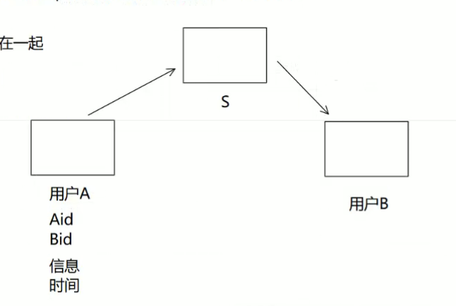
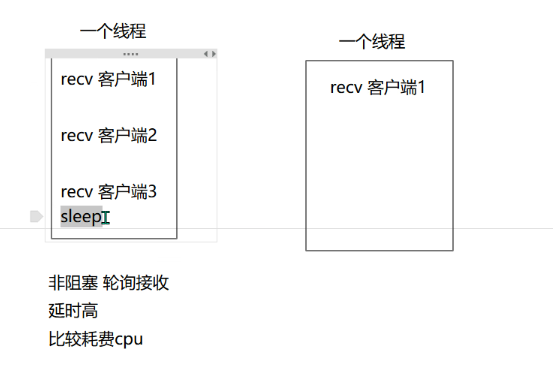
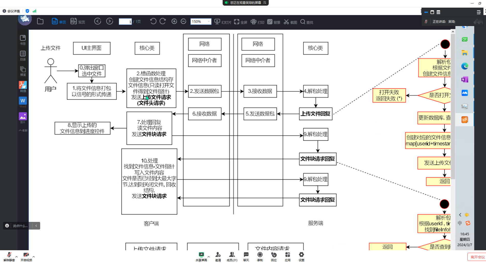
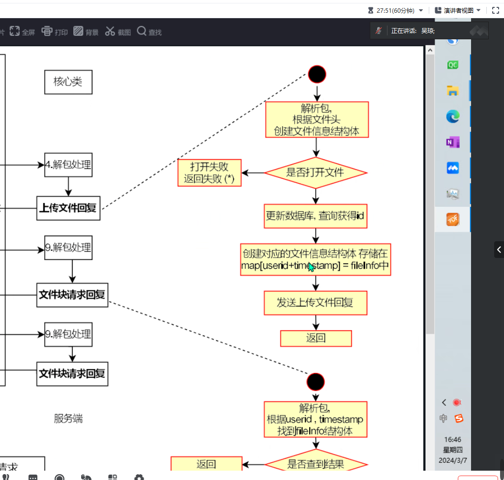
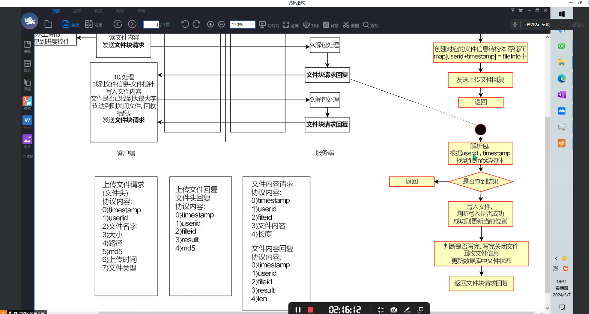
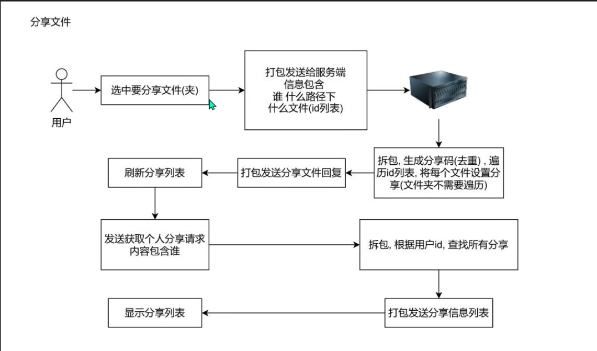
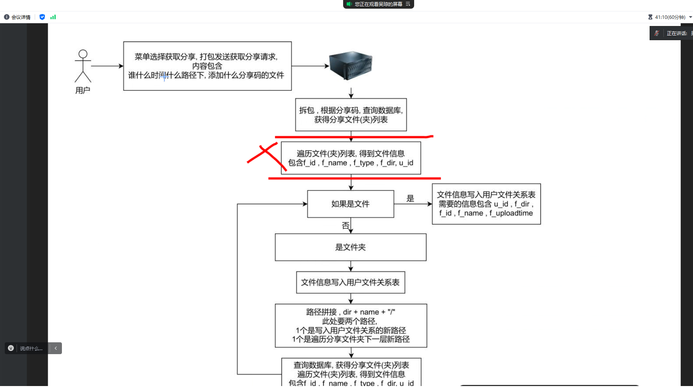
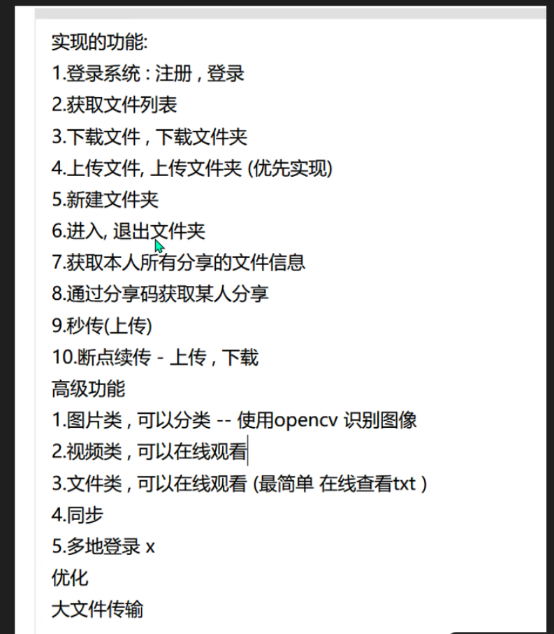

what how why connect diff

联系 区别

1.聊天软件IM即时通信软件

注册 登录 好友 发文字信息 群组信息 发音频 视频

空间

换一个名字，功能上，加一些功能

例子：实名聊天，探探，聊天广场，聊天机器人，

项目的展望

面试技巧;要引导到自己会的，自己不会的少提或者不提

遇到问题自己先想，检索信息能力，怎么搜，

解决问题的能力，会来事，沟通能力强

项目实现

### qt  为什么用QT？

### 为什么不用其他的？

我觉得没有必要去学

### 为什么要写这个项目？

哪个软件里都有它，足够的通用

### 同学有没有使用它？

### 服务器为什么在Windows上面？

当时在写的时候，考虑的是先实现，找到的是Windows模型，在学习到更多的知识后，考虑移植到Linux上面，没有时间

Linux?

里面有很多关于服务器下面的组件，更加方便，问题也会更少

windows server 不同版本，界面很少，更多空间留给开发

epoll

tcp 应用层协议  自定义协议  

### 封装格式  结构体  你了解其他的吗?  

JSON ,可读性好，可以赋空，结构体不能为空，结构体在不同平台上对齐方式不同，解析数据更安全。

优势：JSON 方便解析，读写便于理解，更安全（空数据，结构体空数据有安全隐患），多端可以同时使用

结构体还有字节对齐问题

js: java script

ON:对象表示法   ison-c(linux)  github

qt有json库

```json
{
	"data":"1034",
    "name":"zhangsan",
    "age":18,
    "message":null,
    "hobby":["说"，"唱"]
}
```

### 为什么使用MySQL数据库

经过调查，数据库最好用，其他的没学

索引，事务 一些好的特性都支持，

然后开源 免费的  

学习资料很多 

性能好，并发强

### 注册登录 流程

界面信息 核心的类  封包 中介者类 net 解析包  查电话号码和密码 一致 成功 不一致 返回  登录成功后  同步信息

### 密码

考虑加密，没有明文，

方法：

MD5:信息摘要算法第5版 字符串生成  128位 hash值（二进制数）  32位  16进制数

passwd :1234   contect: 1234_**key=client** -->  MD5 算法 --> 32位  16进制数  

MD5信息的一致性 完整性验证     SHA 

彩虹表   破解 加盐 1a2b3c4d_   参杂无用信息，能登陆，保护了一些信息

MD5 拦截  安全措施  安全验证 **手机号验证 人脸识别 ip异地非法**访问

多端登录  联动效果

## 登录

查数据库  得到个人id    id -> 通讯的套接字捆绑在一起

用户A 发文字消息给用户B  tcp  通讯 套接字



## MySql  哪些表？

用户信息表

用户id 手机号tel 密码passwd   age   email address remark


好友关系表

id1  id2

aid   bid

bid   aid

单向 ：关注 


## 离线处理

好友请求 文件消息   怎么实现？

客户端和服务端都要存

加载历史信息(本地)

用户 客户端存储的数据库  sqlite  文件存储类型数据库  每一个数据库就是一个文件  xx.db

服务器  离线记录（漫游信息）-->  数据库 --> 用户B 登录 推送


## 语音信息

1.录小语音

2.语音通话（电话）

考虑去写


## 文本信息

传文件  断点续传

上传  

要传的文件上传到服务端，再由客户端决定是否下载

合理 推荐到 传文件方式 客户端  发文件上传到服务器，然后转给另一个人

群文件

 断点续传：上传时断了，发送一个请求包，服务端看文件上传了多少字节，直接到最后一个字节，然后发一个包到客户端，也跳到那个字节开始续传

总结起来就是 发送请求  问服务器在哪断了  服务器告诉你，客户端转到那个为止开始读取上传


## 群组聊天

UDP  局域网  广播  组播地址  D类地址 233.233.233.233

UDP丢包了 怎么处理？重传-->超时重传  需要 序列号 确认号--》确认应答 

发的每一个包，首先要缓存，然后这个包有一个定时器，看一下有没有确认，如果没确认就重传，没超时，关闭定时器

广域网  TCP 

为什么用TCP实现网络？

不会丢包，有顺序，可靠

红包发出去，统一激活

数据库表问题

群和用户关系的表

群信息单独写一个表

如果觉得开发查询比较繁琐，可以考虑写视图  用视图查

## tcp 用他的原因

围绕可靠来表述

1）三次握手 四次挥手

2）确认·应答

3）重传

4）流量控制

5）拥塞控制

6）校验和

7）合理分段

8）重排机制，确保顺序

## tcp和udp区别

tcp面向连接的可靠的连接，udp面向非连接的不可靠的连接

tcp数据流 udp数据报

tcp可能粘包  udp可能丢包 可能乱序

tcp 类似于打电话 一般用于可靠的场合  比如传文件

udp 类似于发短信 一般用于延迟较低 事实要求高的场景 直播游戏

udp发送图片 可能15kb 每次send传1kb,可能会乱序，丢包，需要手动的进行封装结构体

## 网络套接字编程 流程

服务端

加载库

创建套接字

绑定端口 ip

监听

创建线程 accept接收数据

如果有客户端连接，在创建线程 用于客户端接收

接收到数据进行处理和发送响应

最后关闭服务器 要先卸载库


## 内存泄漏

不断开连接，关闭套接字 卸载库

## 服务器的网络结构（网络IO)是什么模型

同步阻塞多线程模型：

阻塞套接字 send recv 默认情况下是阻塞收发

send –>copy  用户要发送的数据 拷贝到发送缓冲区（内核缓冲区）

阻塞发送：可能由于发送缓冲区数据堆积，没有足够大的空间用于发送，此时send函数就会阻塞等待使用数据都正确拷贝到发送缓冲区，然后返回 —》阻塞

非阻塞 ：收发 send recv

recv阻塞收 没有数据到来时，会阻塞接收数据

非阻塞的recv  会直接去看有没有数据可以接收，有就接收，没有就返回–》会写一个用户自定义的接收缓冲区 用于缓存接收的数据

非阻塞的send 发送缓冲区有多少空闲空间，就拷贝过去多少数据，然后就返回 返回值就是成功拷贝到缓冲区的字节数  –》循环发送

循环的条件就是待发送的字节数，可以与send返回值进行做差，归0就可以结束  表示想发送的数据都拷贝过去了

考虑到如果服务器使用，可能是send并发执行的，那么需要考虑加锁 进行线程同步控制

## 粘包？怎么产生的？

单位时间数据量很大-》容易产生粘包

场景 比如发文件 图片 视频

怎么处理?

1. 标志位  （发送的数据内容不能与标志位冲突）
2. 固定包长度
3. 先发包长度 再发数据包
4. 短连接 发一个包建立一次tcp连接 （监控可能会使用）因为每次都是新的tcp连接，顺序可能会乱

## 同步？异步？

异步的情况：接收数据的缓冲区交给系统，一旦有数据到来，系统帮你将你的数据填充到你交付的缓冲区里，发一个反馈给你

多路复用IO模型 同步  同时阻塞多个套接字 监听他们有没有读写事件，一旦有，返回集合，用户可以使用这个集合，自己调用recv进行数据接收

## 同步阻塞多线程模型：



为什么用它？简单 容易实现 问题少 稳定

问题？线程栈 占用进程空间 1M 进程 能用的虚拟地址空间2GB（32位）如果客户端特别多，线程申请就会失败，程序就会异常崩溃

结论 同步阻塞多线程网络模型能够支持的同时在线等客户端个数是有上限的

考虑优化

## 多路复用IO模型

前提 ：Linux操作系统  select poll epoll(效率高，稳定)

## 项目里面用了哪些数据结构？

map映射 查找快 查找时间复杂度o(logn)  threadid-> socket 捆绑      id->socket  

list 链表  数组存储

# 网盘

## 业务:

注册 登录 上传 下载 断点续传 分享 获取分享

添加分享文件到自己的目录下面  查看自己的分享

（检索文件  删除 改名字）  秒传   

进阶:在线预览文件  视频  文件分类  图片分类 好友 聊天  同步盘

商用：广告嵌入接口 VIP  限速


### 业务层面







分享文件



获取分享





注册 登录

上传	下载

上传 流程	先发文件的头 再发文件的块

秒传：传文件 上传MD5查数据库 看MD5 有没有  有的话 查出fid -》uid  fid time


断点续传	 上传的时候 客户端崩溃了 再次登录 加载未完成的任务（需要本地有一个数据库，存储没有完成的信息，文件的信息（fid fname fpath fmd5 fsize ftime），尤其是文件id)

 通过选项 可以继续未完成的任务，也可以是主动暂停

继续任务 写一个协议 继续上传协议 发给服务器 fid ->mysql ->fpath->读出文件的大小，此处为续传点  

如果续传的时间不是很久 服务器可以通过map缓存的文件信息，读到文件写到哪里

写一个继续上传回复的协议 fid pos 就可以打开这个文件 跳转到这个位置 然后开始上传 上传文件块

大文件传输 linux dma +mmap 共享内存（文件映射内存）可以加快 服务器发文件的速度。

举例 一个大文件 分成10个 可以建立10个tcp 传这10个文件 可以是10个线程来完成

### 数据库层面

**注册 登录** 用户信息表

**文件存储**  文件信息表  fid  fname fsize fMD5 fpath   ftype fcount(文件的引用计数  归0涉及删除 )

触发器：一旦用户删除了和文件的关系，会触发文件引用计数-1 引用计数归0 触发触发器  删除该条记录

用户和文件写入关系，引用计数可以通过触发器让其+1

方便查某个人的文件 视图

**文件用户关系表**：uid	 fid 	fuploadtime

**文件分享用户关系表** uid 	fid	 fsharetime 	fpasswd	furl

### 协议层面(协议头都要有 省略了)

上传下载   

上传：先发文件头（uid	fid（传完才会有数据库）	 fMD5（验证） 	fsize（有足够的空间） 	fname   ftype（fuploadtime*)  再发文件块(fid	 fcontent	len )

下载 （文件信息 登录的时候 获取用户文件列表）请求 	fid	服务器传文件块(fid	 fcontent	len )

获取文件用户列表fid   fMD5 	fsize	fname	ftype	ftime

分享 uid 	fid	fsharetime	fpasswd（fsharetime*)	回复res	是否成功

获取个人分享文件 	请求uid 	回复 列表 fid	fMD5 fsize	fname	ftype	fsharetime

获取分享 furl  	可以预览 返回 列表 fid fMD5 fsize fname	ftime fsharetime

添加分享到用户目录 uid fid time

删除 uid fid 回复res是否删除成功

秒传 协议和上面一样

### 数据结构层面

map[fid]=fileInfo

fileInfo(文件id 	md5	size	path	type	time	pFile)

每一次文件请求到来，通过fid  ,可以找到fileInfo 然后就有pFile 可以写入文件