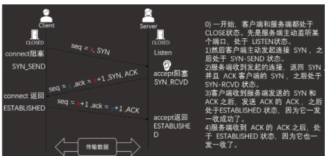
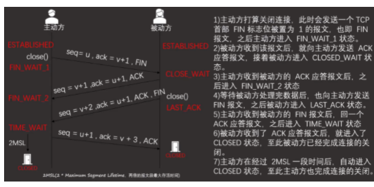
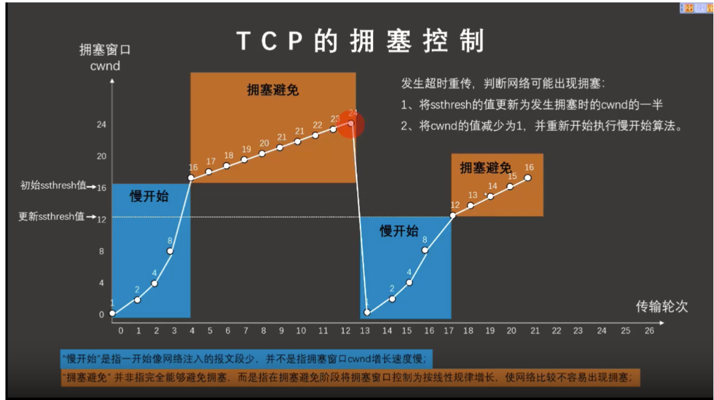
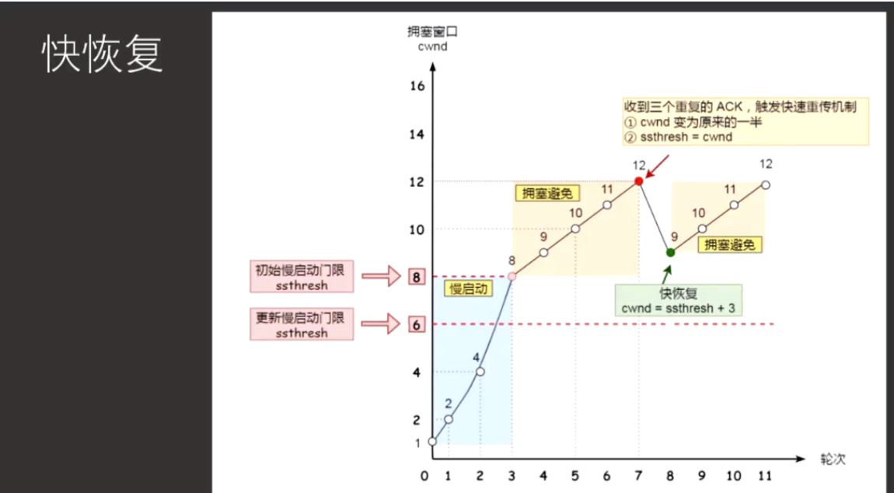
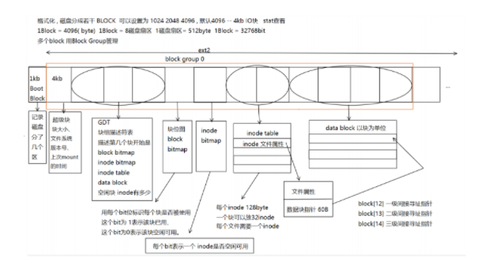
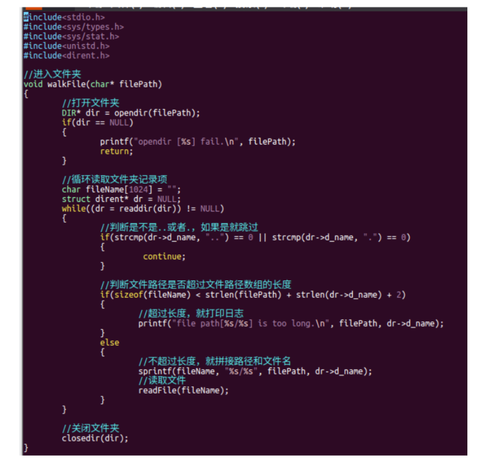
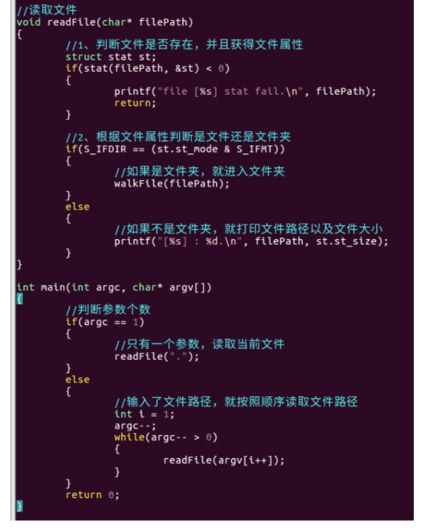
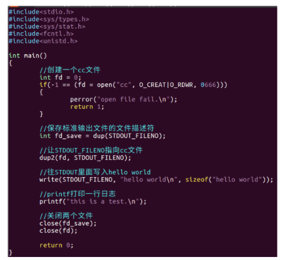

仔细读题

# 1、动态库和静态库分别有什么优缺点?写出原理。

- 以 .a 和 .lib结尾，在编译时被链接到可执行文件exe里，直接拷贝一份。 优点：由于是直接拷贝到可执行文件里，所以加载比较快 缺点：1、静态库的代码进行修改，需要重新编译整个可执行文件 2、可执行文件运行时，就会拷贝到内存里。若有多个可执行文件在运行时都调用了同一个静态库中的函数，那么每一个运行的文件都会保存同一份静态库，会浪费内存空间。
- 以 .so 和 .dll结尾（.so 安卓和linux使用，.dll Windows使用），在运行时被链接，可执行文件exe里有一个索引文件（.lib），通过索引文件找到动态库的位置。 优点： 1、动态库进行了更新，只需要重新编译动态库即可。 2、多个可执行文件都调用同一份动态库，那么这个动态库只会在内存中存在一份。 缺点：由于动态库需要通过索引文件进行寻找，所以加载比较慢。

# 2、ISO/OS七层网络模型都有哪几层?每层分别是什么功能?每层有哪些协议或者设备?

物理层 提供比特流传输   电线，光缆

数据链路层 ：提供链路管理（数据分帧，物理寻址mac，重发） 网卡 交换机

网络层：寻址和转发数据  防火墙，IP，ARP协议，RARP协议

传输层：应用进程之间的逻辑通信 TCP,UDP,线程，端口号，socket

会话层:(建立、维护、管理会话session)：session会话，服务器验证登录，断点续传

表示层：数据格式转化服务，数据加解密，数据解压缩，图片视频编解码

应用层：提供网络之间的通信    HTTP80,HTTPS443,FTP21,DNS53,DHCP68,Telnet23,SMTP25,ssh22

# 3、socket作为通信基石，其中包含通信必须的五种信息都是什么?

连接使用的协议，本地主机的IP地址，本地进程的协议端口，远程主机的IP地址，远程主机的协议端口

# 4、什么是CS模型?什么是BS模型?分别有什么特点?

CS模型：客户端服务端模型，每一个应用程序都有自己对应的客户端，对通信协议没有要求

BS模型：浏览器服务器模型，对客户端没有要求，通信协议必须是HTTP或HTTPS

# 5、分别写出基于UDP和TCP协议的服务端和客户端收发数据的步骤


# 6、直接广播地址是多少?有限广播地址是多少?直接广播和有限广播的区別。

有一个有效的网络号+主机号全为1的地址叫做直接广播地址  192.168.1.255

有限广播地址：网络号和主机号全为1的地址叫做有限广播地址255.255.255.255

有限广播地址只能用于本网广播（连接在同一个局域网内的设备），直接广播地址不仅能进行本网广播，还可以跨路由器，把广播发送到外网

# 7、IP地址分为哪几类?地址范围是多少?默认子网掩码分别是多少?

五类

A类 1.0.0.0~127.255.255.255  大量主机，公网

B类 128.0.0.0~191.255.255.255 国际大公司，政府

C类 192.0.0.0~223.255.255.255  小公司，学校

D类 224.0.0.0~239.255.255.255 组播

E类 240.0.0.0~255.255.255.255 保留

A类  255.0.0.0

B类 255.255.0.0

C类 255.255.255.0


# 8、ip地址:10.71.94.227，子网掩码:255.255.0.0，可以划分多少个子网?写出前三个和后三个子网的IP地址范围和广播地址。

A类子网掩码默认是255.0.0.0. 借了11111111  8个1

可以划分成2^8=256个子网

10.0.0.0~10.0.255.255

10.1.0.0~10.1.255.255

10.2.0.0~10.2.255.255

10.253.0.0~10.253.255.255

10.254.0.0.~10.254.255.255

10.255.0.0~10.255.255.255

# 9、ARP协议的作用。在什么时候使用ARP协议?描述ARP协议的过程。

地址解析协议，根据IP地址获得物理地址的TCP/IP协议

双方第一次接收数据之前

现在有一个PC1想要给PC2发消息，但是不知道PC2的mac地址，只知道PC2的IP地址，怎么办呢? 

PC1要先发一个ARP请求，ARP报文里面只填了源mac地址和源IP地址、目的IP地址，目的mac地址不知道就填0。ARP协议就是利用以太网的"广播“功能：将ARP请求包以广播的形式发送，交换机或WiFi设备（无线路由器）收到广播包时，会将此数据发给同一局域网的其他所有主机。然后PC3和PC4收到之后发现不是自己的IP则丢弃。而PC2收到之后，发现请求包里面有自己的IP地址，判断是给自己的，就会返回个ARP回应包。 而PC2返回ARP回应包，使用单播实现（不需要通过广播来实现，因为大部分网络协议在设计的时候，都需要保持极度克制，不需要的交互就砍掉，能合并的信息就合并，能不用广播就用单播，以此减少需要传输的数据，让带宽变得更多，让网络变得更快。）因为PC1发的ARP请求包里面已经带了PC1的IP地址和mac地址，所以PC2是知道全部信息的，所以只需要把源mac地址、源IP地址，目的mac地址和目的IP地址都填入请求报文中发送出去就可以了。这样PC1收到PC2的回复报文时，就知道了PC2的mac地址了。

# 10、发送ARP 广播时，如果目标主机在外网，怎么办?

此时就需要ARP代理，当发送端广播ARP请求时，本地网络上不会有主机回应（因为IP地址是外网的），此时路由器将会回应该请求，则发送源误认为路由器就是目的主机，会将报文全部转发给它，再由路由器转发报文到外网，则该路由器就被称为ARP代理。

# 11、什么是免费ARP?免费ARP有什么作用?

主机开机设置时会发送一个目的ip地址为自己IP地址的ARP报文请求，称为免费ARP

1.确认本地网络上是否有本地主机ip地址相同的主机，有就返回一个错误报文

2.告诉整个广播域，某个IP对应的mac地址，若接收主机ARP缓存中本身就有发送源主机的IP一MAC对，则会更新，否则，会缓存发送源的MAC对。这一行为的原因：因为缓存会老化（老化指的是缓存中有一些长时间不用的数据就会被删除），所以需要ARP请求去获取一下本机的MAC对。

# 12、HTTP 和 HTTPS 协议的区别。FTP 是什么协议。DNS是什么协议。DHCP是什么协议。

都是浏览器使用的协议 HTTPS使用了SSH加密方式 更加安全

FTP；文件传输协议

DNS:域名解析协议  将域名转换成IP地址

DHCP:动态主机配置协议，自动为我们配置IP

# 13、TCP和UDP分别是什么协议?有什么优缺点?分别适用于哪些场景?

TCP：传输控制协议  面向连接的，可靠的，基于字节流传输的传输协议，有流量控制和差错控制，一般用于文件传输

UDP:用户数据报传输协议，无连接的，低可靠的，效率高的数据报传输协议

在线手游，直播

# 14、分别描述什么是阻塞和非阻塞模式。Socket默认是什么模式?使用哪个函数设置改变 socket的模式?

烧水

阻塞模式

ioctlsocket();

# 15、分别描述一下发送函数的阻塞和非阻塞模式。

发送函数阻塞：当发送缓冲区空间不足够大时，等待空间足够大以后在发送 

非阻塞：有多少空间就发送多少数据 剩余数据由应用函数自己处理(判断发送函数的返回值是否<发送数据的大小 小于的话就是没有全部发送

# 16、为什么说TCP 协议是可靠稳定的?一共6点

三次握手和四次挥手

重传和确认的机制

合理的分段

校验重新排序

滑动窗口-流量控制

拥塞窗口-4种拥塞控制算法

# 17、某主机的网络地址(对外的ip地址)怎么计算?

主机的IP地址&子网掩码

# 18、什么是MSS和MTU?RTT和RTO 分别是什么意思?

MSS:最大报文段长度，除去IP和TCP头，一个网络包所能容纳TCP数据最大长度为1460

MTU：最大传输单元，一个网络包的最大长度，以太网中一般为1500字节

## (Round-Trip Time 往返时延)

在计算机网络中它是一个重要的性能指标，表示从发送端发送数据开始，到发送端收到来自接收端的确认 (接收端收到数据后便立即发送确认)，总共经历的时延 

RTT由三个部分决定：即链路的传播时间、末端系统的处理时间以及路由器的缓存中的排队和处理时间。其中，前面两个部分的值作为一个TCP连接相对固定，路由器的缓存中的排队和处理时间会随着整个网络拥塞程度的变化而变化。也决定了RTT的效率，所以RTT的变化在一定程度上反映了网络拥塞程度的变化。

## RTO(Retransmission Timeout 超时重传时间）

TCP每发送一个报文段，就对此报文段设置一个超时重传计时器。此计时器设置的超时重传时间RTO应当略大于TCP报文段的平均往返时延RTT，一般可取RTO =2RTT。但是，也可以根据具体情况人为调整RTO的值，例如可以设置超时重传时间RTO=90秒。当超过了规定的超时重传时间还未收到对此TCP报文段的预期确认信息，则必须重新传输此TCP报文段。

# 19、画出三次握手和四次挥手的交互流程，写清每个包是什么包，seq和ack的值分别是多少，每个状态。






# 20、为什么是三次握手?不是两次也不是四次。

为了实现可靠传输，双方需要同步SYN序号，序号由发送方开始，由于TCP是双向通信协议，通信双方都需要随机产生一个初始的序列号，并把这个值告诉对方，只有经过三次握手才能确认双方收和发都是没有问题的 若是四次的话，就是把SYN和ACK拆开成两个包。  若是四次的话，就是把SYN和ACK拆开成两个包。

# 21、为什么被动断开方在接收到FIN报文后，没有立刻回复FIN报文?为什么要立刻回复 ACK报文?

因为数据包在网络中传输的顺序不是固定的，可能在主动方的FIN包到达之后还会有一些主动方之前发送的数据包未到达，或者被动方还有未处理完的数据，被动方需要等到这些数据处理完后才能发送FIN包，而这个时间是不固定的，可能会触发主动方的超时重传，所以需要立刻回复一个ACK包。

# 22、为什么主动断开方要等待 2MSL再关闭?

MSL是报文最大生存时间，它是任何报文在网络上存在的最长时间，超过这个时间报文将被丢弃。2MSL这段时间保证数据包可以一去一回，防止四次挥手的第四次数据包丢包后，无法重传数据包，导致服务器无法正常关闭。假如第四个包丢了，那么1个MSL时间后，服务器会给客户端重传一个FIN的包，2倍的MSL时间正好够收到服务器重传FIN包的时间。所以是等待2倍的MSL时间。因为没有办法确认最后一个包对端能不能够收到，所以只能使用超过一段时间后自动关闭的方式来断开连接。

# 23、什么是心跳机制?什么场景下使用心跳机制?

应用场景：在长连接下，有可能很长一段时间都没有数据往来。

什么是心跳机制：就是每隔几分钟发送一个固定信息给服务端，服务端收到后回复一个固定信息。如果服务端几分钟内没有收到客户端信息则视客户端断开。

# 24、为什么TCP协议会产生粘包问题?粘包问题有哪几种解决方法?每种解决方法分别有什么缺点?

使用TCP协议传输的数据就是无边界的，意思就是假如先发送一个42字节的数据，应用程序没有及时取出数据处理，然后又收到一个58字节大小的数据，那么应用程序可以一次去取100个字节大小的数据当成一个数据包处理，因为数据包没有边界，应用程序没有办法区分是两个还是多个数据包，这就是粘包问题。 总结一下：tcp是数据流传输，是一种没有边界的，可以合并的传输数据方式。合并就要能拆开，拆不开就会粘包。

解决办法

1.设置标志位(包括起始标志位，结束标志位)

缺点：（1）发送的数据可能与标志位相同 （2）起始标志位：当只有一个包时，无法确定这个包什么时候结束

2.固定包大小

缺点：发的包大小不足固定的大小时，就会浪费空间

3、先发数据长度，然后再发数据包  

缺点：会多发一个包，浪费资源

4、短连接（适用于用户浏览网站）：每次连接只发一个包 

缺点：效率低，浪费时间和资源

### 25、TCP 的流量控制是怎么实现的?介绍一下原理。

滑动窗口和流量控制是两个东西，**流量控制是通过滑动窗口来实现的。**在实际传输过程中，滑动窗口的大小是不断变化的，怎么变化和根据什么变化，就跟这个流量控制有关系了。首先看一下什么是流量控制。所谓**流量控制，主要是接收方传递信息给发送方，使其不要发送数据太快，是一种端到端的控制。主要的方式就是返回的ACK中会包含自己的接收窗口的大小，并且利用大小来控制发送方的数据发送。**

### 26、拥塞控制和流量控制有什么区别?收发双方第一次交换滑动窗口的大小在什么时候?

拥塞控制：控制的是整个网络，所有接入这个网络中的发送方都受这个拥塞窗口的控制

 流量控制：是端到端的控制，接收方控制发送方

TCP三次握手第二次握手发送的ACK包中

### 27、TCP的拥塞控制算法有哪几种?说一下这几种算法在发送数据的时候怎么使用，什么场景下切换算法，可以画图表示。

1. **慢开始算法的思路就是，不要一开始就发送大量的数据，先探测一下网络的拥塞程度，也就是说由小到大逐渐增加拥塞窗口的大小。** 

   每经过一个传输轮次，拥塞窗口 cwnd 就加倍，这是乘法增长，知道=慢开始门限为止

2. **拥塞避免（Congestion Avoidance）：** 一旦窗口大小达到慢开始门限，就进入拥塞避免阶段。在每个往返时间内，窗口大小逐渐增加，而不是指数增长，以减缓拥塞窗口的增长速率。

   无论是在**慢开始阶段还是在拥塞避免阶段**，只要发送超时重传，判断网络可能出现拥塞（其根据就是没有收到确认，虽然没有收到确认可能是其他原因的分组丢失，但是因为无法判定，所以都当做拥塞来处理）

   1.把**慢开始门限设置为出现拥塞时的发送窗口cwnd大小的一半**。

   **2.把拥塞窗口cwnd减少为1，重新开始执行慢开始算法。**

    

   

3. 快重传：快重传要求接收方在收到一个失序的报文段后就立即发出重复确认 （为的是使发送方及早知道有报文段没有到达对方）而不要等到自己发送数据时捎带确认。快重传算法规定，发送方只要一连收到三个重复确认就应当立即重传对方尚未收到的报文段，而不必继续等待设置的重传计时器时间到期。     

4. 快恢复：考虑到如果网络出现拥塞的话就不会收到好几个重复的确认，所以发送方现在认为网络可能没有出现拥塞。所以此时不执行慢开始算法，而是将cwnd = ssthresh + 3（是因为发送方连续收到三个重复确认消息，所以cwnd=ssthresh以后又加上了3个重复确认消息），然后使用拥塞避免算法。

   

### 28、介绍一下数据库的几种范式。

第一范式（1NF）：属性不可分

第二范式（2NF）：不存在组合关键字中的某些字段决定非关键字段。(组合关键字不可拆)

不符合第二范式会出现的问题：1、数据冗余，2、更新异常，3、插入异常

第三范式（3NF）：不存在依赖传递（即关键字段-->非关键字段x-->非关键字段y）

三个范式是递进关系，如果不符合第一范式，那么就一定不符合第二和第三范式。

BCNF（鲍伊斯-科得范式）：不存在关键字段决定关键字段


# 29、学校考试系统中有三个表

学生基本信息表 student(学号id，学生姓名 name，年龄age，性别 sex)，

选课信息表 course(学号id,课程编号courseld,成绩score),课程信息表 

class(课程编号courseld,课程名称 courseName，任课老师teacherName)，

其中学号是主键并且是自增的，学生姓名要求唯一并且不能为空，年龄默认20岁，性别是枚举值'男’和'女’。写出下面的SOL语句，涉及到多表查询的不允许使用笛卡尔积查询。

1)创建 student 表

```mysql
create table student(
id int primary key auto_increment,
name varchar(10) unique not null,
age int default 20,
sex enum('男','女'));
```

2)从选课信息表course表中删除选择Liy老师的女学生的选课记录

```mysql
delete from course where id in(select id from student where teacherName='Liy' and sex='女');
```

3)列出及学过“1”号课程成绩比“2”号课程成绩高的所有学生的学号及其“1”和“2”号课程的成绩

```mysql
select id,
(select score from sc where C='01' and sc.S=student.S) 01score,
(select score from sc where C='02' and sc.S=student.S) 02score 
from student having 01score>02score;
```

4)在student表增加一列 school列，int 类型

```mysql
alter table student add school int;
```

5)修改student 表中的 school列的类型为字符串类型

```mysql
alter table student modify school varchar(10);
```

6)删除student 表中的 school 列

```mysql
alter table student drop school;
```

7)删除 class 表

```mysql
drop table class;
```

8)在 student 表中增加自己的姓名、年龄和性别

```mysql
insert into student (name,age,sex) values ('chihe',20,'男');
```

9)修改张三同学01课程的成绩为75分

 

```mysql
update course set score=75 where courseId='01' and name='张三';
```

10)查询王姓同学的03课程成绩、课程名称和任课老师

```mysql
select student.score,student.courseName,student.tracherName from student
inner join course on
student.id = course.id
inner join course on course.courserId=class.courseId 
where student.name like '王%' and studet.course='03';
SELECT course.成绩, class.课程名称, class.任课老师
FROM course
JOIN class ON course.课程编号courseld = class.课程编号courseld
WHERE course.学号id IN (SELECT 学号id FROM course WHERE 学号id LIKE '王%' AND 课程编号courseld = '03');

```

4)创建一个触发器，在删除student表的时候，同时删除course 表中相同学号的信息

```mysql
delimiter //
create trigger mydelete after 
delete on student for each row begin 
delete from course where id=old.id;
end //
delimiter ;

```

5)创建一个分页的存储过程,对student表进行分页,输入参数页数(page int)和每页显示的行数(nCount int)。

```mysql
输入参数当前是第几页（page int）， 每页显示多少行数据（count int）。
注意参数校验，当page>最大页数，就显示最后一页的数据；当page<=0，就显示第一页的数据。
尝试把查询的表名变成变量传入——比较难

delimiter //

create procedure getstudentpage(page int, count int)
begin
    declare totalrows int default 0;
    declare maxpage int default 0;
	declare offset int default 0;
    set offset=(page-1 ) * count;
    #获取总行数
    select count(*) into totalrows from student;

    #计算最大页数  ceil向上取整
    set maxpage = ceil(totalrows / count);
    
    if page>maxpage then set page=maxpage;
    end if;
    if page<=0 then set page=1;
    end if;
    #分页查询
    select * from student limit offset, count;

end //

delimiter ;
```


# 30，聚合函数有哪几个

查询行数count()  求和sum()  最大值max()  最小值min()  平均分avg()


# 27、函数和存储过程的区别是什么?

存储过程没有返回值，函数有返回值，存储过程可以通过参数传递数据，把参数设置成IN|INOUT|OUT

函数里面不能有sql语句，存储过程是操作sql语句的，可以调用函数

# 28、什么是事务?事务的关键字是什么?事务有哪几种特性?展开说说

作为单个逻辑单元执行的一系列sql操作，要么都执行要么都不执行。

特性:ACID 

A 原子性:事务是最小的工作单元，不可再分，要么都执行，要么都不执行 

C一致性:数据库的完整性约束不能被破坏。 

I隔离性:并行执行的事务之间是隔离的，相互不影响。 

D 持久性：之后数据改变永久保存 

关键字：transation


### 30、GDB 调试命令

1)查看代码:list/l  

2)逐过程:next/n

3)逐语句:step/s

4)查看变量内容:printf 变量名

5)持续监测变量:dispaly

6)结束监测:undispaly

7)下断点:break/b 行号/函数名

8)run 和 start区别:run 跑到第一个断点，没有断点就直接到结尾

start到main函数第一行

9)continue: 继续运行到下一个断点

10)临时禁用断点:disable

11)重新启用断点:enable

12)退出 gdb 调试:quit/q


## 31、写出完成一下功能的常用shell命令(除了13题，其他都是一条命令)

1)查看/etc/bin 文件夹下的所有文件(包括子文件夹以及所有隐藏文件的详细信息);

ls -Rla  /etc/bin

2)切换到根目录下:

cd /

3)在当前路径下创建一个 aa/bb/cc 关系的文件夹:

mkdir aa/bb/cc -p

4)删除上面创建的文件夹:

rm -rf aa

5)mv 命令的作用:

第一个参数是目标，第二个参数是文件路径且文件存在，就是移动，如果是文件，就是重命名

6)输出字符串"hello world”到a.txt(文件已存在当前路径下)文件中:

echo   hello world >a.txt

7)查看磁盘使用情况:

df

8)当前在~路径下,修改/usr路径下aa文件的权限为r-xrw-r--：

chmod 564 /usr/aa

9)把/etc/bin文件夹下的a文件所有者和所属组从原来的 root root 修改为 colin colin:

sudo chown colin:colin  /etc/bin/a

10)查看/etc文件夹(包括子文件夹)下的所有以a开头的文件的名字:

find /etc -name "a*"

12)查询当前路径(包括子文件夹)下文件中有以“ret”开头的字符串的文件，并显示文件中的行号:

grep -Rn "ret"

13)写出挂起进程cat，并使用信号杀死这个进程的一组命令:

cat

ctrl + z

ps aux

kill -9 pid(根据ps aux查询)

# 32、代码如图，写出以下编译命令

```c
@colinsoft:~/20220705/testgcc$ ls
add.c add.h main.c
colin@colinsoft：~/20220705/testgcc$ cat main.c

#include "add.h"
#include <stdio.h>
int main()
{
    int c = add(2, 4);
	int a;
    #ifdef DEF_LOG
    	printf("this is a test.\n");
    #endif// DEF LOG
    printf("2 + 4 = %d.\n",c);
    return 0;
}

colin@colinsoft:~/20220705/testgcc$ cat add.c
#include "add h"
int add(int a, int b)
{
    return a + b;
}

colin@colinsoft:~/20220705/testgcc$ cat add.h
#pragma once
int add(int a, int b);
colin@colinsoft:~/20220705/testgcc$

```

1)写出编译生成名为xx的可执行文件的编译命令:

gcc  add.c add.h main.c  -o xx

2)写出执行可执行文件的编译命令:

./xx

3)写出运行可执行文件能够打印出“thisisatest.”的可执行文件的编译命令:

gcc add.c add.h main.c -DDEF_LOG -o xx

./xx

4)写出能够使用 gdb 调试的生成可执行文件的编译命令:

gcc add.c add.h main.c -g -o xx

5)在当前路径下创建一个pp文件夹，把“add.h”移动到pp文件夹中(已做完)，写出生成可执行文件名为xx的可执行文件的编译命令:

gcc add.c main.c -I/pp -o xx

6)写出编译过程中提示a变量未使用的编译命令:  

gcc add.c main.c -I./pp -Wall -o xx

## 33、给 aa 文件创建一个符号连接文件 xx和硬链接文件yy的命令分别是什么?

符号链接  ln -s aa xx

ln aa yy

## 符号连接和硬链接有什么区别?从原理、inode 编号、链接计数器、删除源文件后的现象等几个方面进行描述。

1. 当给一个文件创建硬链接时，源文件与硬链接文件的硬链接个数都会加1。 符号链接计数器始终是1，因为符号连接文件本身是一个独立的文件，不论有多少个符号连接指向同一个目标文件，计数器都是1。

   硬链接的文件属性是普通文件，软链接的文件属性是链接文件。

   **inode 编号：**

   - **符号连接：** 拥有自己的 inode 号码，指向目标文件的 inode。
   - **硬链接：** 共享相同的 inode 号码，因为它们实际上是同一个文件。

    软链接的文件大小是被链接文件的文件名长度，硬链接的文件大小与被链接文件的文件大小相等。 

   查找硬链接时，直接找到文件内容，而查找软链接时，是先找到被链接文件，然后根据被链接文件找到文件内容。

    删除硬链接文件，被链接文件会减少硬链接计数器的个数，删除软链接文件，对被链接文件无影响。 

   删除被链接文件，硬链接文件的硬链接计数器的个数减1，但还是可以根据硬链接文件看到文件内容，而软链接直接失效。 此时再重新touch一个与被删除文件同名的文件，软链接就会指向这个重名的文件。

## 34、Makefile 的优势是什么?

1、可以便捷的编译代码（不需要每次都写复杂的编译命令） 

2、可以节省编译时间（减少编译成本） 

3、重用性比较强，可以在不同的项目中反复使用

## makefile 是怎么节省编译时间的?

使用空间换时间的方式，工程在第一次编译的时候会花费大量的时间，第二次改动不变的时候编译时间就会大大缩短，编译器保留了编译过程中的中间文件，例如.o文件，makefile会识别哪些文件改动了，只编译那些改动的文件，时间就会缩短

## 编译器是怎么判断哪个源文件被修改的?

比较源文件的修改时间和.o文件的生成时间，如果源文件修改时间靠后，就说明上次编译后，文件修改过了

## 35、发送函数阻塞和非阻塞有什么区别?分别写出在linux和 windows 下设置套接字阻塞和非阻塞的函数。

发送函数阻塞：当发送缓冲区空间不足够大时，等待空间足够大以后在发送 

非阻塞：有多少空间就发送多少数据 剩余数据由应用函数自己处理(判断发送函数的返回值是否<发送数据的大小 小于的话就是没有全部发送

linux    fcntl()函数


windows  ioctlsocket()函数

## 36、Linux文件IO函数有哪几个?哪些函数在什么场景下是阻塞函数?

open close read write lseek fcntl ioctl

**read()**：当没有足够的数据可读时，read 操作将阻塞

**write()**：如果写操作无法立即完成（例如，写缓冲区已满），则 write 操作可能会阻塞

**lseek()**：在某些情况下，当文件位置指针移动到某个位置时，可能需要等待数据被读入或者等待空间用于写入，导致 lseek 阻塞。



## 37、描述 Linux 文件系统存储文件的过程。

1、首先看Boot Block看磁盘分区，找到要存储的磁盘。

2、来到具体的磁盘里的block group，可以直接跳过超级块。

3、到GDT表里面，从GDT表中读取出块位图、inode位图、inode tabl和data block的起始位置。

4、通过inode位图找到空闲的inode 节点，写入文件属性并把inode位图的对应位 置1。

5、通过块位图找出空闲的data block，向空闲的data block中写入文件内容“hello”并把块位图的对应位 置1，并把data block的地址赋值给写入文件属性的那个inode 节点。


## 38、描述 Lnux文件系统读取文件的过程。Inode 节点编号保存在什么地方?使用哪几个函数可以读取 inode 编号?

1、首先在Boot Block看磁盘分区，找到要存储的磁盘。

2、来到具体的磁盘里的block group，通过inode节点的编号，找到对应的inode节点，读取出里面的文件属性和数据块指针。

3、根据数据块指针，到对应的数据块的位置读取出文件的内容。

inode table

stat函数

## 39、一个inode 节点中有数据块指针 60字节，一个地址是4字节，可以存 15个地址指针，是怎么存储大文件的?

- 这15个指针并不是所有的都是指向数据块的。前12个是指向数据块的，block[12]叫一级间接寻址指针，block[13]叫二级间接寻址指针，block[14]叫三级间接寻址指针。
- block[12]也指向了1个block，但是这个block不是用来存数据的，是用来存寻址指针，这些指针指向的是实际存储数据的块的地址，1个block是4K可以存4096字节/4字节=1024个地址，每个地址都会指向1个4K的block，那么就可以存储1024*4K=4096K=4M大小的文件。
- block[13]会存1024个一级间接寻址指针，一个一级间接寻址指针可以存储4M的文件，那么一个二级间接寻址指针可以存1024*4M=4096M=4G大小的文件。
- block[14]会存1024个二级间接寻址指针，一个二级间接寻址指针可以存储4G的文件，那么一个三级间接寻址指针可以存1024*4G=4096G=4T大小的文件。

### 40、从 Linux 文件系统的原理分析，为什么永久删除的文件还能够复原?

在 Linux 文件系统的原理中，通常情况下，删除文件并不是真正意义上的物理擦除文件数据，而是将文件的 Inode 标记为"未分配"，使其所占用的磁盘块标记为"未使用"，从而释放磁盘空间。这样的删除操作被称为软删除（soft delete）。

当你删除文件时，实际上只是删除了文件名和 Inode 之间的关联，而文件数据仍然存在于磁盘上，只是被标记为可被覆写的空间。在这个阶段，可以通过一些工具或手段来恢复被删除的文件。这是因为文件内容并没有真正从磁盘中擦除，只是文件系统认为这部分空间可以重新分配使用。

## 41、写出实现linux下递归遍历目录的函数，要求必须且只能输入一个路径，按照指定路径打印路径下的所有文件X及大小。





## 42、写出实现linux下的 copy 功能的函数。

```
#include<stdio.h>
#include<sys/types.h>
#include<sys/stat.h>
#include<fcntl.h>
#include<unistd.h>
int main(int argc,char* argv[])
{
    //判断参数个数，<3说明参数个数不对
    if(argc<3){
        printf("please input file name\n");
    }
    //以只读方式打开源文件，判断打开是否成功
    int fd_src=open(argv[1],O_RDONLY);
    if(-1==fd_src)
    {
        printf("open file [%s] fail\n",argv[1]);
        return 1;
    }
    //以只读方式打开目标文件，如果目标文件不存在就创建，如果目标文件存在就截取长度为0（覆盖）
    umask(0000);
    int fd_dest=open(argv[2],O_RDWR|O_CREAT|O_TRUNC,0664);
    if(-1==fd_dest){
        printf("open file [%s] fail\n",argv[2]);
        close(fd_src);
        return 1;
    }
    
    //循环读取源文件内容
    char buf[1024]="";
    int nReadLen=0;
    while(0!=(nReadLen=read(fd_src,buf,sizeof(buf))))
    {
        //写入目标文件中
        write(fd_dest,buf,nReadLen);
    }
    //关闭两个打开的文件
    close(fd_src);
    close(fd_dest);
    return 0;
}
```

## 43、写出实现 linux下的echo重定向功能(echo命令要求重定向的文件必须存在)的函数。


1.保存标准输出文件的文件描述符

2.打开xx文件

3.STDOUT_FILENO指向xx文件

4.打印日志

5.关闭文件

```
#include<stdio.h>
#include<sys/types.h>
#include<sys/stat.h>
#include<unistd.hz.
int main()
{
	int fd_xx=open("cc",O_RDWR)；
	if(-1==fd_xx)
	{
		perror("open file fail\n");
		return 1；
	}
	
	int fd_save=dup(STDOUT_FILENO);
	
	dup2(fd,STDOUT_FILENO);
	
	//打印日志
	printf("this is test\n");
	
	close(fd_save);
	close(fd_xx);
	return 0;
}
```

